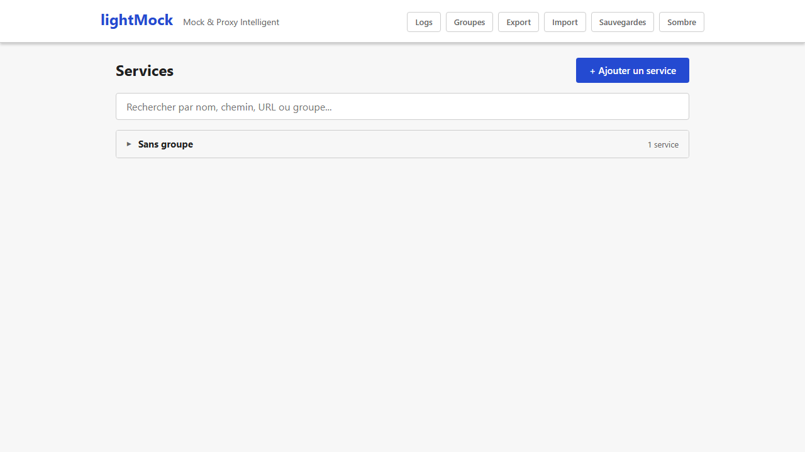

# Administration : import, export, réinitialisation, mode sombre

Quelques fonctionnalités transversales, accessibles depuis la barre de navigation en haut de l'interface.

## Export : sauvegarder toute la configuration dans un fichier

Le bouton **"Export"** télécharge un fichier contenant l'intégralité de la configuration actuelle (tous les services, groupes et règles) — pratique pour partager une configuration avec un collègue, la versionner, ou en garder une copie avant une manipulation risquée.

## Import : recharger une configuration depuis un fichier

Le bouton **"Import"** permet de charger un fichier exporté précédemment. Deux modes sont proposés au moment de l'import :

- **Remplacer** : la configuration importée remplace entièrement la configuration actuelle.
- **Fusionner** : la configuration importée est ajoutée à l'existant, sans supprimer ce qui est déjà présent.

*(Capture manquante — aucun scénario E2E existant n'ouvre la modale d'import via l'interface [`config.spec.mjs` importe uniquement via l'API] ; à réaliser manuellement, cf `frontend/e2e/README.md` section captures.)*

> Comme pour toute modification, une [sauvegarde automatique](sauvegardes-et-restauration.md) de l'état précédent est créée avant l'import — une erreur de manipulation reste réversible.

## Réinitialisation complète

Le bouton **"Reset"** supprime **tous** les services et groupes en une seule action. C'est une opération destructrice, protégée par une double sécurité :

- Une **confirmation explicite** est demandée (il faut taper un mot-clé exact pour activer le bouton de confirmation — impossible de cliquer par accident).
- Une [sauvegarde spéciale](sauvegardes-et-restauration.md), à l'abri de la purge automatique pendant 30 jours, est créée juste avant, pour permettre un retour en arrière si besoin.

*(Capture manquante — aucun scénario E2E existant n'ouvre la confirmation du bouton "Reset" via l'interface [le reset est déclenché uniquement via l'API dans les tests existants] ; à réaliser manuellement, cf `frontend/e2e/README.md` section captures.)*

## Mode sombre

Le bouton **"Sombre"/"Clair"** dans la barre de navigation bascule le thème visuel de l'interface. Le choix est mémorisé pour vos prochaines visites (ou suit automatiquement la préférence de votre navigateur/système si vous n'avez jamais choisi explicitement).

## Prérequis et limites

- Aucun prérequis particulier : ces fonctionnalités sont disponibles dès l'installation de base.
- Le bouton "Reset" n'est visible que pour les utilisateurs autorisés (super-administrateurs si l'[authentification](authentification.md) est activée ; sinon, sa visibilité dépend d'un réglage
  fait par l'administrateur système de votre instance — dans tous les cas, l'autorisation réelle est toujours vérifiée côté serveur, pas seulement par l'affichage ou non du bouton).
- Import/Export portent sur **toute** la configuration : il n'y a pas d'export partiel (un seul service ou groupe) depuis ces boutons.
