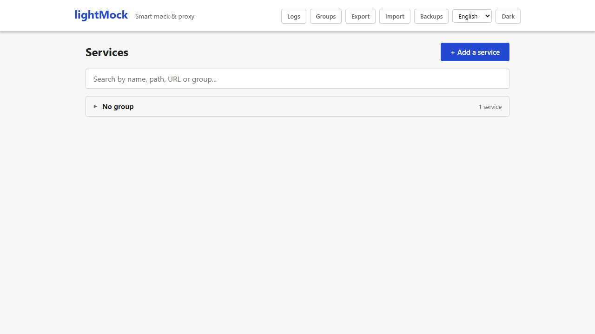

# Administration: import, export, reset, dark mode

A few features that apply to everything, from the navigation bar at the top of the interface.

## Export: save the whole configuration to a file

**"Export"** downloads a file holding the whole current configuration (every service, group and rule): handy to share a configuration with a colleague, version it, or keep a copy before a risky change.

## Import: load a configuration from a file

**"Import"** loads a file exported earlier (or an example such as [examples/devops-toolchain.json](../examples/devops-toolchain.json)). Two modes are offered:

- **Replace everything**: the imported configuration replaces the current one entirely.
- **Merge (add what is missing)**: the imported services and groups are added to the existing ones, without removing anything.

> As for any change, an [automatic backup](backups-and-restore.md) of the previous state is written before the import: a mistake can be undone.

## Full reset

**"Reset"** deletes **every** service and group at once. It is destructive, so it is doubly guarded:

- An **explicit confirmation** is required: the confirm button only unlocks once you type an exact keyword, so it cannot be clicked by accident.
- A [special backup](backups-and-restore.md), out of reach of the normal rotation for 30 days, is written right before, to allow going back.

## Dark mode

The **"Dark"/"Light"** button of the navigation bar switches the visual theme. Your choice is remembered for your next visits; until you choose, the theme follows your browser or system preference.

## Language

The language selector of the navigation bar switches the interface between the available languages (English and French today). Your choice is remembered; until you choose, the interface follows your browser's language, and falls back to English. Error messages from the server follow the same choice.

## Requirements and limits

- No requirement: available in every installation.
- "Reset" is only shown to users allowed to use it (super-admins when [authentication](authentication.md) is on; otherwise, its display depends on a setting chosen by whoever runs your instance). Either way, the server checks the permission itself: hiding or showing the button is never the protection.
- Import and export cover **the whole** configuration: these buttons do not export a single service or group.
