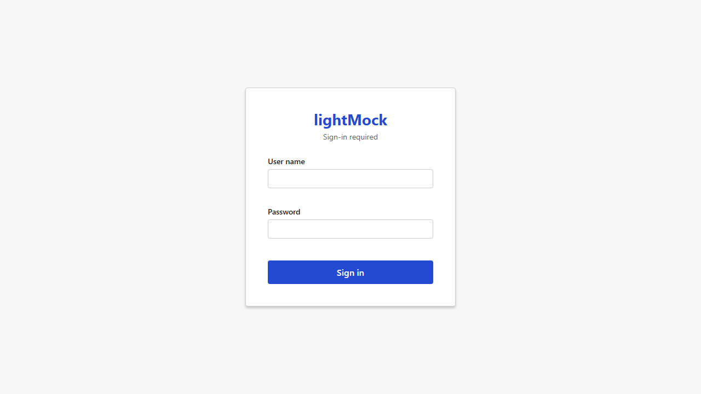
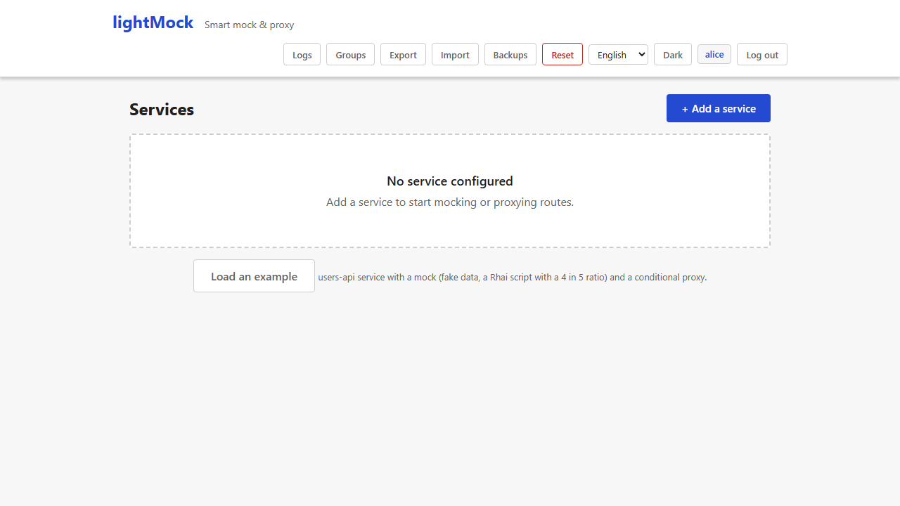

# Authentication

By default, lightMock is **open to everyone** who can reach it: anyone can see and change everything, without logging in. That suits a developer's machine or a closed test environment, and it is why the binary only listens on the local machine by default. Authentication can be **turned on** when needed, for an environment shared by several teams, for instance.

## How it works once on

With authentication on, lightMock relies on **Keycloak** (an identity server your organization may already run) to check identities: a login screen appears, and access then follows the logged-in user.

Access rights then depend on:

- The user's membership of [service groups](groups.md): group admins manage the group and its services, members work on its services.
- A list of **super-admins**, who can do everything, including sensitive actions (full reset, restoring backups, ungrouped services).

The exact rights of each endpoint are listed in the [reviewer guide](../REVIEWING.md#authorization-matrix).

Once logged in, the user name shows as a badge in the navigation bar; here the user is also a super-admin, hence the "Reset" button next to the badge.

## Requirements and limits

- **Off by default.** Turning it on is a decision of whoever runs lightMock (environment variables at startup, see the README), not an option of the interface. If you do not know whether it is on for your instance, check whether a login screen appears when you open it.
- It needs a Keycloak server that lightMock can reach. When authentication is on but its settings are missing, lightMock refuses to start rather than run half-protected.
- **lightMock needs no authentication gateway in front of it.** It serves its own login screen, including when authentication is on: the page itself (HTML, script, styles) is reachable without a token, and only the management API (services, groups, backups…) requires one. Running behind a reverse proxy or gateway is possible, never required.
- The mocked services themselves never require a lightMock token: they carry the credentials of the applications under test.
- Tokens are checked by lightMock itself against the realm's published keys (signature, issuer, expiry, client); see the [security model](security.md#authentication).
- Only Keycloak is supported today, through its password login. Other OpenID Connect providers and a browser redirect login (authorization code with PKCE) are on the [roadmap](../ROADMAP.md).
- The "Reset" button (full reset, see [Administration](administration.md)) can be shown or hidden independently of authentication, but its presence on screen is **never** the protection: the server always checks the permission.
