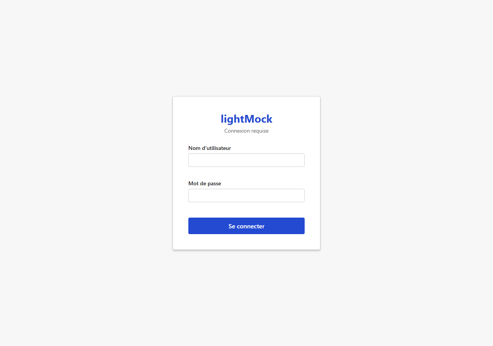
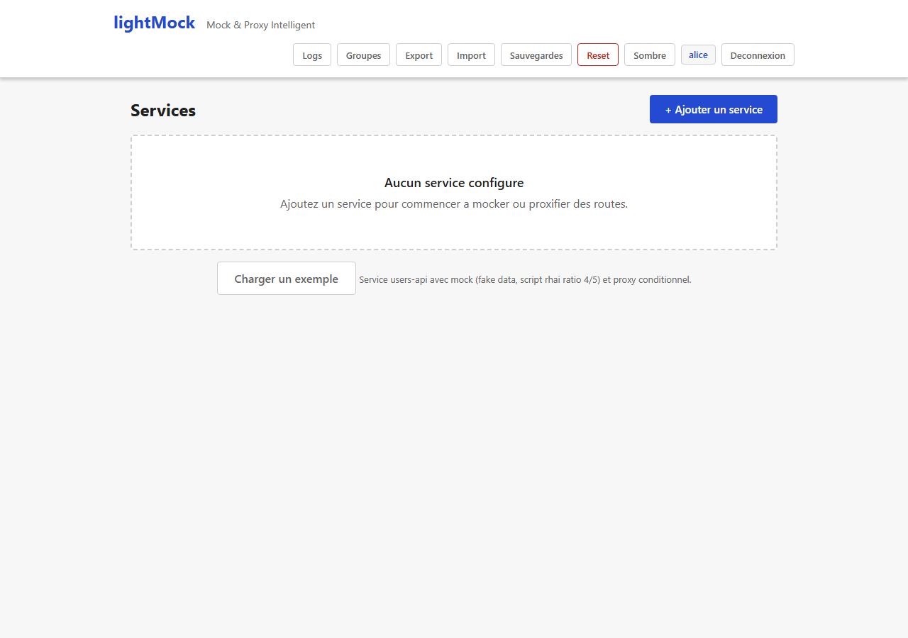

# Authentification

Par défaut, lightMock est **ouvert à tous** — n'importe qui ayant accès à l'URL peut tout voir et tout modifier, sans avoir besoin de se connecter. C'est volontaire pour un usage en environnement de développement/test fermé. L'authentification peut être **activée** si besoin (par exemple pour un environnement partagé entre plusieurs équipes).

## Fonctionnement une fois activée

Quand l'authentification est activée, lightMock délègue la vérification de l'identité à **Keycloak** (un serveur d'authentification externe déjà utilisé par ailleurs, le cas échéant) : un écran de connexion apparaît, et l'accès est ensuite lié à l'utilisateur connecté.

*(Capture réalisée manuellement contre une instance locale temporaire configurée avec `AUTH_ENABLED=true` et un serveur Keycloak de substitution ne servant qu'à illustrer l'écran — aucun véritable serveur Keycloak d'organisation n'a été utilisé. Le rendu de l'écran lui-même est identique quel que soit le Keycloak réellement connecté.)*

Les droits d'accès dépendent alors :

- Des **rôles** de l'utilisateur (quels services/groupes il peut voir ou modifier).
- De son appartenance aux [groupes de services](groupes.md) (admin de groupe, membre...).
- D'une liste de **super-administrateurs**, qui ont accès à tout, y compris aux actions sensibles (réinitialisation complète, restauration de sauvegardes).

*(Même capture de substitution que ci-dessus. Une fois connecté, le nom d'utilisateur apparaît en badge dans la barre de navigation ; ici l'utilisateur est aussi super-administrateur, d'où la présence du bouton "Reset" à côté du badge.)*

## Prérequis et limites

- **Désactivée par défaut.** Son activation est une décision d'administration système (variable d'environnement au démarrage de lightMock), pas une option que l'on bascule depuis l'interface — si vous ne savez pas si elle est active sur votre instance, regardez si un écran de connexion apparaît à l'ouverture.
- Nécessite un serveur Keycloak déjà en place et accessible depuis lightMock ; sans cette configuration renseignée correctement, lightMock refuse de démarrer si l'authentification est activée (pour éviter de tourner accidentellement "à moitié protégé").
- **lightMock est autonome : aucune passerelle d'authentification externe n'est requise en amont.** L'application sert elle-même son écran de connexion, y compris quand l'authentification est activée — la page d'accueil (HTML, script et style) reste accessible sans token, seuls les appels à l'API de gestion (services, groupes, sauvegardes, etc.) l'exigent. Un déploiement derrière un reverse-proxy/une passerelle reste possible, mais n'est jamais un prérequis pour que l'écran de connexion s'affiche.
- Un bouton "Reset" (réinitialisation complète, voir [Administration](administration.md)) peut être affiché ou masqué indépendamment de l'authentification — mais sa présence à l'écran n'est **jamais** la seule protection réelle : l'autorisation est toujours vérifiée côté serveur.
