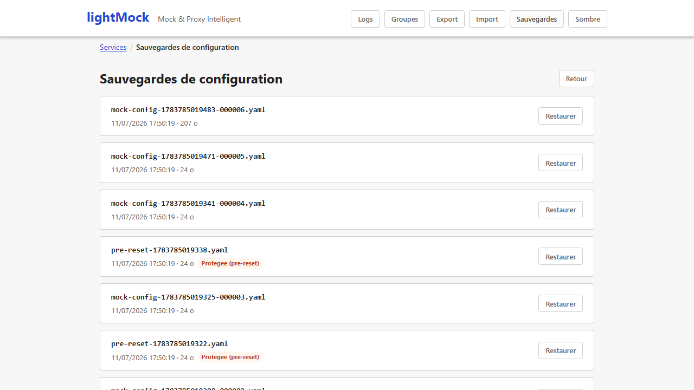
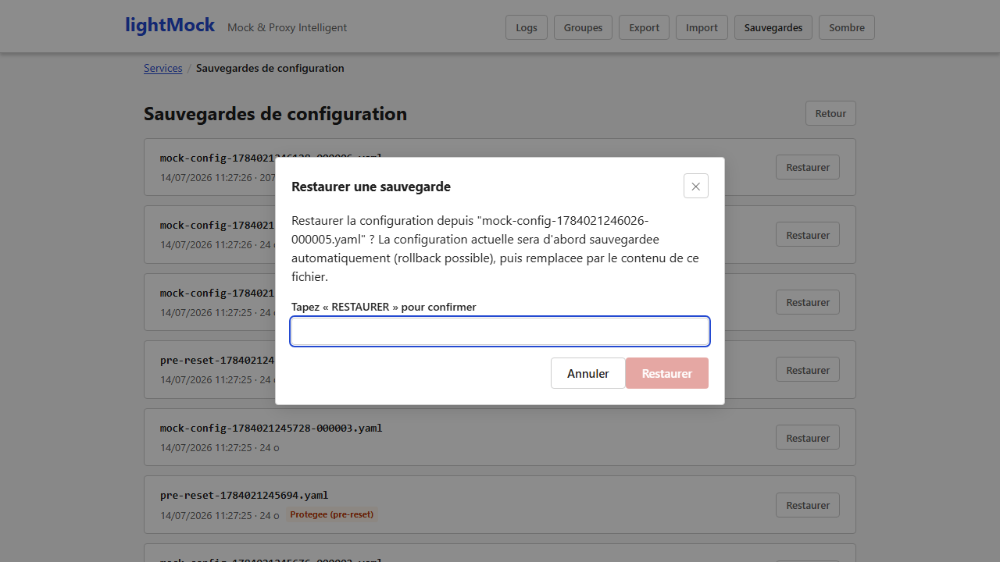

# Backups and restore

lightMock protects your configuration against mistakes: before each change, the previous state is saved, so you can always go back.

## Automatic backups

Before **every change** to the configuration (creating, editing or deleting a service or a rule, restoring a backup…), the previous state is copied to a backup history, **without any action on your part**.

Only the most recent backups are kept (`BACKUP_MAX_COUNT`, 5 by default): older ones are removed as new ones arrive.

## Restoring a backup

**"Backups"** in the navigation bar lists every available backup with its date and size, and restores one **in a click**.

A restore itself first backs up the state it overwrites: even a restore can be undone.

## A special backup before a full reset

Before a [full reset](administration.md) (which deletes every service), an extra backup is written to a protected place, out of reach of the normal rotation for 30 days: enough time to notice and restore it if the reset was a mistake.

## Requirements and limits

- No requirement: available in every installation, always on.
- Listing and restoring backups are reserved to **super-admins** when [authentication](authentication.md) is on. Without authentication, everyone can use them (as the rest of the interface in that mode).
- Backups and restores cover **the whole configuration** (every service and group): a single service cannot be restored on its own from an old backup.
