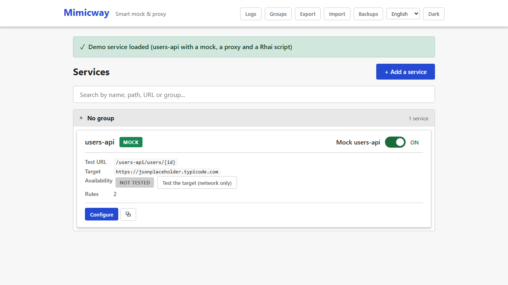

[Français](../fr/availability-check.md)

# Availability check

On a [service](services.md)'s card and page, the **"Test the target (network only)"** button checks whether the real backend (`real_target_url`) can be reached over the network.

## What the check does, and does not do

It only opens a **raw network connection** (a TCP connection) to the backend's address and port, with a short timeout. It **never sends an HTTP request** (no `GET`, no `HEAD`, no call to any route of the target API):

- ✅ "Reachable" means the network lets you reach that address.
- ❌ It says **nothing** about the health of the API itself, which can be failing while still being reachable.

This is deliberate: the check must never have a side effect on the real backend (no application log on its side, no API quota used, and so on).

## Statuses

| Status | Meaning |
|---|---|
| Not tested | No check has run for this service yet |
| Testing… | The network check is running |
| Reachable | The connection succeeded |
| Unreachable | The connection failed (backend down, wrong address, firewall…) |
| Expired | The last result is more than 2 minutes old: run the check again for a fresh one |

Clicking again within 2 minutes of a check reuses its result without opening a new connection.

## Requirements and limits

- No requirement: available in every installation.
- Only offered when the service has a `real_target_url`.
- The result is **not saved** with the service: it is a temporary status, cleared when Mimicway restarts.
