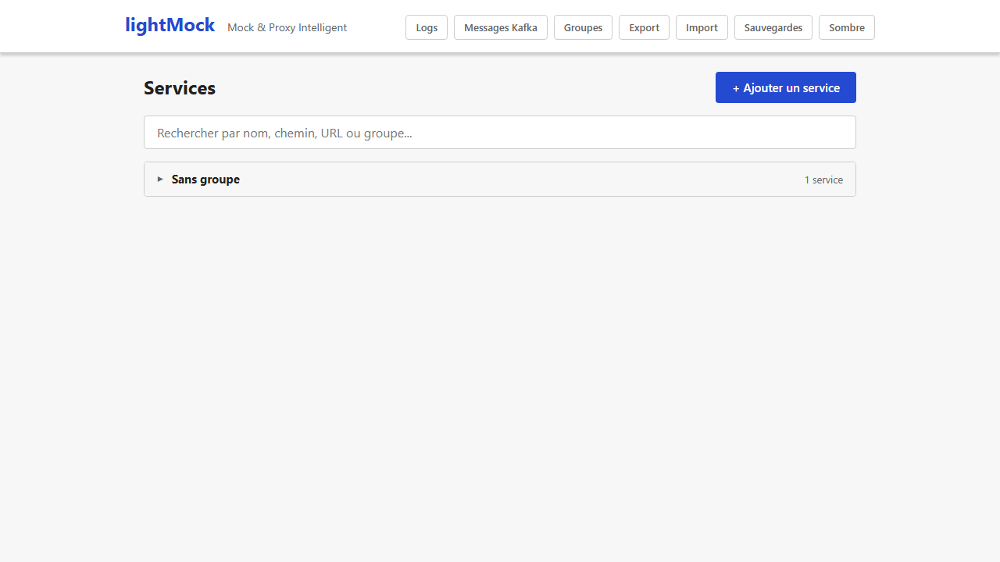
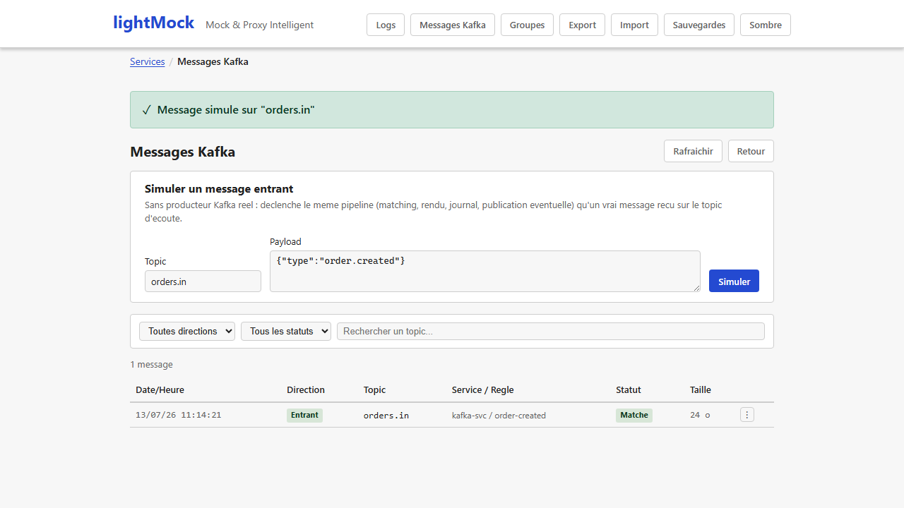
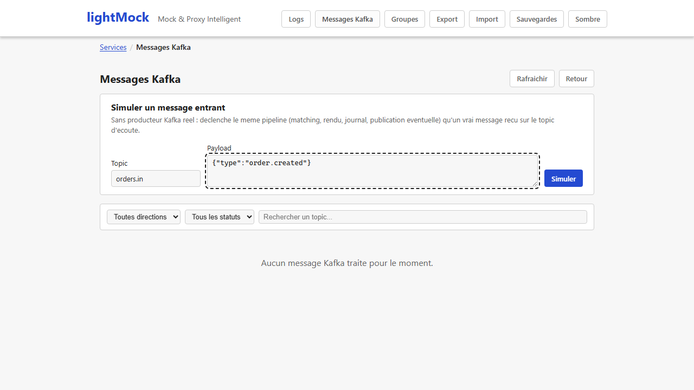

# Kafka messaging (optional)

Beyond HTTP requests, Mimicway can also answer **Kafka messages** (Kafka is a messaging system that lets applications talk asynchronously, as opposed to a direct HTTP call). This feature is **optional** and not part of every Mimicway build.

## Is it available on your instance?

**"Kafka messages"** only appears in the navigation bar when the running Mimicway binary was built with Kafka support (`--features messaging-kafka`). When it is missing, the feature is simply not part of your installation: it is not an error.

## How it works

Once enabled and connected to Kafka, Mimicway listens to a topic (a Kafka message channel) and applies **the same rules and dynamic responses** as for HTTP (conditions on the message content, [templates](responses-and-templates.md) to build the answer): the first rule that matches the incoming message applies, and its answer can be published to another topic.

A **message log**, like the HTTP [request log](request-log.md), shows the messages received, whether they matched, and their answer.

## Simulating a message without a Kafka server

**"Simulate an incoming message"** tests how Kafka rules behave directly from the interface, with no Kafka server sending the message: handy to check a rule before plugging it into a real flow.

## Requirements and limits

- **Needs a Mimicway build with Kafka support**, which is not the default. If "Kafka messages" does not appear, your installation does not include it.
- Also needs a Kafka server configured and reachable (`KAFKA_BROKERS`, `KAFKA_LISTEN_TOPIC`… see the README): without it, even a build with Kafka support does not start listening.
- A single global listening topic is handled (no topic per service): an incoming message is compared with the rules of **every** service, and the first match wins.
- [Rhai scripts](rhai-scripts.md) (pre-script, script, post-script) do **not** run for a Kafka message: they are for HTTP traffic.
- The message log is bounded in time and size: the oldest entries are removed (after `MESSAGE_LOG_TTL_MS`, 24 hours by default), and a large message is truncated in the log (`MESSAGE_LOG_MAX_BODY_SIZE`).
- With authentication on, reading the message log and simulating messages are reserved to super-admins.
