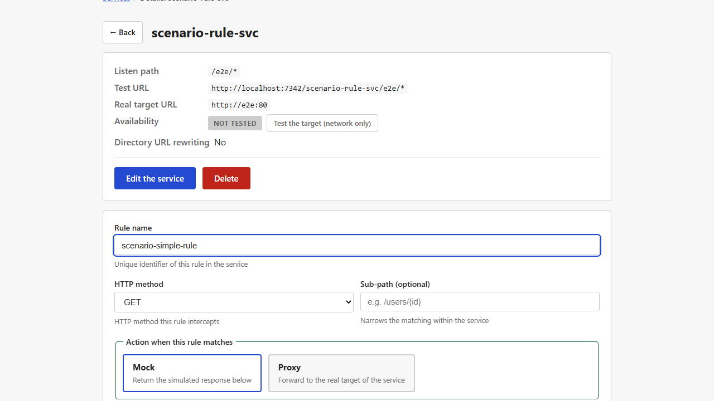
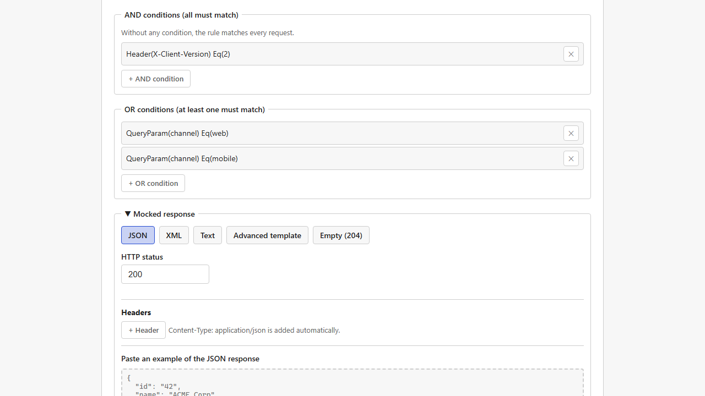
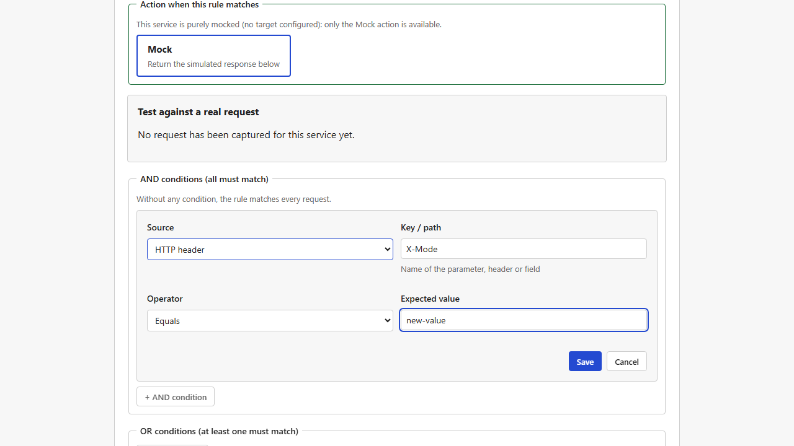
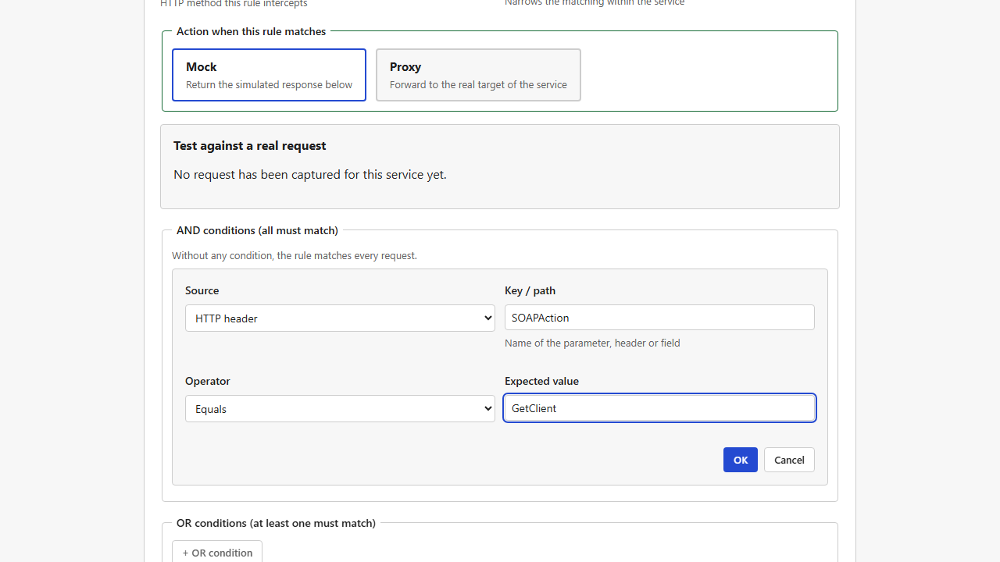
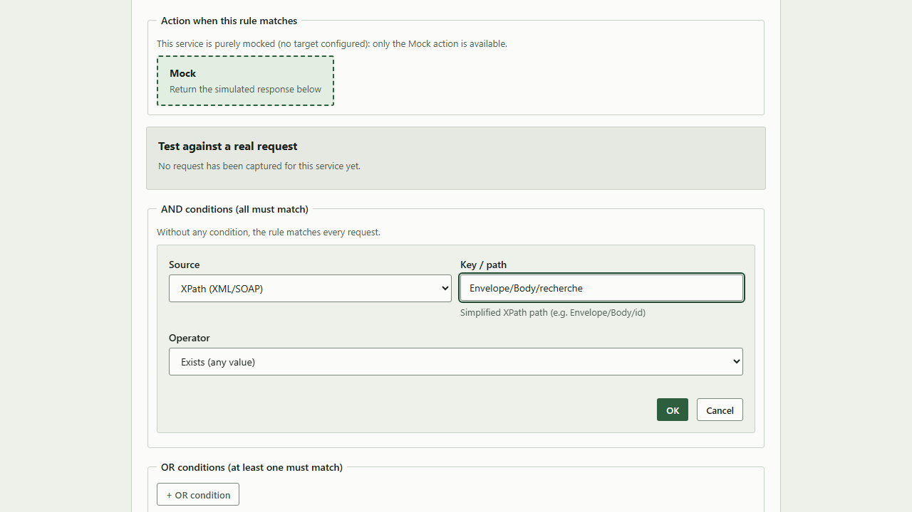
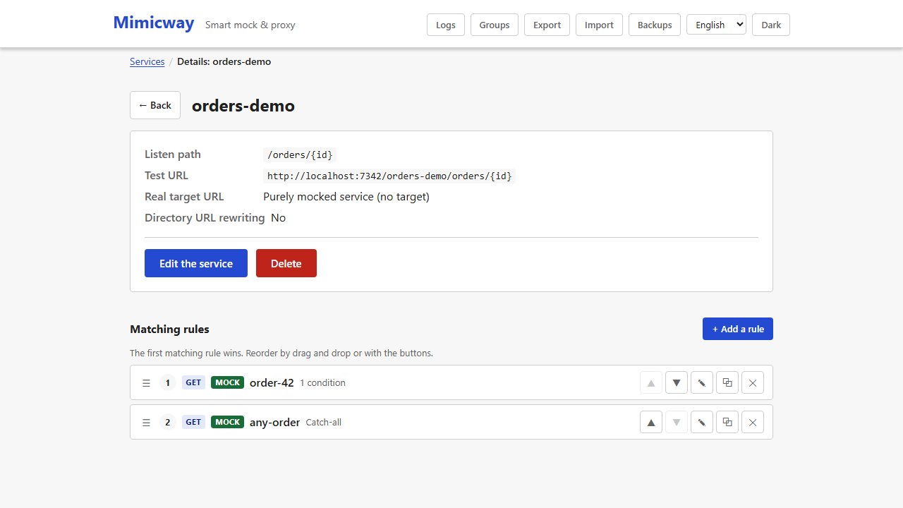

[Français](../fr/matching-rules.md)

# Matching rules

A [service](services.md) in mock mode can hold **several rules**. Each rule says "for which request" to send "which response". Rules are the heart of mocking: without one, a mocked service has nothing specific to answer.

## What a rule defines

- **Name**: identifies the rule in the interface (unique within the service).
- **HTTP method**: `GET`, `POST`, `PUT`, `PATCH`, `DELETE`, `OPTIONS` or `HEAD`. The rule carries the method, not the service, so one service can answer `GET` and `POST` differently.
- **Sub-path** (optional): added to the service's listen path, to tell apart rules on neighboring URLs. Left empty, the rule applies to any path under the service.
- **Conditions** (optional): extra criteria that narrow down when the rule applies (see below). Without conditions, the rule matches as soon as the method and sub-path do.
- **Action**: `mock` (answer with the configured content, see [Responses and templates](responses-and-templates.md)) or `proxy` (relay the requests it matches to the real backend, for a partial mock; see [Services and routing](services.md)). On a [purely mocked service](services.md#purely-mocked-service-no-target) (no real target), `proxy` is not offered.



**Opening a `proxy` rule on a service that has since become purely mocked**: the form shows it as `mock`, the only action left. Nothing changes until you save; if you do save the rule, even for another change such as a condition, Mimicway first warns that saving will really turn the rule from `proxy` into `mock`, and lets you confirm ("Save anyway") or go back.

## Conditions: targeting a request precisely

A condition compares a value found in the request (URL parameter, header, part of the body…) with an expected value. The sources:

| Source | Typical use |
|---|---|
| **Query parameter** (`?key=value`) | Match only when a query parameter is present, or has a given value |
| **HTTP header** | For instance, match on an `X-Client-Version` header |
| **Path parameter** (`{param}` in the URL) | Match only when `{id}` has a given value |
| **JSON Pointer** | Match on `amount` in a JSON body `{"amount": 100}` |
| **XPath (XML/SOAP)** | The same for an XML or SOAP body |
| **Form field** | For a body sent as `application/x-www-form-urlencoded` |
| **Raw body (whole text)** | Compare the body as it is, without parsing it |

The operators:

- **Equals** an exact value.
- **Contains** a substring.
- **Regular expression**: matches a pattern.
- **Exists (any value)**: only checks that the field is there.

Conditions combine in two ways:

- **AND conditions (all must match)**: the rule matches only when every condition holds.
- **OR conditions (at least one must match)**: the rule matches as soon as one holds.

A rule can use both: it then matches when **all** its AND conditions hold **and** at least one of its OR conditions does. The rule below answers clients that send the `X-Client-Version: 2` header and ask for the `web` or the `mobile` channel (`?channel=web` or `?channel=mobile`); a version 2 client on another channel, or a client without that header, does not trigger it.



### Typing help

For a path parameter, the form offers a closed list of the parameter names that the service's URL really contains (no typo possible). For a query parameter, it suggests the parameters seen in the recent [request log](request-log.md), while still accepting a name that does not appear there yet.

### Editing a condition

A condition added to a rule **can be edited in place**: click it in the list (it is shown as a button) to reopen the form used to add it, filled with its current source, key, operator and value. Change what you need, including the source (from a query parameter to an HTTP header, for instance), then confirm to save it where it was: the other conditions of the rule keep their order and content. "Cancel" closes the form without changing anything.



## Use case: one URL, a different answer per SOAP operation

A frequent question for SOAP/XML services: can **the same URL** answer differently depending on the `SOAPAction` header, or on the content of the envelope? **Yes, with no development**: create several rules on the same service, each with its own condition. Rules are evaluated in order and the first match wins (see below), so each SOAP operation gets its own mocked answer.

### Routing on the `SOAPAction` header

Create one rule per operation, each with an **HTTP header** condition on the `SOAPAction` key:

| Rule `get-client` | Rule `get-order` |
|---|---|
|  |  |

A `POST` to this service with `SOAPAction: GetClient` triggers `get-client` and its answer, while `SOAPAction: GetOrder` triggers `get-order`: **same URL**, no condition on the path. A request with another `SOAPAction` value, or without that header, matches neither rule and gets the "no rule matches" answer (see [Services and routing](services.md)).

### Variant: routing on the body instead of a header

Some SOAP clients send no usable `SOAPAction` header, or you may prefer to tell operations apart by the XML element sent in the envelope. Use an **XPath (XML/SOAP)** condition on the body instead, still one rule per operation:

- Rule `get-client`: source `XPath (XML/SOAP)`, key `Envelope/Body/GetClientRequest`, operator `Exists (any value)`. It matches any body whose envelope holds a `GetClientRequest` element in `Body` (the path ignores namespace prefixes such as `soap:Envelope`).
- Rule `get-order`: the same with `Envelope/Body/GetOrderRequest`.

The same idea works on a JSON body with a **JSON Pointer** condition, for instance `/type` equal to `"client"`.

#### Checked example: two SOAP operations told apart by the element in `Body`

Service `directory-soap`, path `/service`, two `POST` rules:

| Rule | Condition |
|---|---|
| `search-operation` | `XPath (XML/SOAP)`, key `Envelope/Body/recherche`, operator `Exists (any value)` |
| `mode-operation` | `XPath (XML/SOAP)`, key `Envelope/Body/mode`, operator `Exists (any value)` |



A `POST` with this body (note the empty `<Header></Header>` before `<Body>`, written with an opening and a closing tag, a common envelope layout):

```xml
<SOAP:Envelope>
  <SOAP-ENV:Header></SOAP-ENV:Header>
  <SOAP-ENV:Body>
    <ns3:recherche>
      <ns3:Nom>Test</ns3:Nom>
      <ns3:Siret>98765432109876</ns3:Siret>
    </ns3:recherche>
  </SOAP-ENV:Body>
</SOAP:Envelope>
```

triggers `search-operation`, and **not** `mode-operation`. A request with `<ns3:mode>...</ns3:mode>` instead of `<ns3:recherche>` triggers `mode-operation`. The path `Envelope/Body/recherche` holds **no namespace prefix** (no `SOAP:`, `SOAP-ENV:` or `ns3:`): that is the right syntax. Prefixes are always ignored in the path, and a path that includes them (`SOAP-ENV:Body/ns3:recherche`) would never match.

To copy a value of this SOAP body (the `Siret`, for instance) into the response, see [the use case in Rhai scripts](rhai-scripts.md#use-case-copy-a-value-from-a-soap-request-into-the-response).

## Which rule applies when several match?

A service's rules are evaluated **in the order they are listed**, and **the first match wins**: the next ones are not even looked at. Order matters: a general rule placed before a more specific one always hides it.

You can **reorder rules** in the list: drag a rule by its ☰ handle onto the handle of the rule whose place it should take, or move it one step with its ▲ ▼ buttons. The new order is saved at once. In the example below, the general rule `any-order` came first and answered every `GET /orders/{id}`, even `/orders/42` that `order-42` was written for; once `order-42` is dragged above it, `/orders/42` gets its own answer and every other order still gets the general one.



To avoid surprises, use the [rule tester and conflict detection](rule-tester-and-conflicts.md): when you save, it warns if a new rule may be hidden by an existing one (or hide it), without stopping you when that is what you want.

## Requirements and limits

- No requirement: available in every installation.
- Overlap detection between rules (see [rule tester and conflict detection](rule-tester-and-conflicts.md)) covers the common cases, not every possible one: it is a help, not a guarantee.
