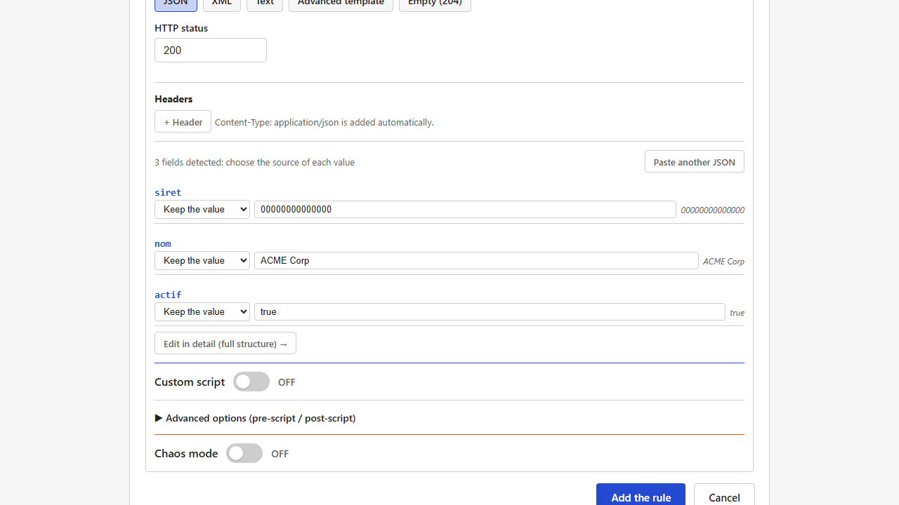
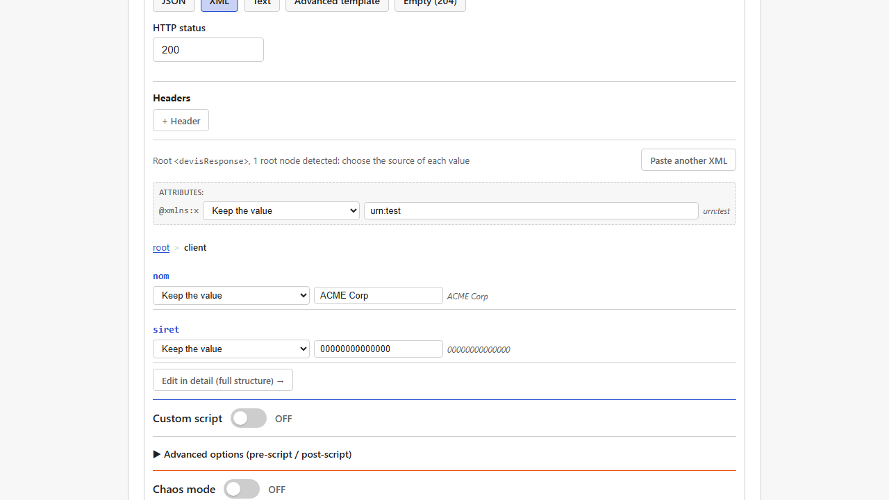
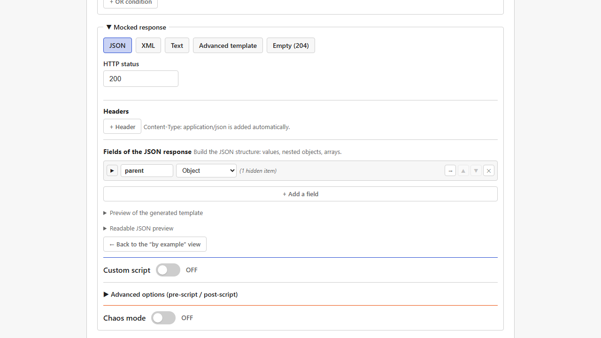
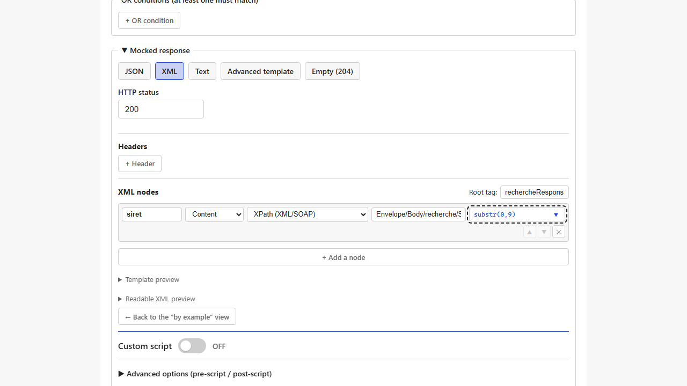

[Français](../fr/responses-and-templates.md)

# Responses and templates

Once a [rule](matching-rules.md) matches, Mimicway produces a response: an HTTP status, headers and a body (JSON, XML or text) that can be **static** or **dynamic** (holding values computed for each request).

## Pick a format, then a level of detail

The body is built in two steps: first a **format** (JSON, XML, Text, Advanced template, or Empty (204)), then, for JSON and XML only, an **editing level** (by example, or in detail). These levels are **not two modes to choose up front**: you always start by example (paste a sample), and **"Edit in detail (full structure) →"** reveals, on the *same* data, everything the detailed level offers, without losing anything you already entered.

### 1. By example: paste an existing response

For bodies that are already complex, it is often faster to **paste a real response** (one you got from the real backend, for instance): Mimicway detects every field, and you can then replace some values with variables or fake data, field by field. Each variable value can also get a **transformation** (see "Transformations" below), exactly as in the detailed level.

For JSON, the detected fields are listed **flat**, with indentation for nested levels: enough for REST payloads, which are usually shallow. A nested **object** field still shows a **chevron** (▼/▶) on its left to fold it for a while (a "(N hidden items)" note reminds you that content is hidden): handy when a pasted sample holds several nested objects and you want to focus on one. Folding never deletes anything: it only changes the view, and everything is unfolded by default.

For XML, often nested more deeply (a SOAP envelope, for instance), this level also offers:

- a **breadcrumb** ("→" enters a node, the clickable path takes you back out),
- **fold chevrons** (▼/▶), as for JSON,
- editing of the **XML attributes** of each element, root included: a detected attribute (such as a namespace declaration `xmlns:soap="..."`) can be replaced with a variable or kept, like text content.

Namespace prefixes (`soap:Envelope`) and `xmlns`/`xmlns:*` declarations are kept as they are, as text; Mimicway does not resolve them. Pasting XML with namespaces works without errors, but no semantic validation is done.

> The by-example level does not rename, add or remove a detected field or node: for that, click **"Edit in detail (full structure) →"** (see below).

### 2. In detail: the full structure

**"Edit in detail (full structure) →"**, under the list of fields, opens the complete editor on the *same* fields: rename a key, add, remove or reorder fields, change a type (value, object, array), and build a **brand-new** structure when you did not start from a sample (the button is there even when nothing was pasted: click it to start from scratch). Nothing is lost on the way: it reveals more capabilities on the data already there, it never converts or starts over.

**"← Back to the “by example” view"**, under the detailed editor, goes the other way at any time, losslessly too (same data, only the view changes). You can switch between the two levels as often as you like before saving the rule.

Each **object** or **array** field (JSON and XML) shows a **chevron** (▼/▶) on its left: click it to **fold** the field and hide its content for a while, handy once a branch is configured and you want to focus on the rest. A "(N hidden items)" note reminds you that content is hidden. Folding never deletes anything, and everything is unfolded when the form opens.

To move around a deeply nested structure, a breadcrumb above the editor (a clickable path such as `root > address > city`) lets you enter a level and come back out in one click.

### Changing format on the way

You can change format (from "Advanced template" to "XML", for instance) after you started writing a response. Mimicway then tries to **convert** what you already typed instead of starting over:

- **Advanced template → JSON** or **Advanced template → XML**: when the text is valid JSON or XML (with its `{{...}}` variables already in place), it is taken as it is into the by-example view of the new format: fields, values, pipes, and for XML the root tag and its attributes.
- When the content is **not** valid in the target format, a warning explains why it cannot be converted, and offers "Switch anyway" (start empty in the new format) or cancelling to fix the content first.
- Some conversions are deliberately left manual (XML → JSON, for instance): the warning says so and suggests going through "Advanced template" as an intermediate step.

### Reopening a rule restores its view

When you reopen a saved rule, Mimicway remembers **which view** built it (by example or in detail, JSON or XML) and opens that one. A rule built by example reopens by example (with "Edit in detail" still at hand), a rule built in detail reopens in detail. "Text" and "Advanced template" are restored too.

**Limit**: if the response was changed outside the interface (configuration file edited by hand, old backup restored) and no longer fits the shape the remembered view expects, Mimicway falls back to "Advanced template" instead of showing an error: your content stays visible and editable, only the structured view is not restored. Likewise, a JSON body whose root is an **array** (only possible by example) cannot be restored in a structured view when reopened: "Advanced template" takes over.

## Template syntax: `{{ }}`

Whatever editor you use, the result is a **template**: JSON or XML text in which passages between double braces are evaluated for each request.

| Written | Meaning |
|---|---|
| `{` and `}` (single brace) | Literal characters, as in any JSON or XML; **not** a variable |
| `{{variable}}` | An expression evaluated for each request |
| `{{variable \| transformation}}` | A variable, then transformed (see "Transformations" below) |

Example: `{"siret":"{{path.siret}}"}` returns the `siret` path parameter of the request.

### Variables

| Variable | Content |
|---|---|
| `path.X` | Value of the path parameter `X` (`{id}` in the service's URL, for instance) |
| `query.X` | Value of the query parameter `X` (`?X=...`) |
| `header.X` | Value of the HTTP header `X` |
| `body.X` | Value at the JSON pointer `X` in the request body (JSON bodies only) |
| `xpath.X` | Value at the simplified XPath `X` in the request body (XML or SOAP bodies only) |
| `fake.KindName` | Generated fake data (see below) |
| `uuid` | A generated unique identifier |
| `now_ms` / `now_iso` / `now_epoch` | The current date and time, in several formats |
| `seq` | A call counter |
| `script` / `pre_script` / `post_script` | The result of a [Rhai script](rhai-scripts.md) of the rule, if you wrote one |

In the builder (both levels, JSON and XML), each variable is an option of the **source** menu of each field: "URL parameter {param}", "Query param", "HTTP header", "Script result", and so on. A few deserve a word:

- **"Echo of the body (JSON pointer)"** (`body.X`) only extracts a value when the request body is **JSON**. On an XML or SOAP body it always gives nothing (the body is simply not valid JSON): an empty value, not an error.
- **"XPath (XML/SOAP)"** (`xpath.X`) is the equivalent for an **XML or SOAP** body, offered in the **XML** response builder (both levels). The path follows the same simplified syntax as an [XPath condition](matching-rules.md#use-case-one-url-a-different-answer-per-soap-operation): segments separated by `/`, **without namespace prefixes** (`Envelope/Body/recherche/Siret`, not `SOAP-ENV:Body/ns3:recherche`). It covers "take this value from the request and put it back in the response" without a [Rhai script](rhai-scripts.md#use-case-copy-a-value-from-a-soap-request-into-the-response).
- **"Script result"** (`script.X`): once this source is chosen, a **"Value"** field appears (JSON and XML, both levels) to say **which key** of the script's result to use. Leave it empty to take `{{script}}` as it is (the whole result, when the script returns a plain string), or type a key (`name`, for instance) to get `{{script.name}}` (when the script returns a map `#{ name: "...", ... }`). Without it, there would be no way to pick one of several returned values.

**Checked example**: a `siret` field with the source **"XPath (XML/SOAP)"**, the value `Envelope/Body/recherche/Siret` and the transformation `substr(0,9)` (to keep the first 9 characters):

Against a `POST` whose SOAP body holds `<ns3:Siret>98765432109876</ns3:Siret>` under `Envelope/Body/recherche` (even with a `<Header></Header>` written in full before `<Body>`), the response contains `<siret>987654321</siret>`.

### Transformations (pipes)

A variable can be transformed before it is inserted: `lower`, `upper`, `trim`, `capitalize`, `first(N)` (the first N characters), `last(N)`, `substr(start,length)`, `default("value")` (fallback when empty), `replace("a","b")`, `prepend("x")` (adds in front), `append("x")` (adds after), `length`.

Example: `{{path.siret | first(9)}}` keeps the first 9 characters of the SIRET received.

### Fake data (`fake.*`)

To fill a response with realistic-looking data without typing it: first name, last name, email, French phone number, company, street, city, postcode, SIREN/SIRET, full address, past or future date, timestamp, random boolean, filler sentence ("lorem"), country, French IBAN. The builder also offers an integer in a range (`Integer{min,max}`). Several kinds follow French formats today; locale-aware fake data is planned (see the [roadmap](../../ROADMAP.md)).

## Chaos mode: failures and slowness on demand

To test how an application copes with an unreliable backend, each mocked response can turn on a "chaos mode":

- **Latency**: a fixed delay, or a random one between a minimum and a maximum, before answering.
- **Error rate**: a share of requests that get an HTTP error instead of the normal response (configurable status, `500` by default).

## Requirements and limits

- No requirement: available in every installation.
- The by-example level does not rename, add or remove fields: click "Edit in detail" for that, without losing what you entered.
- In XML, a namespace (`xmlns:...`) is kept as it is in the tag or attribute, without resolution (see "By example" above).
- In XML still, a node that mixes direct text and child elements ("mixed content") is not represented faithfully: the child elements are kept, the direct text is dropped.
- A JSON body whose root is an array (only possible by example) cannot be restored in a structured view when the rule is reopened (see "Reopening a rule restores its view" above).
