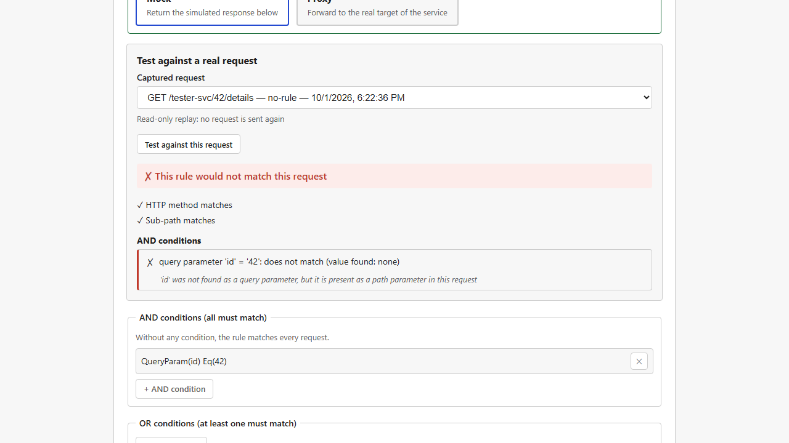
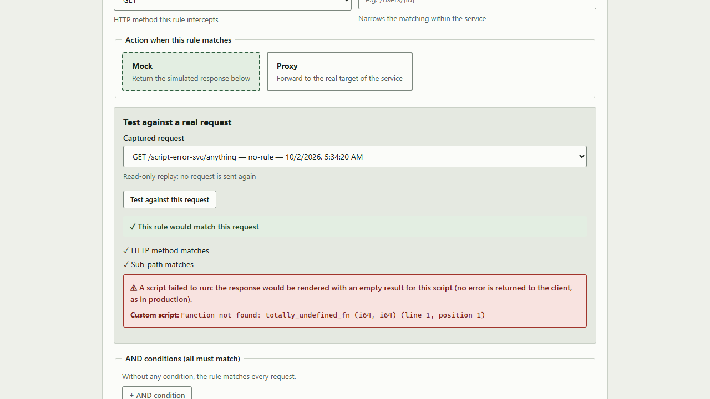
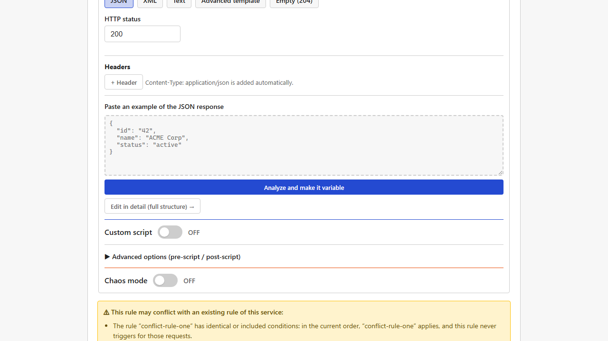

[Français](../fr/rule-tester-and-conflicts.md)

# Rule tester and conflict detection

Two quality aids built into the [rule](matching-rules.md) editor, against the two most frequent traps when configuring rules: "why does my rule not match?" and "why does another rule answer instead of mine?".

## The rule tester: check against real traffic

While you create or edit a rule, **"Test against a real request"** checks the draft against a **request Mimicway really received** recently (from the [request log](request-log.md)), without saving the rule first or sending a new request.

For each condition of the rule, the result says whether it matched and, above all, **why**. A typical case: you set a condition on a "query parameter" (`?key=value`) while the value was really in a "path parameter" of the URL (`{key}`). Without help, the rule just did not match, with no clue. The tester spots this kind of mix-up and says so ("`key` was not found as a query parameter, but it is present as a path parameter in this request").

### Catch a broken script before saving

When your rule holds [Rhai scripts](rhai-scripts.md), the tester really runs them against the selected request (only when the rule matches it, as in production). When a script fails, for instance because it calls a function that does not exist, an explicit message names the failing block (custom script, pre-script or post-script) and the exact error.

This matters because once the rule is saved, a script error **never blocks the response**: the request is still served, with an empty result for the failing script, and nothing visible for whoever receives the response. The tester is where such a problem becomes visible again, before saving; see [Rhai scripts: when a script fails](rhai-scripts.md#when-a-script-fails).

### See what a script really produced, even without error

A script can run **without any error** and still produce something other than what you expected: a misspelled key, or a nested field that does not behave like a JSON path (see [Rhai scripts: pick a whole object from a list](rhai-scripts.md#use-case-pick-a-whole-object-not-just-a-value-from-a-list)). With no error to report, nothing would point to it.

For each script that runs without error, the tester therefore shows **the result it really produced**: each template variable it makes available (`{{script}}`, or `{{script.field}}` for each field of the returned map), with its exact value. It is the most reliable way to notice that a key you meant to use does not exist, or that a field you thought held a simple value holds a whole JSON block.

## The conflict detector: a warning when you save

Mimicway applies the **first rule that matches** a request (see [Matching rules](matching-rules.md)), so the order of the list matters. With many rules, it is easy to add one that, unintentionally, is **hidden** by a more general rule placed before it (or the reverse).

Each time a rule is saved (created or edited), Mimicway compares the draft with the service's other rules and shows a warning when a plausible overlap is found, saying **which of the two rules would really apply** in the current order.

The warning **never blocks**: two choices are always offered,

- **Save anyway**, when the overlap is intended (a general fallback rule placed on purpose after more specific ones, for instance),
- **Edit the rule**, to review it before saving.

## Requirements and limits

- No requirement: available in every installation.
- The tester can only check your draft against requests that **already went through** Mimicway and are kept in the log. If none fits yet, send one (with `curl`, Postman or the application under test) and come back to the tester.
- A request relayed by a service in proxy mode (see [Services and routing](services.md)) has no details kept in the log, so as not to slow that path down: the tester says that no details are available for those entries.
- The tester only runs scripts when the rule matches the selected request and its action is "Mock": as in production, the script of a "Proxy" rule never runs.
- Conflict detection catches the common, clear-cut cases (same conditions, a more specific rule behind a more general one…) but does not promise to find **every** possible overlap, especially complex combinations of OR conditions. It deliberately never raises a false alarm, at the cost of missing some edge cases: a warning you see deserves trust.
- The detection is **informative only**: it never changes the actual order of evaluation or the behavior of rules.
