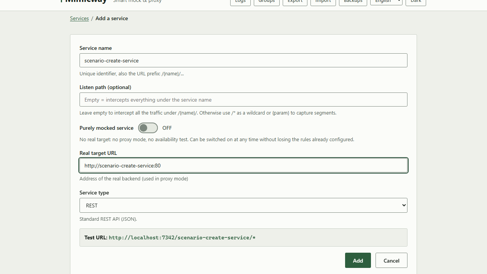
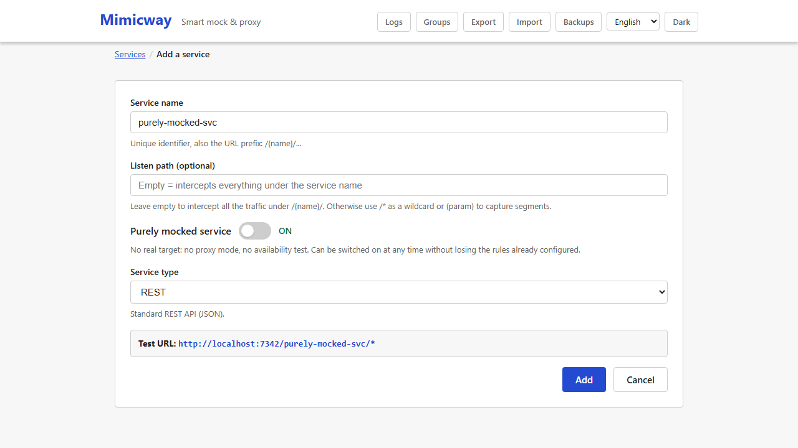
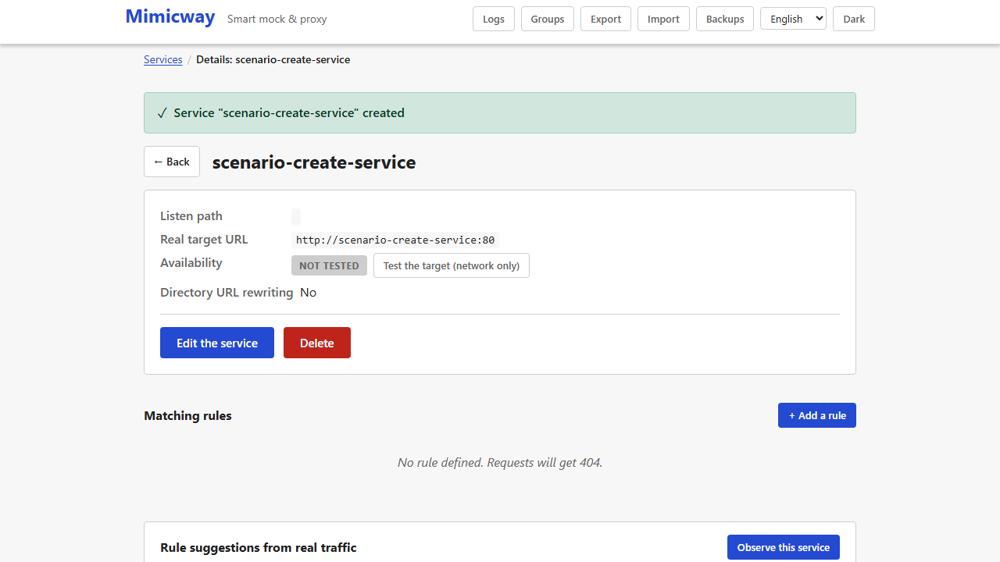
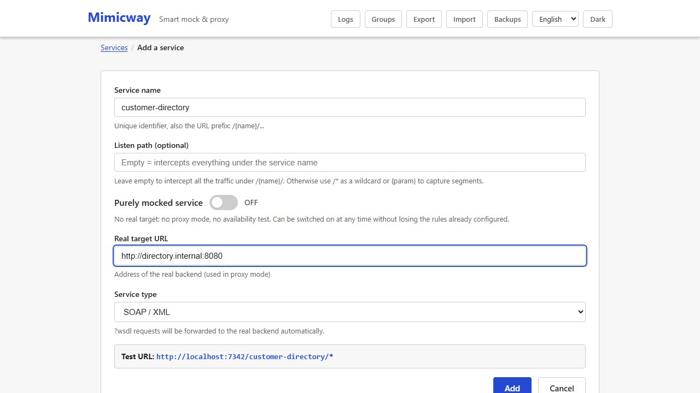

# Services and routing

A **service** is the basic unit of Mimicway: it stands for one API you want to mock or relay. Each service you create is reachable at once on its own URL, without restarting anything.

## Creating a service

On the home screen, **"+ Add a service"** opens a form with:

- **Name**: identifies the service and is the first segment of its URL (see below). Letters, digits, dashes and underscores only.
- **Listen path** (`listen_path`): the part of the URL after the service name, for example `/v1/users/{id}`. It can hold parameters in braces (`{id}`) that responses can reuse. Left empty, the service answers **any path** under its name.
- **Purely mocked service** (switch): see the next section.
- **Real target URL** (`real_target_url`): the address of the real backend, used when a request is relayed in proxy mode (see below) and by the [availability check](availability-check.md).
- **Service type**: REST (default) or SOAP; see the section further down.
- **Group** (optional, offered once a group exists): attaches the service to a [group](groups.md).

A new service with a target starts in proxy mode: it relays every request until you turn on the **Mock** switch of its card in the service list (see below).



## Purely mocked service (no target)

Some services are never meant to relay a real request: they only produce mocked answers, and typing a target URL for them is pointless. The **"Purely mocked service"** switch removes that step:

- Once it is on, the **Real target URL** field disappears from the form, and so does the [availability check](availability-check.md), which means nothing without a target.
- The service stays in mock mode (the mock switch cannot be turned off for a service without a target: relaying to nowhere could only fail).
- Turning it off at any time, including when editing, shows the target field again without losing anything: rules, group and service type stay as they were.



**A request that no rule matches**: on a purely mocked service, the answer is a `404` with an explicit message ("this service is purely mocked, no target configured") rather than a failed attempt to relay to an empty address.

**A rule with the "Proxy" action makes no sense on a purely mocked service**, so the rule form only offers "Mock" for such services.

**Making an existing service purely mocked while some of its rules use "Proxy"**: Mimicway warns instead of blocking. The message lists the rules concerned (they will stop relaying and answer with a clear error) and offers "Save anyway" or going back to fix them first.

## How the URL is built

Each service lives in its own namespace, so services never collide:

```
/{service-name}/{listen-path}
```

or, when the service belongs to a group:

```
/{group-code}/{service-name}/{listen-path}
```

| Service name | Listen path | URL to call |
|---|---|---|
| `insee` | `/v4/sirene/{siret}` | `GET /insee/v4/sirene/44306184100047` |
| `accounts` | `/login` | `POST /accounts/login` |
| `users` | *(empty)* | `GET /users/anything` (any path) |

The exact URL to call is always shown on the service's page: no need to work it out by hand.



## Mock or proxy: two modes, two levels

Mimicway can either **answer a request itself** (*mock* mode, with the response you configured) or **pass it to the real backend** and return its answer unchanged (*proxy* mode). The choice exists at two levels:

- **Service level**: the mock switch turns the WHOLE service into a pure proxy (no rule is evaluated, every request goes straight to `real_target_url`) or into mock mode (the service's rules are evaluated, see [Matching rules](matching-rules.md)).
- **Rule level**: while the service is in mock mode, each rule can itself be set to "mock" (answer with the configured content) or "proxy" (relay the requests it matches to the real backend). This gives a **partial mock**: for instance, mock only the error cases and let everything else reach the real service.

Either way, a relayed request keeps its method, parameters, headers and body: nothing is changed or lost on the way.

## Service type: REST or SOAP

The "Service type" selector sets how technical SOAP requests are handled (WSDL, the file that describes a SOAP API):

- **REST** (default): standard behavior, no SOAP-specific handling.
- **SOAP**: WSDL requests can either be **relayed as they are to the real backend** (`Proxy`/`Auto`, handy to let a SOAP client discover the real API contract) or **answered by your mocked rules** (`Mock`, to mock the service description too).



Turning a service into a SOAP one happens entirely in this form: nothing else needs configuring.

## Editing, duplicating, deleting

- **Edit** opens the same form, filled in.
- **Duplicate** fills a new form from an existing service (suggested name `{name}-copy`, which you can change): a quick way to build a variant.
- **Delete** removes that service only: a service with the same name in another group is not affected (two services may share a name as long as they are in different groups, or one has no group and the other has one).

## Finding a service

The service list has a search field that filters by name, path, URL or group, and opens the group of a match that sits in a collapsed group.

## Requirements and limits

- No requirement: available in every installation.
- A service name must be unique **within its scope** (no group, or one group). Two services with the same name in two groups are allowed and told apart everywhere in the interface.
- Some names are reserved by Mimicway itself (`api`, `auth`, `assets`, `index.html`, `favicon.ico`, `runtime-config.json`) and cannot name a service, so that they never hide the interface.
