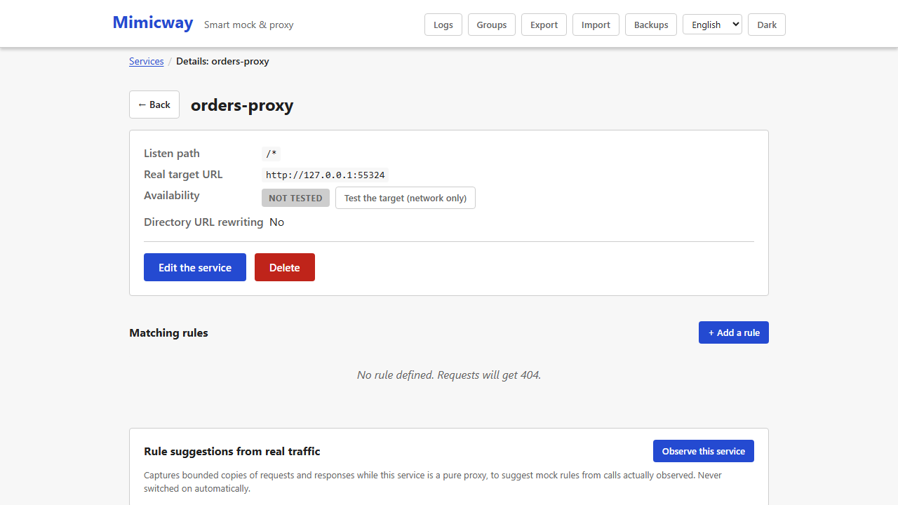
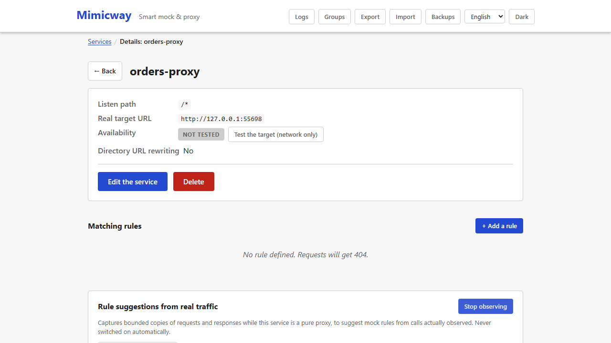
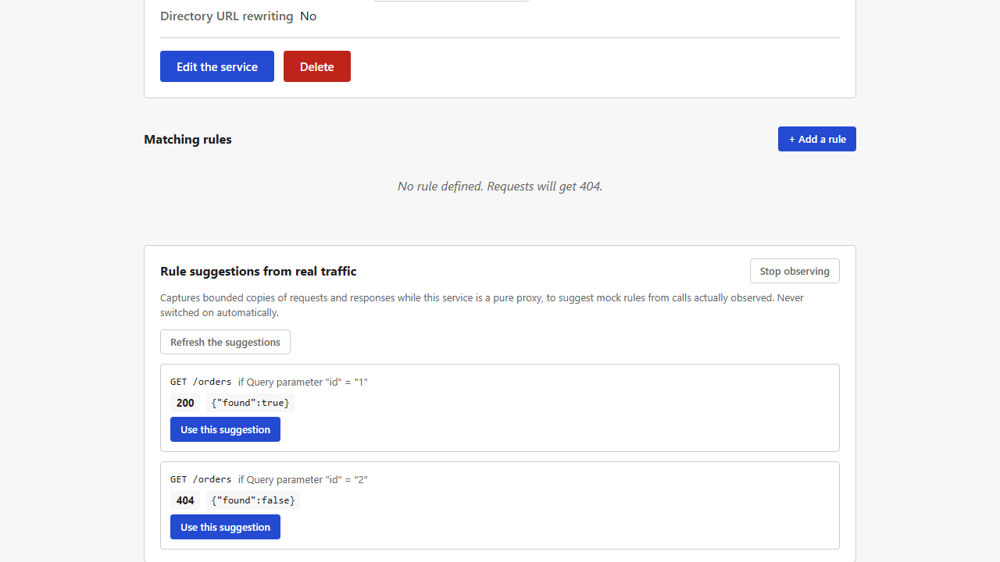
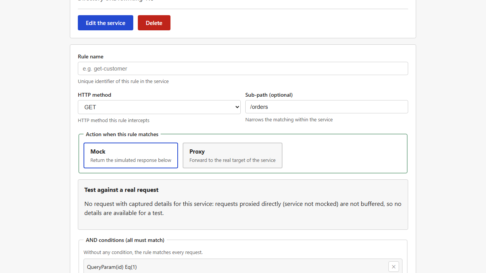

[Français](../fr/traffic-observation.md)

# Traffic observation and rule suggestions

For a service in **pure proxy** mode (not mocked at all yet), Mimicway can watch the traffic really exchanged with the real backend and **suggest mock rules** from what it saw, instead of having you write them all by hand. Nothing starts by itself: you turn it on explicitly, service by service.

## Turning observation on

On the page of a service **in proxy mode** (`is_mocked` off), the "Rule suggestions from real traffic" panel offers **"Observe this service"**. Once clicked, Mimicway captures (within bounds, see "Limits" below) the request and the response of each call relayed to the real backend, as long as observation stays on.

This changes **nothing** in how the proxy behaves (the request is still relayed as it is): it only adds a capture on the side, which you can turn off at any time.

## The trap Mimicway avoids

Two calls to the same endpoint (same method, same path) can legitimately get different answers: a parameter, a header or an identifier that changes also changes the real backend's answer. A rule generated naively from the **first** call seen would silently break every other case.

Mimicway therefore waits until it has seen **several calls** to an endpoint before suggesting anything, then:

- When every observed response is the same, it suggests a rule **without conditions**.
- When the responses vary and a query parameter, a JSON body field or a header **predicts exactly** which response comes back for which value, it suggests **one rule per value**, each with its condition.
- When the responses vary **and no field explains it reliably**, it suggests no rule. A message reports the variance, rather than a rule that would silently break some calls.

## Using a suggestion

**"Refresh the suggestions"** reads the traffic observed since observation was turned on and computes the suggestions again (nothing refreshes in the background). **"Use this suggestion"** does **not** create the rule: it fills the usual rule form (method, sub-path, condition, response), so that you review, adjust and save it like any other rule.

## Requirements and limits

- Only for a service in **pure proxy** mode (`is_mocked` off): "Observe this service" is refused otherwise, since observation only makes sense on traffic relayed to a real backend.
- A call is captured only when the sizes of its request and response are known in advance (a `Content-Length` header, or no body). A response streamed in chunks (`Transfer-Encoding: chunked`, no announced size) is still relayed normally but not observed.
- The number of observations kept is bounded, per endpoint and overall (see the `TRAFFIC_OBSERVATION_*` settings in the README): beyond that, the oldest are replaced by the newest, so memory never grows without limit.
- Credentials are never captured: `Authorization`, cookies, API-key headers and any header listed in `REDACT_HEADERS` are kept as `[redacted]`, and suggested rules never copy them.
- Observation stops by itself when its service is deleted, and on every full reset of the configuration.
- Like the [request log](request-log.md), nothing is written to disk: a restart of Mimicway starts with no observation.
