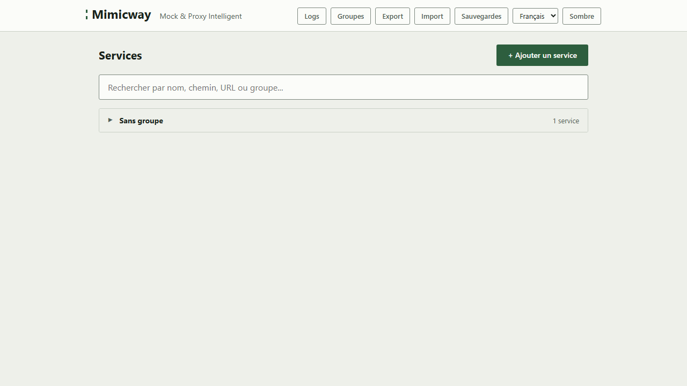
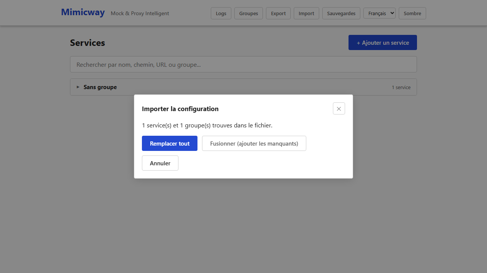
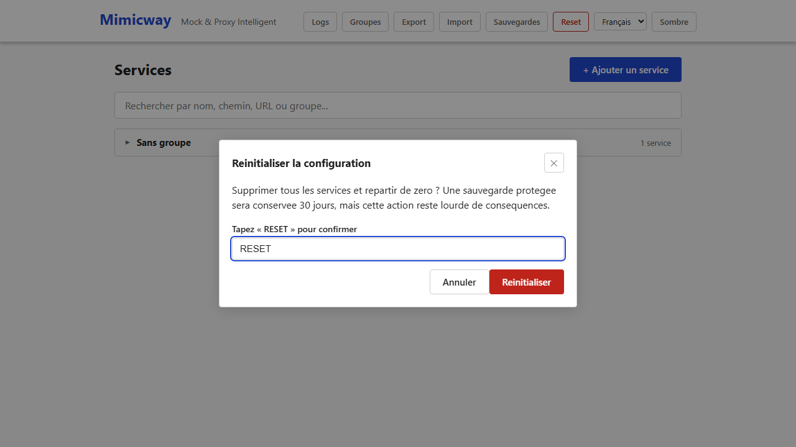

[English](../en/administration.md)

# Administration : import, export, réinitialisation, mode sombre

Quelques fonctionnalités qui portent sur l'ensemble, depuis la barre de navigation en haut de l'interface.

## Export : enregistrer toute la configuration dans un fichier

**« Export »** télécharge un fichier qui contient toute la configuration actuelle (tous les services, groupes et règles) : pratique pour partager une configuration avec un collègue, la versionner, ou en garder une copie avant un changement risqué.

## Import : charger une configuration depuis un fichier

**« Import »** charge un fichier exporté auparavant (ou un exemple comme [examples/devops-toolchain.json](../../examples/devops-toolchain.json)). Deux modes sont proposés :

- **Remplacer tout** : la configuration importée remplace entièrement la configuration actuelle.
- **Fusionner (ajouter les manquants)** : les services et groupes importés s'ajoutent à ceux qui existent, sans rien supprimer ; un groupe qui existe déjà sous le même nom, ou un service qui existe déjà sous le même nom dans le même groupe, reste tel quel.

Avant tout changement, la fenêtre indique combien de services et de groupes contient le fichier ; « Annuler » laisse la configuration intacte.

> Comme pour tout changement, une [sauvegarde automatique](backups-and-restore.md) de l'état précédent est écrite avant l'import : une erreur reste réversible.

## Réinitialisation complète

**« Reset »** supprime **tous** les services et groupes d'un coup. C'est destructeur, d'où une double protection :

- Une **confirmation explicite** est exigée : le bouton de confirmation ne se déverrouille qu'une fois un mot-clé exact saisi, si bien qu'on ne peut pas le cliquer par accident.
- Une [sauvegarde spéciale](backups-and-restore.md), hors de portée de la rotation normale pendant 30 jours, est écrite juste avant, pour permettre un retour en arrière.

Le mot-clé est `RESET` : le bouton de confirmation reste grisé tant qu'il n'est pas saisi exactement, en majuscules.

## Mode sombre

Le bouton **« Sombre »/« Clair »** de la barre de navigation change le thème visuel. Votre choix est retenu pour vos prochaines visites ; tant que vous n'avez pas choisi, le thème suit la préférence de votre navigateur ou de votre système.

## Langue

Le sélecteur de langue de la barre de navigation fait passer l'interface d'une langue disponible à l'autre (l'anglais et le français aujourd'hui). Votre choix est retenu ; tant que vous n'avez pas choisi, l'interface suit la langue de votre navigateur, et à défaut l'anglais. Les messages d'erreur du serveur suivent le même choix.

## Prérequis et limites

- Aucun prérequis : disponible dans toutes les installations.
- « Reset » n'est affiché qu'aux utilisateurs autorisés à s'en servir (les super-admins quand l'[authentification](authentication.md) est activée ; sinon, son affichage dépend d'un réglage choisi par qui exploite votre instance). Dans tous les cas, le serveur vérifie lui-même l'autorisation : masquer ou afficher le bouton n'est jamais la protection.
- Import et export portent sur **toute** la configuration : ces boutons n'exportent pas un service ou un groupe isolé.
