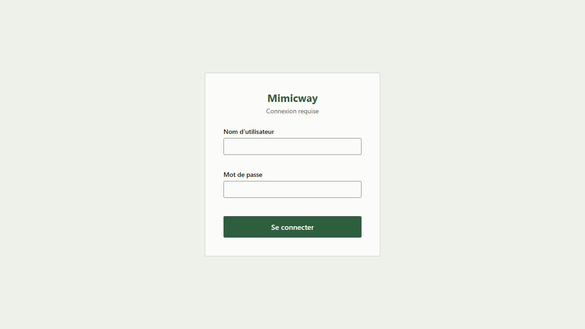
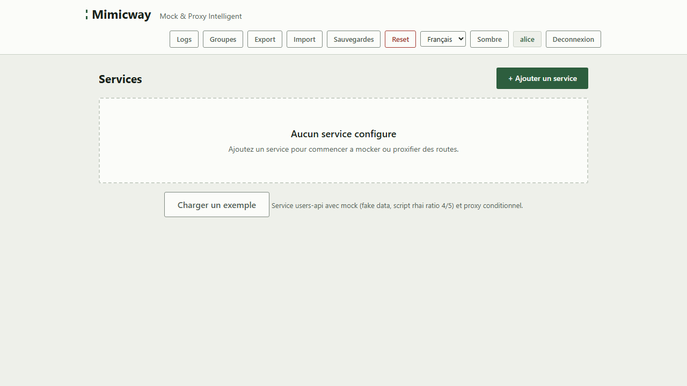

[English](../en/authentication.md)

# Authentification

Par défaut, Mimicway est **ouvert à toute personne** qui peut l'atteindre : n'importe qui peut tout voir et tout modifier, sans se connecter. Cela convient au poste d'un développeur ou à un environnement de test fermé, et c'est pourquoi le binaire n'écoute par défaut que sur la machine locale. L'authentification peut être **activée** au besoin, par exemple pour un environnement partagé entre plusieurs équipes.

## Fonctionnement une fois activée

Avec l'authentification activée, Mimicway s'appuie sur **Keycloak** (un serveur d'identité que votre organisation exploite peut-être déjà) pour vérifier les identités : un écran de connexion apparaît, et l'accès dépend ensuite de l'utilisateur connecté.

Les droits d'accès dépendent alors :

- De l'appartenance de l'utilisateur aux [groupes de services](groups.md) : les administrateurs d'un groupe gèrent le groupe et ses services, les membres travaillent sur ses services.
- D'une liste de **super-admins**, qui peuvent tout faire, y compris les actions sensibles (réinitialisation complète, restauration de sauvegardes, services hors groupe).

Les droits exacts de chaque point d'accès sont listés dans le [guide du relecteur](../../REVIEWING.md#authorization-matrix).

Une fois connecté, le nom d'utilisateur s'affiche en badge dans la barre de navigation ; ici, l'utilisateur est aussi super-admin, d'où le bouton « Reset » à côté du badge.

## Prérequis et limites

- **Désactivée par défaut.** L'activer est une décision de qui exploite Mimicway (variables d'environnement au démarrage, voir le README), pas une option de l'interface. Si vous ne savez pas si elle est active sur votre instance, regardez si un écran de connexion apparaît à l'ouverture.
- Elle nécessite un serveur Keycloak que Mimicway peut joindre. Quand l'authentification est activée mais que ses réglages manquent, Mimicway refuse de démarrer plutôt que de tourner à moitié protégé.
- **Mimicway n'a besoin d'aucune passerelle d'authentification devant lui.** Il sert son propre écran de connexion, y compris quand l'authentification est activée : la page elle-même (HTML, script, styles) est accessible sans jeton, et seule l'API de gestion (services, groupes, sauvegardes…) en exige un. Fonctionner derrière un proxy inverse ou une passerelle est possible, jamais obligatoire.
- Les services simulés eux-mêmes n'exigent jamais de jeton Mimicway : ils transportent les identifiants des applications testées.
- Les jetons sont vérifiés par Mimicway lui-même avec les clés publiées par le realm (signature, émetteur, expiration, client) ; voir le [modèle de sécurité](security.md#authentification).
- Seul Keycloak est pris en charge aujourd'hui, via sa connexion par mot de passe. Les autres fournisseurs OpenID Connect et une connexion par redirection du navigateur (code d'autorisation avec PKCE) sont prévus dans la [feuille de route](../../ROADMAP.md).
- Le bouton « Reset » (réinitialisation complète, voir [Administration](administration.md)) peut être affiché ou masqué indépendamment de l'authentification, mais sa présence à l'écran n'est **jamais** la protection : le serveur vérifie toujours l'autorisation.
