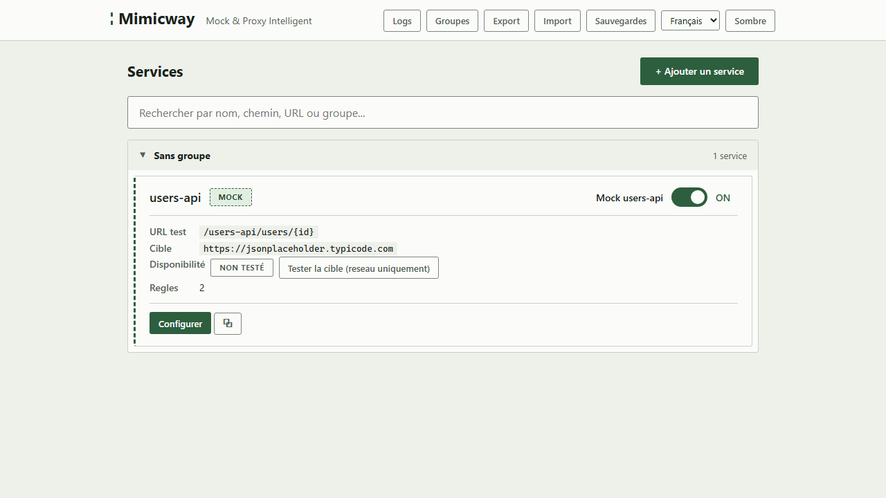

[English](../en/availability-check.md)

# Test de disponibilité

Sur la carte et sur la page d'un [service](services.md), le bouton **« Tester la cible (réseau uniquement) »** vérifie si le vrai backend (`real_target_url`) est joignable sur le réseau.

## Ce que fait le test, et ce qu'il ne fait pas

Il ouvre seulement une **connexion réseau brute** (une connexion TCP) vers l'adresse et le port du backend, avec un délai d'expiration court. Il **n'envoie jamais de requête HTTP** (pas de `GET`, pas de `HEAD`, aucun appel à une route de l'API cible) :

- ✅ « Accessible » signifie que le réseau permet d'atteindre cette adresse.
- ❌ Cela ne dit **rien** de la santé de l'API elle-même, qui peut être en panne tout en restant joignable.

C'est voulu : le test ne doit jamais avoir d'effet de bord sur le vrai backend (pas de trace applicative de son côté, pas de quota d'API consommé, etc.).

## États

| État | Signification |
|---|---|
| Non testé | Aucun test n'a encore été lancé pour ce service |
| Test en cours… | La vérification réseau est en cours |
| Accessible | La connexion a réussi |
| Inaccessible | La connexion a échoué (backend arrêté, mauvaise adresse, pare-feu…) |
| Expiré | Le dernier résultat a plus de 2 minutes : relancez le test pour un résultat à jour |

Un nouveau clic dans les 2 minutes qui suivent un test reprend son résultat sans ouvrir de nouvelle connexion.

## Prérequis et limites

- Aucun prérequis : disponible dans toutes les installations.
- Proposé seulement quand le service a une `real_target_url`.
- Le résultat n'est **pas enregistré** avec le service : c'est un état temporaire, effacé au redémarrage de Mimicway.
