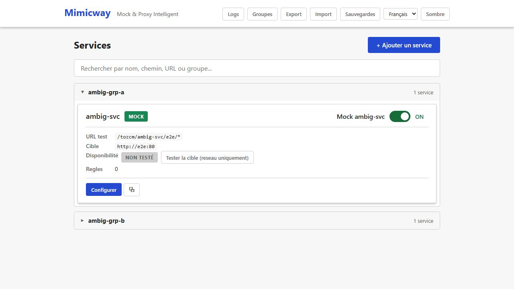
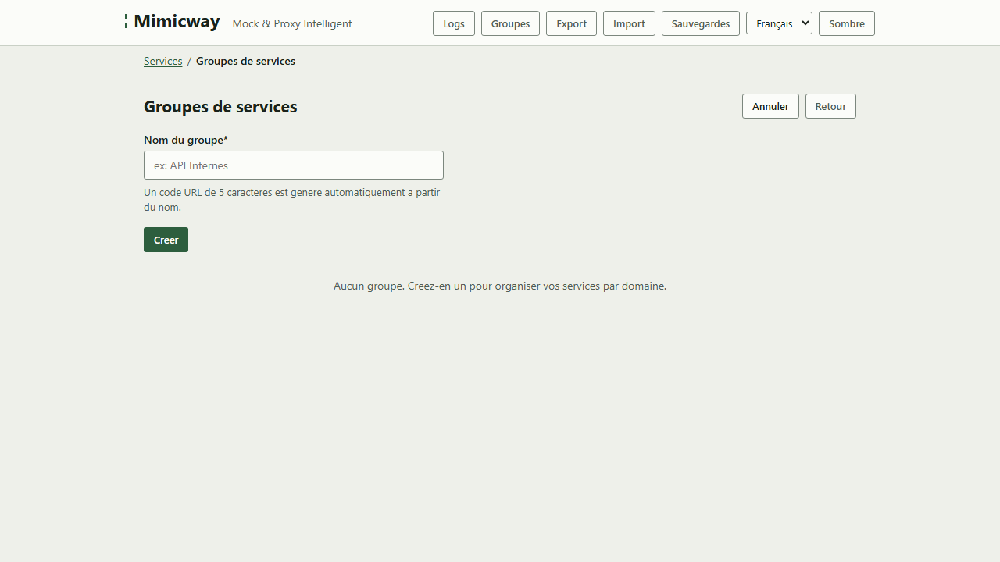

[English](../en/groups.md)

# Groupes de services

Quand le nombre de services simulés grandit, les groupes gardent l'interface lisible et permettent de gérer les accès par équipe ou par domaine fonctionnel.

## À quoi sert un groupe

Un groupe rassemble plusieurs [services](services.md) sous :

- Une **section repliable** dans la liste (un accordéon par groupe), pour qu'une longue liste reste facile à parcourir.
- Un **préfixe d'URL commun** : les services d'un groupe sont joignables sous `/{code-du-groupe}/{nom-du-service}/...` plutôt que `/{nom-du-service}/...`.
- **Leurs propres droits d'accès** (administrateurs et membres du groupe) quand l'[authentification](authentication.md) est activée.

## Créer un groupe

Le bouton « Groupes » de la barre de navigation ouvre un court formulaire qui ne demande que le **nom** du groupe. Un **code de 5 caractères** est déduit du nom (un même nom donne toujours le même code) ; ce code préfixe les URL des services du groupe. Il n'y a rien à saisir pour lui.

**Qui peut créer un groupe ?** N'importe quel utilisateur. La personne qui crée un groupe en devient administratrice.

## Membres et droits

Chaque groupe a deux catégories d'utilisateurs :

- Les **administrateurs** peuvent modifier ou supprimer le groupe et gérer sa liste d'administrateurs et de membres.
- Les **membres** peuvent travailler sur les services du groupe (voir [authentification](authentication.md) pour les droits exacts).

Un **super-admin**, quand il y en a un de configuré, peut gérer tous les groupes.

> Quand l'authentification est désactivée sur votre Mimicway, tout le monde peut tout faire : administrateurs et membres de groupe ne sont alors qu'indicatifs.

## L'état déplié ou replié est conservé pendant la navigation

Quand vous dépliez un groupe puis allez modifier un de ses services, le groupe est toujours déplié à votre retour sur la liste : vous ne perdez pas votre place. Un rechargement complet de la page (F5) le remet à zéro : c'est un confort pendant la navigation, pas une préférence enregistrée.

## Prérequis et limites

- Aucun prérequis : disponible dans toutes les installations.
- Un nom de groupe doit être unique, sans tenir compte des majuscules.
- Les droits fins (qui voit quoi) ne s'appliquent que si l'[authentification](authentication.md) est activée ; sans elle, tout le monde a un accès complet.
