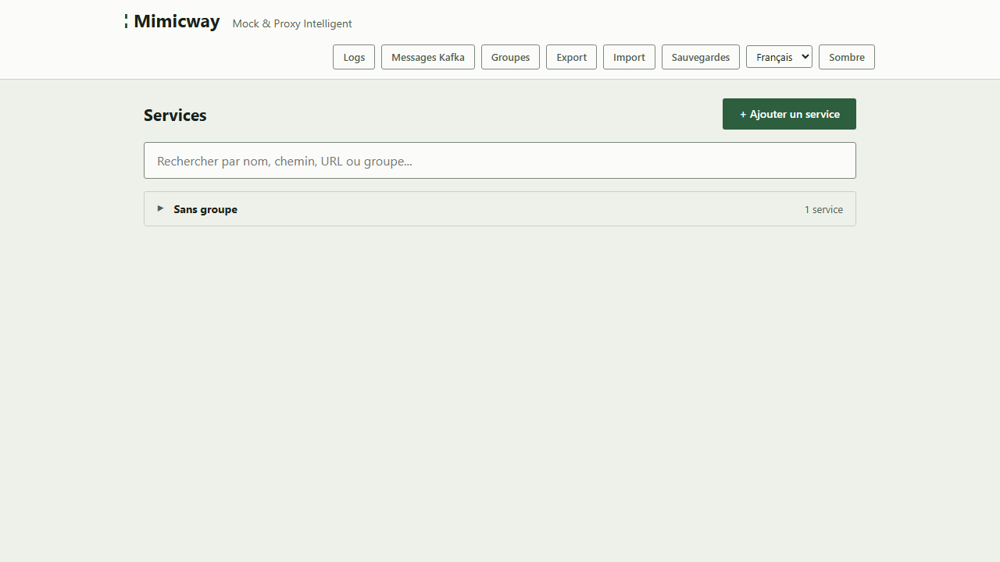
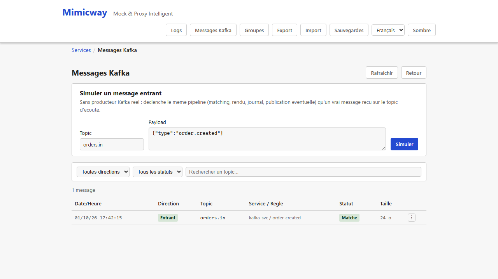
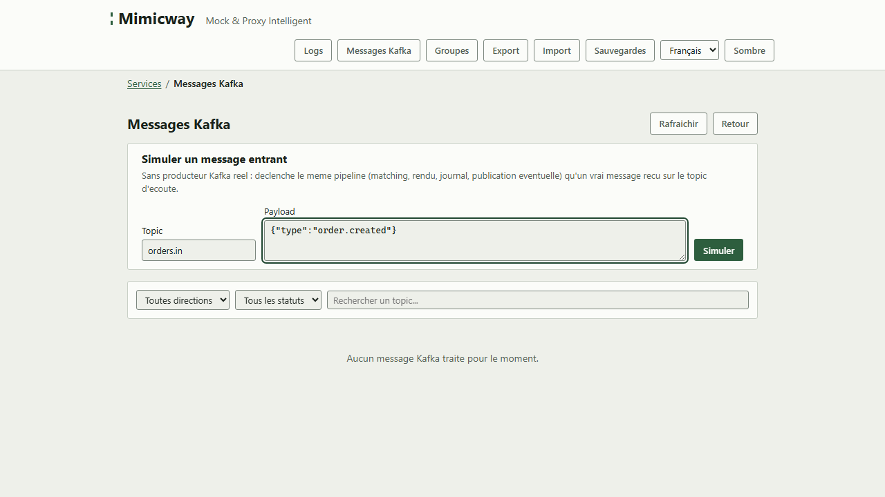

[English](../en/kafka-messaging.md)

# Messagerie Kafka (optionnelle)

Au-delà des requêtes HTTP, Mimicway peut aussi répondre à des **messages Kafka** (Kafka est un système de messagerie qui permet à des applications de communiquer de façon asynchrone, par opposition à un appel HTTP direct). Cette fonctionnalité est **optionnelle** et ne fait pas partie de toutes les versions de Mimicway.

## Est-elle disponible sur votre instance ?

**« Messages Kafka »** n'apparaît dans la barre de navigation que si le binaire Mimicway en service a été compilé avec le support Kafka (`--features messaging-kafka`). S'il manque, la fonctionnalité ne fait simplement pas partie de votre installation : ce n'est pas une erreur.

## Fonctionnement

Une fois activé et connecté à Kafka, Mimicway écoute un topic (un canal de messages Kafka) et applique **les mêmes règles et réponses dynamiques** que pour le HTTP (conditions sur le contenu du message, [templates](responses-and-templates.md) pour construire la réponse) : la première règle qui correspond au message reçu s'applique, et sa réponse peut être publiée sur un autre topic.

Un **journal des messages**, comme le [journal des requêtes](request-log.md) HTTP, montre les messages reçus, s'ils ont matché, et leur réponse.

## Simuler un message sans serveur Kafka

**« Simuler un message entrant »** teste le comportement des règles Kafka directement depuis l'interface, sans serveur Kafka qui envoie le message : pratique pour vérifier une règle avant de la brancher sur un vrai flux.

## Prérequis et limites

- **Nécessite une version de Mimicway compilée avec le support Kafka**, ce qui n'est pas le cas par défaut. Si « Messages Kafka » n'apparaît pas, votre installation ne l'inclut pas.
- Nécessite aussi un serveur Kafka configuré et joignable (`KAFKA_BROKERS`, `KAFKA_LISTEN_TOPIC`… voir le README) : sans lui, même une version avec le support Kafka ne se met pas à l'écoute.
- Un seul topic d'écoute global est géré (pas de topic par service) : un message entrant est comparé aux règles de **tous** les services, et la première qui correspond l'emporte.
- Les [scripts Rhai](rhai-scripts.md) (pré-script, script, post-script) ne s'exécutent **pas** pour un message Kafka : ils sont réservés au trafic HTTP.
- Le journal des messages est borné en durée et en taille : les entrées les plus anciennes sont retirées (après `MESSAGE_LOG_TTL_MS`, 24 heures par défaut), et un message volumineux est tronqué dans le journal (`MESSAGE_LOG_MAX_BODY_SIZE`).
- Avec l'authentification, consulter le journal des messages et simuler des messages est réservé aux super-admins.
