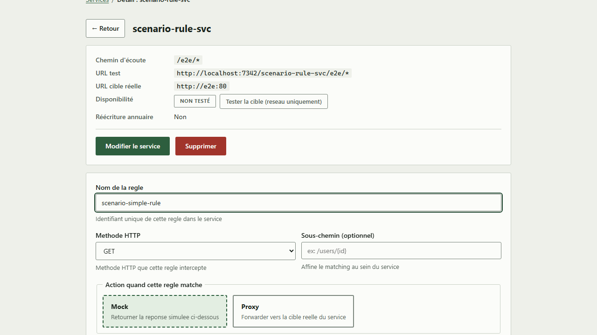
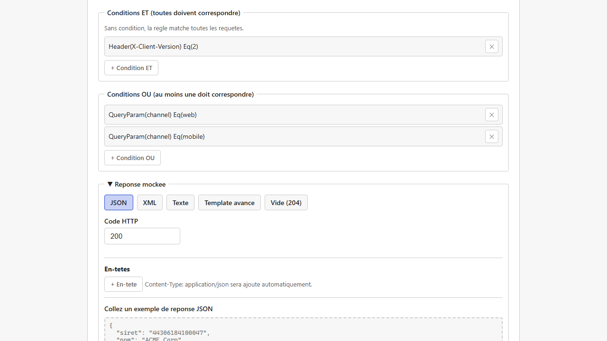
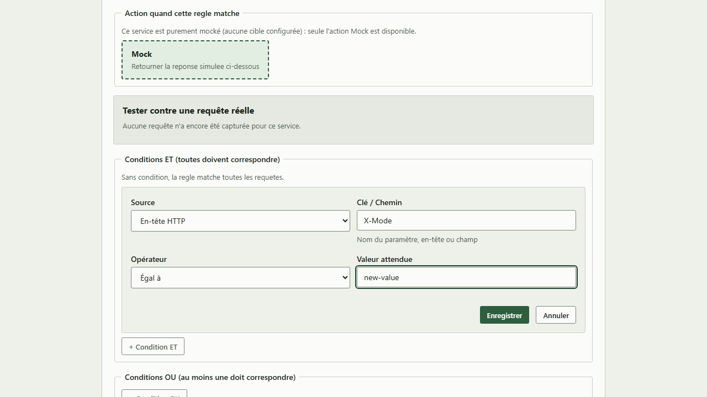
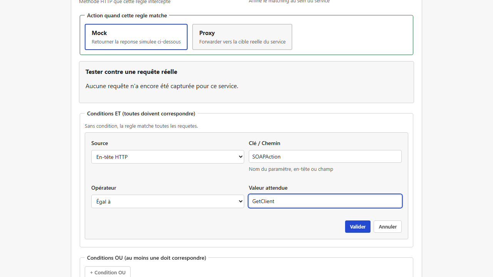
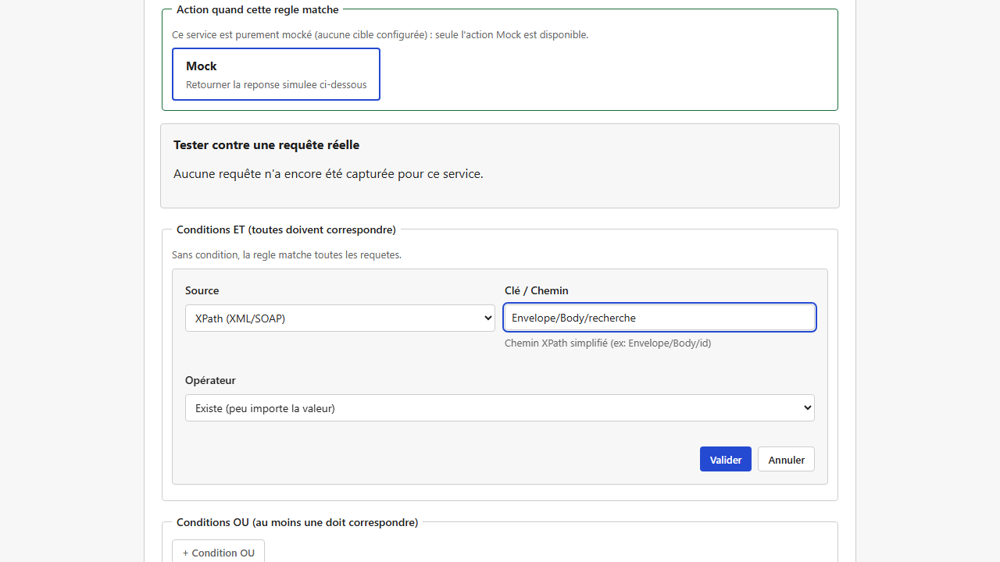
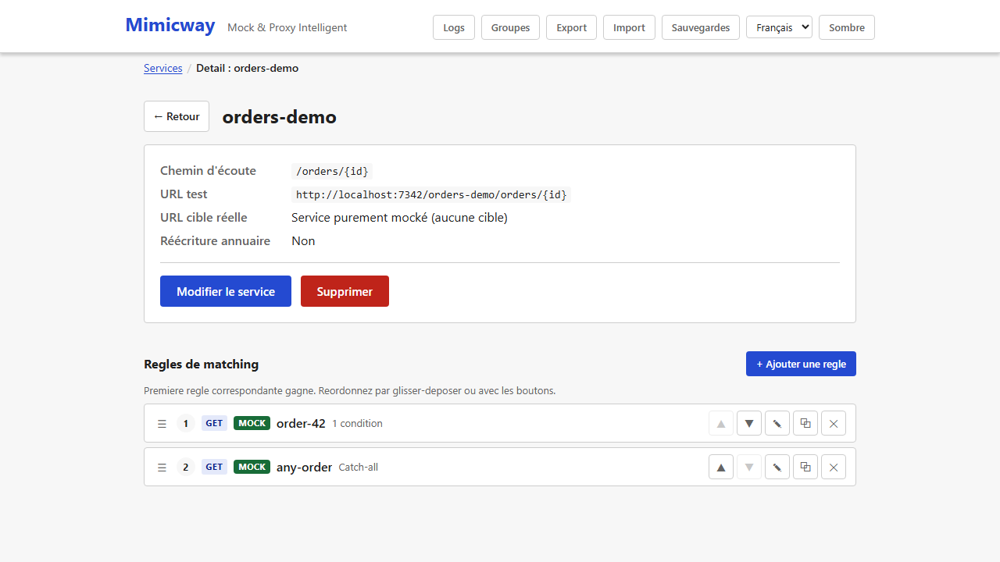

[English](../en/matching-rules.md)

# Règles de correspondance

Un [service](services.md) en mode mock peut avoir **plusieurs règles**. Chaque règle dit « pour quelle requête » renvoyer « quelle réponse ». Les règles sont le cœur de la simulation : sans elles, un service simulé n'a rien de précis à répondre.

## Ce que définit une règle

- **Nom** : identifie la règle dans l'interface (unique au sein du service).
- **Méthode HTTP** : `GET`, `POST`, `PUT`, `PATCH`, `DELETE`, `OPTIONS` ou `HEAD`. C'est la règle qui porte la méthode, pas le service : un même service peut donc répondre différemment à `GET` et à `POST`.
- **Sous-chemin** (optionnel) : s'ajoute au chemin d'écoute du service, pour distinguer des règles sur des URL voisines. Laissé vide, la règle s'applique à tout chemin sous le service.
- **Conditions** (optionnelles) : des critères supplémentaires qui restreignent les cas où la règle s'applique (voir plus bas). Sans condition, la règle matche dès que la méthode et le sous-chemin correspondent.
- **Action** : `mock` (répondre avec le contenu configuré, voir [Réponses et templates](responses-and-templates.md)) ou `proxy` (relayer au vrai backend les requêtes qu'elle matche, pour un mock partiel ; voir [Services et routage](services.md)). Sur un [service purement mocké](services.md#service-purement-mocké-aucune-cible) (sans cible réelle), `proxy` n'est pas proposé.



**Ouvrir une règle `proxy` sur un service devenu depuis purement mocké** : le formulaire l'affiche en `mock`, la seule action restante. Rien ne change tant que vous n'enregistrez pas ; si vous enregistrez la règle, même pour un autre changement comme une condition, Mimicway prévient d'abord que l'enregistrement fera réellement passer la règle de `proxy` à `mock`, et vous laisse confirmer (« Enregistrer quand même ») ou revenir en arrière.

## Conditions : cibler une requête précisément

Une condition compare une valeur trouvée dans la requête (paramètre d'URL, en-tête, partie du corps…) à une valeur attendue. Les sources :

| Source | Usage typique |
|---|---|
| **Paramètre de requête** (`?cle=valeur`) | Matcher seulement quand un paramètre de requête est présent, ou a une valeur donnée |
| **En-tête HTTP** | Par exemple, matcher sur un en-tête `X-Client-Version` |
| **Paramètre de chemin** (`{param}` dans l'URL) | Matcher seulement quand `{id}` a une valeur donnée |
| **JSON Pointer** | Matcher sur `amount` dans un corps JSON `{"amount": 100}` |
| **XPath (XML/SOAP)** | La même chose pour un corps XML ou SOAP |
| **Champ de formulaire** | Pour un corps envoyé en `application/x-www-form-urlencoded` |
| **Corps brut (texte entier)** | Comparer le corps tel quel, sans l'analyser |

Les opérateurs :

- **Égal à** une valeur exacte.
- **Contient** une sous-chaîne.
- **Expression régulière** : correspond à un motif.
- **Existe (peu importe la valeur)** : vérifie seulement que le champ est présent.

Les conditions se combinent de deux façons :

- **Conditions ET (toutes doivent correspondre)** : la règle ne matche que si chaque condition est vraie.
- **Conditions OU (au moins une doit correspondre)** : la règle matche dès qu'une condition est vraie.

Une règle peut utiliser les deux : elle matche alors quand **toutes** ses conditions ET sont vraies **et** qu'au moins une de ses conditions OU l'est. La règle ci-dessous répond aux clients qui envoient l'en-tête `X-Client-Version: 2` et demandent le canal `web` ou le canal `mobile` (`?channel=web` ou `?channel=mobile`) ; un client en version 2 sur un autre canal, ou un client sans cet en-tête, ne la déclenche pas.



### Aide à la saisie

Pour un paramètre de chemin, le formulaire propose la liste fermée des noms de paramètres que l'URL du service contient réellement (aucune faute de frappe possible). Pour un paramètre de requête, il suggère les paramètres vus dans le [journal des requêtes](request-log.md) récent, tout en acceptant un nom qui n'y figure pas encore.

### Modifier une condition

Une condition ajoutée à une règle **se modifie sur place** : cliquez-la dans la liste (elle s'affiche comme un bouton) pour rouvrir le formulaire qui a servi à l'ajouter, rempli avec sa source, sa clé, son opérateur et sa valeur actuels. Changez ce qu'il faut, y compris la source (d'un paramètre de requête à un en-tête HTTP, par exemple), puis validez pour l'enregistrer à sa place : les autres conditions de la règle gardent leur ordre et leur contenu. « Annuler » referme le formulaire sans rien changer.



## Cas d'usage : une même URL, une réponse différente par opération SOAP

Question fréquente pour les services SOAP/XML : **la même URL** peut-elle répondre différemment selon l'en-tête `SOAPAction`, ou selon le contenu de l'enveloppe ? **Oui, sans aucun développement** : créez plusieurs règles sur le même service, chacune avec sa propre condition. Les règles sont évaluées dans l'ordre et la première qui correspond l'emporte (voir plus bas) : chaque opération SOAP obtient ainsi sa propre réponse simulée.

### Router sur l'en-tête `SOAPAction`

Créez une règle par opération, chacune avec une condition **En-tête HTTP** sur la clé `SOAPAction` :

| Règle `get-client` | Règle `get-order` |
|---|---|
|  |  |

Un `POST` sur ce service avec `SOAPAction: GetClient` déclenche `get-client` et sa réponse, tandis que `SOAPAction: GetOrder` déclenche `get-order` : **même URL**, aucune condition sur le chemin. Une requête avec une autre valeur de `SOAPAction`, ou sans cet en-tête, ne matche aucune des deux règles et reçoit la réponse « aucune règle ne correspond » (voir [Services et routage](services.md)).

### Variante : router sur le corps plutôt que sur un en-tête

Certains clients SOAP n'envoient pas d'en-tête `SOAPAction` exploitable, ou vous préférez distinguer les opérations par l'élément XML envoyé dans l'enveloppe. Utilisez alors une condition **XPath (XML/SOAP)** sur le corps, toujours une règle par opération :

- Règle `get-client` : source `XPath (XML/SOAP)`, clé `Envelope/Body/GetClientRequest`, opérateur `Existe (peu importe la valeur)`. Elle matche tout corps dont l'enveloppe contient un élément `GetClientRequest` dans `Body` (le chemin ignore les préfixes d'espace de noms comme `soap:Envelope`).
- Règle `get-order` : la même chose avec `Envelope/Body/GetOrderRequest`.

La même idée fonctionne sur un corps JSON avec une condition **JSON Pointer**, par exemple `/type` égal à `"client"`.

#### Exemple vérifié : deux opérations SOAP distinguées par l'élément présent dans `Body`

Service `directory-soap`, chemin `/service`, deux règles `POST` :

| Règle | Condition |
|---|---|
| `search-operation` | `XPath (XML/SOAP)`, clé `Envelope/Body/recherche`, opérateur `Existe (peu importe la valeur)` |
| `mode-operation` | `XPath (XML/SOAP)`, clé `Envelope/Body/mode`, opérateur `Existe (peu importe la valeur)` |



Un `POST` avec ce corps (notez le `<Header></Header>` vide avant `<Body>`, écrit avec une balise ouvrante et une balise fermante, une forme d'enveloppe courante) :

```xml
<SOAP:Envelope>
  <SOAP-ENV:Header></SOAP-ENV:Header>
  <SOAP-ENV:Body>
    <ns3:recherche>
      <ns3:Nom>Test</ns3:Nom>
      <ns3:Siret>98765432109876</ns3:Siret>
    </ns3:recherche>
  </SOAP-ENV:Body>
</SOAP:Envelope>
```

déclenche `search-operation`, et **pas** `mode-operation`. Une requête avec `<ns3:mode>...</ns3:mode>` à la place de `<ns3:recherche>` déclenche `mode-operation`. Le chemin `Envelope/Body/recherche` ne contient **aucun préfixe d'espace de noms** (ni `SOAP:`, ni `SOAP-ENV:`, ni `ns3:`) : c'est la bonne syntaxe. Les préfixes sont toujours ignorés dans le chemin, et un chemin qui les inclut (`SOAP-ENV:Body/ns3:recherche`) ne matcherait jamais.

Pour recopier une valeur de ce corps SOAP (le `Siret`, par exemple) dans la réponse, voir [le cas d'usage des scripts Rhai](rhai-scripts.md#cas-dusage--recopier-une-valeur-de-la-requête-soap-dans-la-réponse).

## Quelle règle s'applique quand plusieurs correspondent ?

Les règles d'un service sont évaluées **dans l'ordre de la liste**, et **la première qui correspond l'emporte** : les suivantes ne sont même pas examinées. L'ordre compte : une règle générale placée avant une règle plus précise la masque toujours.

Vous pouvez **réordonner les règles** dans la liste : faites glisser une règle par sa poignée ☰ jusqu'à la poignée de la règle dont elle doit prendre la place, ou déplacez-la d'un cran avec ses boutons ▲ ▼. Le nouvel ordre est enregistré aussitôt. Dans l'exemple ci-dessous, la règle générale `any-order` venait en premier et répondait à tous les `GET /orders/{id}`, même à `/orders/42` pour lequel `order-42` avait été écrite ; une fois `order-42` glissée au-dessus, `/orders/42` reçoit sa propre réponse et toutes les autres commandes reçoivent toujours la réponse générale.



Pour éviter les surprises, servez-vous du [testeur de règle et de la détection de conflits](rule-tester-and-conflicts.md) : à l'enregistrement, il prévient si une nouvelle règle risque d'être masquée par une règle existante (ou de la masquer), sans vous bloquer quand c'est voulu.

## Prérequis et limites

- Aucun prérequis : disponible dans toutes les installations.
- La détection des chevauchements entre règles (voir [testeur de règle et détection de conflits](rule-tester-and-conflicts.md)) couvre les cas courants, pas tous les cas possibles : c'est une aide, pas une garantie.
