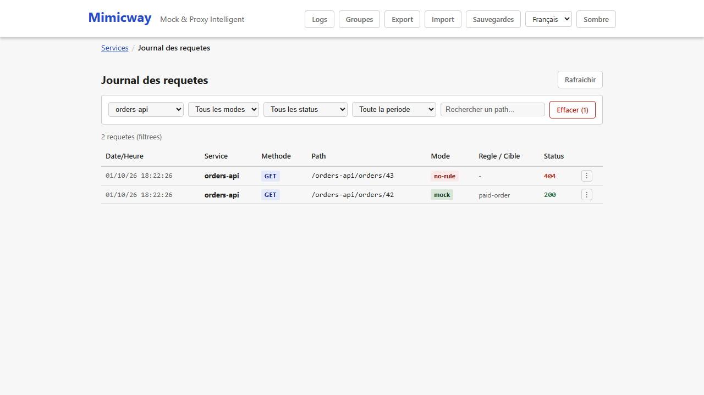
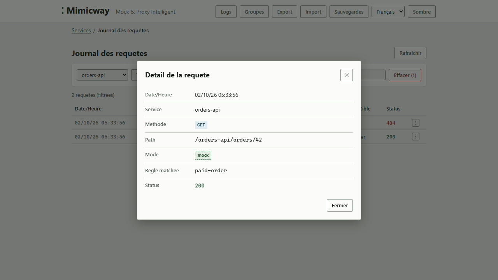

[English](../en/request-log.md)

# Journal des requêtes

**« Logs »** dans la barre de navigation ouvre l'historique des dernières requêtes reçues par Mimicway, tous services confondus. Il montre ce que l'application testée a réellement envoyé, et aide à diagnostiquer une règle qui ne se déclenche pas comme prévu.

## Ce que montre une entrée

- La date et l'heure de la requête, sa méthode et son chemin.
- Le service, et le mode dans lequel elle a été traitée : simulée, relayée, ou sans règle correspondante.
- La règle qui a répondu, s'il y en a une, et le statut renvoyé.

Le bouton de détail ouvre ces mêmes informations pour une entrée. En coulisse, Mimicway conserve aussi la requête elle-même (en-têtes, paramètres de requête et de chemin, corps) quand elle est disponible (voir « Limites » plus bas) : c'est cette capture que le [testeur de règle](rule-tester-and-conflicts.md) rejoue contre un brouillon de règle.

## Prérequis et limites

- Aucun prérequis : disponible dans toutes les installations, alimenté dès qu'une requête arrive.
- Seules les **200 requêtes les plus récentes** sont conservées (le journal n'est pas un historique permanent) ; les plus anciennes sont retirées.
- Un corps volumineux est tronqué dans le journal au-delà d'une taille fixée (`REQUEST_LOG_MAX_BODY_SIZE`, 16 Kio par défaut) ; les autres informations (méthode, en-têtes, paramètres) sont toujours complètes.
- Les identifiants ne sont jamais conservés : les valeurs de `Authorization`, `Cookie`, `Set-Cookie`, des en-têtes de clé d'API et de tout en-tête listé dans `REDACT_HEADERS` s'affichent `[redacted]`.
- Une requête relayée par un service en mode proxy (aucune règle évaluée) n'a pas de détail conservé, pour ne pas ralentir ce chemin : seul le fait que l'appel a eu lieu est journalisé.
- Avec l'authentification, chaque utilisateur ne voit que les entrées des services auxquels il a accès.
