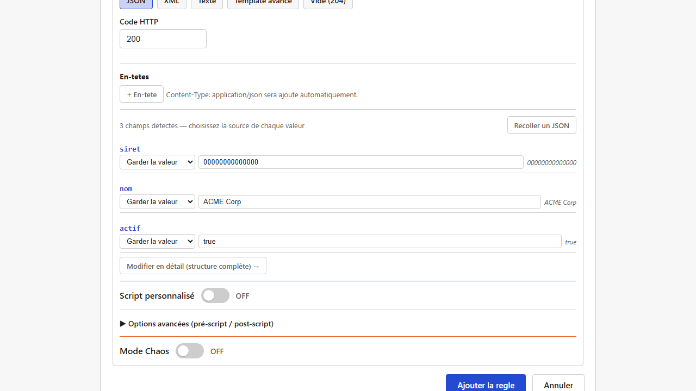
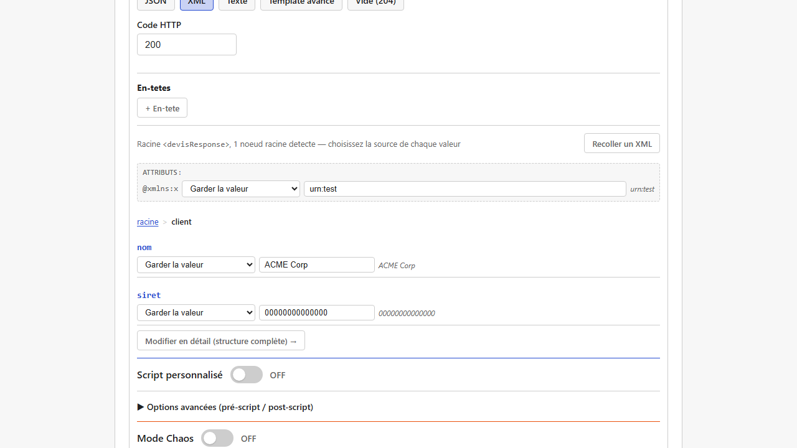
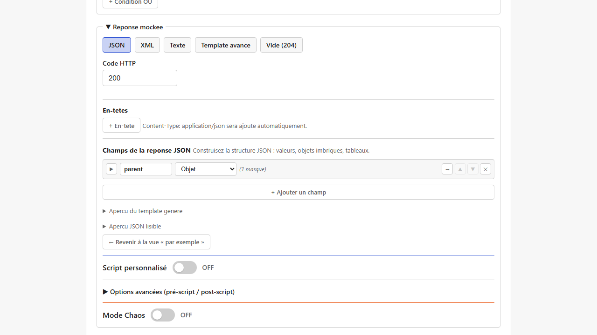
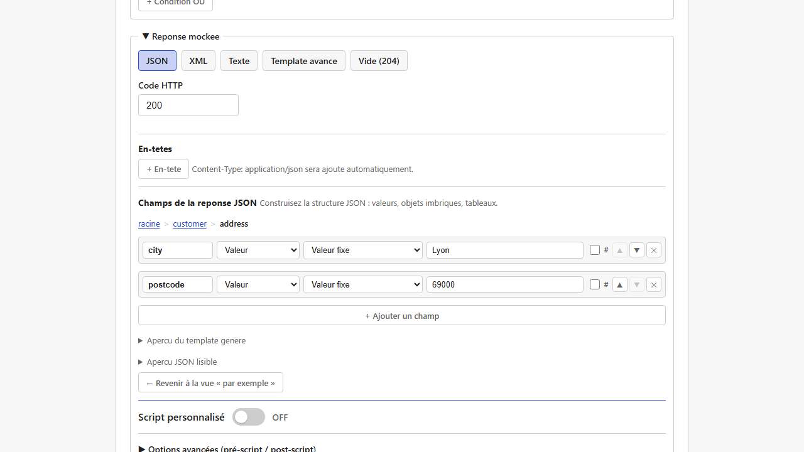
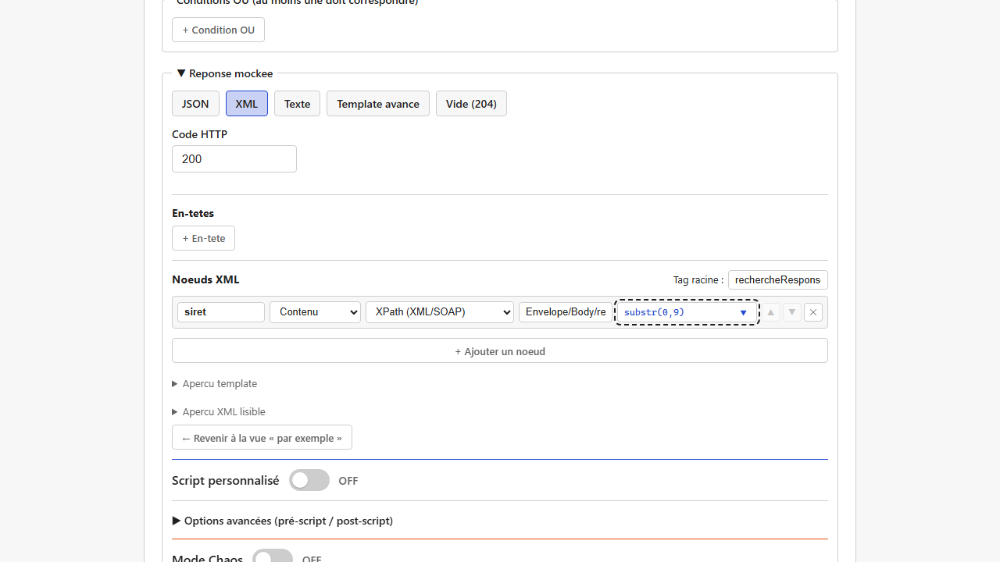
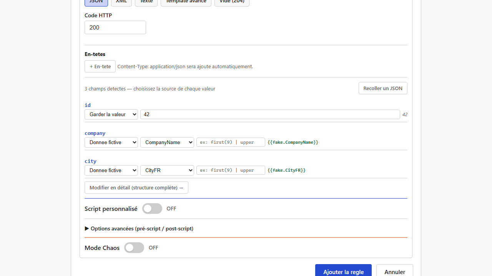
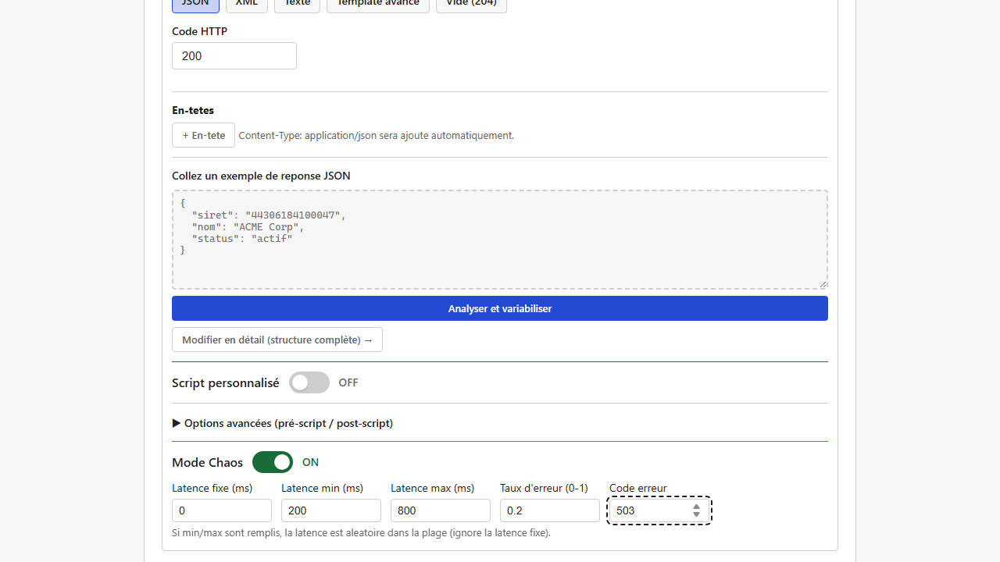

[English](../en/responses-and-templates.md)

# Réponses et templates

Quand une [règle](matching-rules.md) matche, Mimicway produit une réponse : un statut HTTP, des en-têtes et un corps (JSON, XML ou texte) qui peut être **statique** ou **dynamique** (avec des valeurs calculées à chaque requête).

## Choisir un format, puis un niveau de détail

Le corps se construit en deux temps : d'abord un **format** (JSON, XML, Texte, Template avancé, ou Vide (204)), puis, pour JSON et XML seulement, un **niveau d'édition** (par l'exemple, ou en détail). Ces niveaux **ne sont pas deux modes à choisir d'emblée** : vous commencez toujours par l'exemple (coller un échantillon), et **« Modifier en détail (structure complète) → »** révèle, sur les *mêmes* données, tout ce que propose le niveau détaillé, sans rien perdre de ce que vous avez déjà saisi.

### 1. Par l'exemple : coller une réponse existante

Pour les corps déjà complexes, il est souvent plus rapide de **coller une vraie réponse** (obtenue du vrai backend, par exemple) : Mimicway détecte chaque champ, et vous pouvez ensuite remplacer certaines valeurs par des variables ou des données factices, champ par champ. Chaque valeur variable peut aussi recevoir une **transformation** (voir « Transformations » plus bas), exactement comme au niveau détaillé.

En JSON, les champs détectés sont listés **à plat**, avec une indentation pour les niveaux imbriqués : cela suffit pour les charges REST, généralement peu profondes. Un champ **objet** imbriqué affiche tout de même un **chevron** (▼/▶) à sa gauche pour le replier un moment (une note « (N masqués) » rappelle que du contenu est caché) : pratique quand un échantillon collé contient plusieurs objets imbriqués et que vous voulez vous concentrer sur l'un d'eux. Replier ne supprime jamais rien : seule la vue change, et tout est déplié par défaut.

En XML, souvent plus profondément imbriqué (une enveloppe SOAP, par exemple), ce niveau propose aussi :

- un **fil d'Ariane** (« → » entre dans un nœud, le chemin cliquable permet d'en ressortir),
- des **chevrons de pliage** (▼/▶), comme en JSON,
- la modification des **attributs XML** de chaque élément, racine comprise : un attribut détecté (comme une déclaration d'espace de noms `xmlns:soap="..."`) peut être remplacé par une variable ou conservé, comme un contenu texte.

Les préfixes d'espace de noms (`soap:Envelope`) et les déclarations `xmlns`/`xmlns:*` sont conservés tels quels, comme du texte ; Mimicway ne les résout pas. Coller du XML avec des espaces de noms fonctionne sans erreur, mais aucune validation sémantique n'est faite.

> Le niveau par l'exemple ne renomme, n'ajoute ni ne supprime un champ ou un nœud détecté : pour cela, cliquez sur **« Modifier en détail (structure complète) → »** (voir plus bas).

### 2. En détail : la structure complète

**« Modifier en détail (structure complète) → »**, sous la liste des champs, ouvre l'éditeur complet sur les *mêmes* champs : renommer une clé, ajouter, supprimer ou réordonner des champs, changer un type (valeur, objet, tableau), et construire une structure **entièrement nouvelle** quand vous ne partez d'aucun échantillon (le bouton est présent même quand rien n'a été collé : cliquez-le pour partir de zéro). Rien ne se perd en route : il révèle davantage de possibilités sur les données déjà là, il ne convertit ni ne recommence jamais.

**« ← Revenir à la vue « par exemple » »**, sous l'éditeur détaillé, fait le chemin inverse à tout moment, sans perte lui aussi (mêmes données, seule la vue change). Vous pouvez passer d'un niveau à l'autre autant de fois que vous le souhaitez avant d'enregistrer la règle.

Chaque champ **objet** ou **tableau** (JSON et XML) affiche un **chevron** (▼/▶) à sa gauche : cliquez-le pour **replier** le champ et masquer son contenu un moment, pratique quand une branche est configurée et que vous voulez vous concentrer sur le reste. Une note « (N masqués) » rappelle que du contenu est caché. Replier ne supprime jamais rien, et tout est déplié à l'ouverture du formulaire.

Pour circuler dans une structure profondément imbriquée, le bouton **→** d'un champ objet permet d'y entrer : l'éditeur n'affiche plus que ce niveau, sous un fil d'Ariane (un chemin cliquable comme `racine > customer > address`) qui permet d'en ressortir en un clic.

### Changer de format en cours de route

Vous pouvez changer de format (de « Template avancé » à « XML », par exemple) après avoir commencé à écrire une réponse. Mimicway tente alors de **convertir** ce que vous avez déjà saisi au lieu de repartir de zéro :

- **Template avancé → JSON** ou **Template avancé → XML** : quand le texte est du JSON ou du XML valide (avec ses variables `{{...}}` déjà en place), il est repris tel quel dans la vue par l'exemple du nouveau format : champs, valeurs, pipes, et pour XML la balise racine et ses attributs.
- Quand le contenu n'est **pas** valide dans le format cible, un avertissement explique pourquoi il ne peut pas être converti, et propose « Changer quand même » (partir à vide dans le nouveau format) ou d'annuler pour corriger le contenu d'abord.
- Certaines conversions restent volontairement manuelles (XML → JSON, par exemple) : l'avertissement le dit et suggère de passer par « Template avancé » comme étape intermédiaire.

### Rouvrir une règle restaure sa vue

Quand vous rouvrez une règle enregistrée, Mimicway se souvient de **la vue** qui l'a construite (par l'exemple ou en détail, JSON ou XML) et ouvre celle-là. Une règle construite par l'exemple se rouvre par l'exemple (avec « Modifier en détail » toujours à portée de main), une règle construite en détail se rouvre en détail. « Texte » et « Template avancé » sont restaurés aussi.

**Limite** : si la réponse a été modifiée hors de l'interface (fichier de configuration édité à la main, ancienne sauvegarde restaurée) et ne correspond plus à la forme qu'attend la vue retenue, Mimicway se rabat sur « Template avancé » au lieu d'afficher une erreur : votre contenu reste visible et modifiable, seule la vue structurée n'est pas restaurée. De même, un corps JSON dont la racine est un **tableau** (possible seulement par l'exemple) ne peut pas être restauré dans une vue structurée à la réouverture : « Template avancé » prend le relais.

## Syntaxe des templates : `{{ }}`

Quel que soit l'éditeur utilisé, le résultat est un **template** : un texte JSON ou XML dans lequel les passages entre doubles accolades sont évalués à chaque requête.

| Écriture | Signification |
|---|---|
| `{` et `}` (accolade simple) | Caractères littéraux, comme dans n'importe quel JSON ou XML ; **pas** une variable |
| `{{variable}}` | Une expression évaluée à chaque requête |
| `{{variable \| transformation}}` | Une variable, puis transformée (voir « Transformations » plus bas) |

Exemple : `{"siret":"{{path.siret}}"}` renvoie le paramètre de chemin `siret` de la requête.

### Variables

| Variable | Contenu |
|---|---|
| `path.X` | Valeur du paramètre de chemin `X` (`{id}` dans l'URL du service, par exemple) |
| `query.X` | Valeur du paramètre de requête `X` (`?X=...`) |
| `header.X` | Valeur de l'en-tête HTTP `X` |
| `body.X` | Valeur au JSON Pointer `X` dans le corps de la requête (corps JSON seulement) |
| `xpath.X` | Valeur au XPath simplifié `X` dans le corps de la requête (corps XML ou SOAP seulement) |
| `fake.NomDuType` | Une donnée factice générée (voir plus bas) |
| `uuid` | Un identifiant unique généré |
| `now_ms` / `now_iso` / `now_epoch` | La date et l'heure actuelles, dans plusieurs formats |
| `seq` | Un compteur d'appels |
| `script` / `pre_script` / `post_script` | Le résultat d'un [script Rhai](rhai-scripts.md) de la règle, si vous en avez écrit un |

Dans le constructeur (aux deux niveaux, en JSON comme en XML), chaque variable est une option du menu **source** de chaque champ : « Paramètre URL {param} », « Query param », « En-tête HTTP », « Résultat du script », etc. Quelques-unes méritent un mot :

- **« Echo body (JSON pointer) »** (`body.X`) n'extrait une valeur que si le corps de la requête est du **JSON**. Sur un corps XML ou SOAP, il ne donne jamais rien (le corps n'est tout simplement pas du JSON valide) : une valeur vide, pas une erreur.
- **« XPath (XML/SOAP) »** (`xpath.X`) est l'équivalent pour un corps **XML ou SOAP**, proposé dans le constructeur de réponse **XML** (aux deux niveaux). Le chemin suit la même syntaxe simplifiée qu'une [condition XPath](matching-rules.md#cas-dusage--une-même-url-une-réponse-différente-par-opération-soap) : des segments séparés par `/`, **sans préfixe d'espace de noms** (`Envelope/Body/recherche/Siret`, et non `SOAP-ENV:Body/ns3:recherche`). Il couvre « prendre cette valeur dans la requête et la remettre dans la réponse » sans [script Rhai](rhai-scripts.md#cas-dusage--recopier-une-valeur-de-la-requête-soap-dans-la-réponse).
- **« Résultat du script »** (`script.X`) : une fois cette source choisie, un champ **« Valeur »** apparaît (JSON et XML, aux deux niveaux) pour indiquer **quelle clé** du résultat du script utiliser. Laissez-le vide pour prendre `{{script}}` tel quel (le résultat entier, quand le script renvoie une simple chaîne), ou saisissez une clé (`name`, par exemple) pour obtenir `{{script.name}}` (quand le script renvoie un objet `#{ name: "...", ... }`). Sans lui, il n'y aurait aucun moyen de choisir une valeur parmi plusieurs valeurs renvoyées.

**Exemple vérifié** : un champ `siret` avec la source **« XPath (XML/SOAP) »**, la valeur `Envelope/Body/recherche/Siret` et la transformation `substr(0,9)` (pour garder les 9 premiers caractères) :

Contre un `POST` dont le corps SOAP contient `<ns3:Siret>98765432109876</ns3:Siret>` sous `Envelope/Body/recherche` (même avec un `<Header></Header>` écrit en entier avant `<Body>`), la réponse contient `<siret>987654321</siret>`.

### Transformations (pipes)

Une variable peut être transformée avant d'être insérée : `lower`, `upper`, `trim`, `capitalize`, `first(N)` (les N premiers caractères), `last(N)`, `substr(debut,longueur)`, `default("valeur")` (valeur de secours si vide), `replace("a","b")`, `prepend("x")` (ajoute devant), `append("x")` (ajoute derrière), `length`.

Exemple : `{{path.siret | first(9)}}` garde les 9 premiers caractères du SIRET reçu.

### Données factices (`fake.*`)

Pour remplir une réponse avec des données d'apparence réaliste sans les saisir : prénom, nom, e-mail, numéro de téléphone français, entreprise, rue, ville, code postal, SIREN/SIRET, adresse complète, date passée ou future, horodatage, booléen aléatoire, phrase de remplissage (« lorem »), pays, IBAN français. Le constructeur propose aussi un entier dans une plage (`Integer{min,max}`). Plusieurs types suivent aujourd'hui des formats français ; des données factices adaptées à chaque langue sont prévues (voir la [feuille de route](../../ROADMAP.md)).

Dans le constructeur, choisissez **Donnée fictive** comme source d'un champ, puis le type de donnée dans le menu voisin. L'expression écrite pour le champ (`{{fake.CompanyName}}`) s'affiche à sa droite, et une nouvelle valeur est tirée à chaque requête.

## Mode Chaos : pannes et lenteurs à la demande

Pour tester comment une application se comporte face à un backend peu fiable, chaque réponse simulée peut activer un « mode Chaos » :

- **Latence** : un délai fixe, ou aléatoire entre un minimum et un maximum, avant de répondre.
- **Taux d'erreur** : une part des requêtes reçoit une erreur HTTP au lieu de la réponse normale (statut configurable, `500` par défaut).

Ces réglages apparaissent quand l'interrupteur **Mode Chaos** de la règle est activé. Quand une latence minimale et une latence maximale sont toutes deux renseignées, chaque délai est tiré entre les deux et la latence fixe est ignorée.

## Prérequis et limites

- Aucun prérequis : disponible dans toutes les installations.
- Le niveau par l'exemple ne renomme, n'ajoute ni ne supprime de champ : cliquez sur « Modifier en détail » pour cela, sans perdre ce que vous avez saisi.
- En XML, un espace de noms (`xmlns:...`) est conservé tel quel dans la balise ou l'attribut, sans résolution (voir « Par l'exemple » plus haut).
- En XML toujours, un nœud qui mêle texte direct et éléments enfants (« contenu mixte ») n'est pas représenté fidèlement : les éléments enfants sont conservés, le texte direct est abandonné.
- Un corps JSON dont la racine est un tableau (possible seulement par l'exemple) ne peut pas être restauré dans une vue structurée à la réouverture de la règle (voir « Rouvrir une règle restaure sa vue » plus haut).
