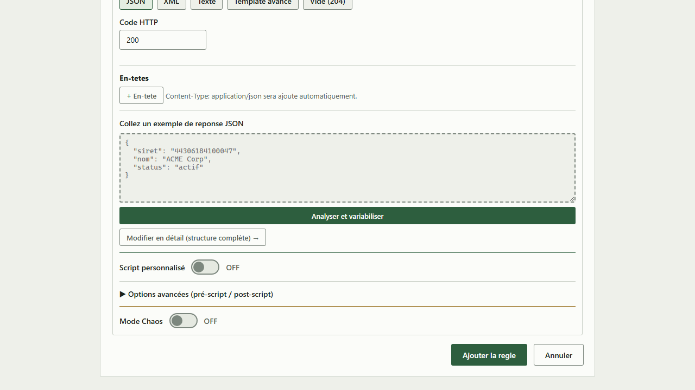
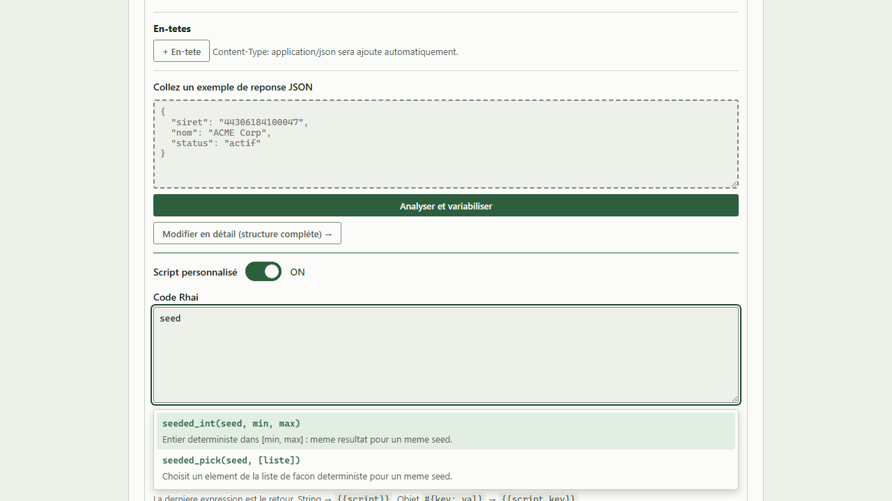
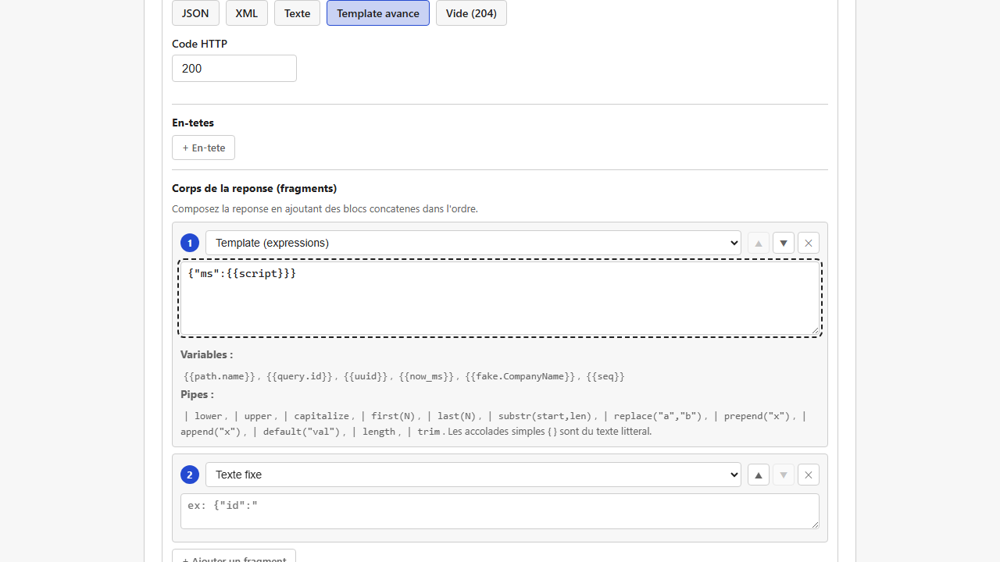
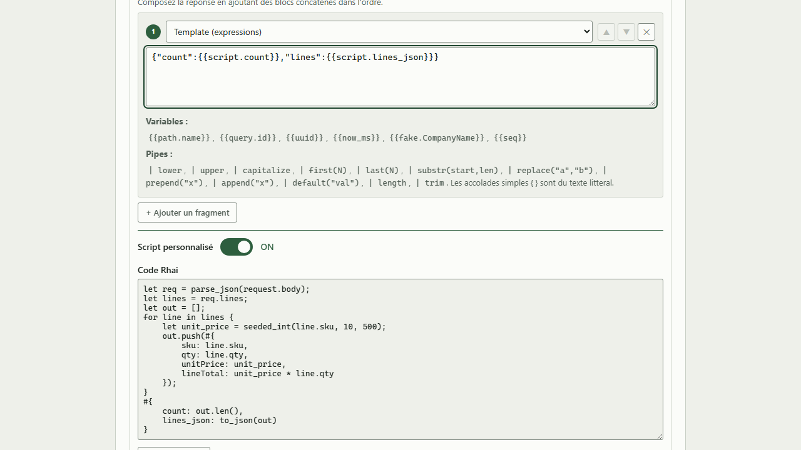
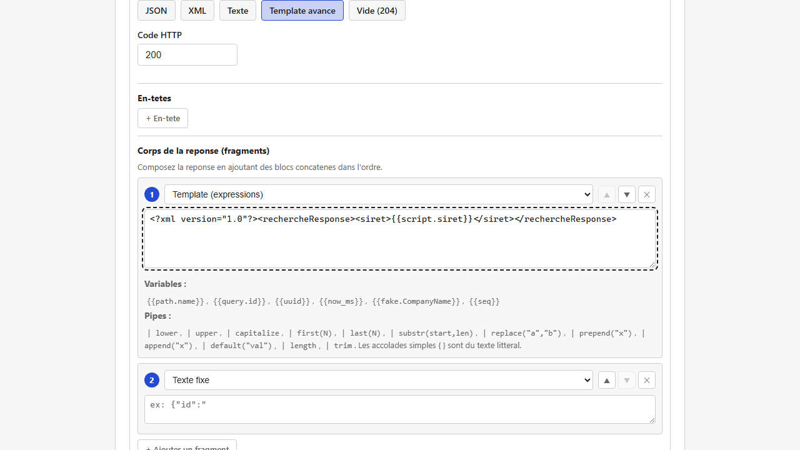

[English](../en/rhai-scripts.md)

# Scripts Rhai (valeurs calculées dans une règle)

Pour ce que le [constructeur de réponse](responses-and-templates.md) ne couvre pas directement (calculs, valeurs qui dépendent les unes des autres, données « toujours identiques pour une même entrée »…), chaque règle peut exécuter un court script écrit dans un langage simple appelé **Rhai**. Le résultat du script devient alors une variable du corps de la réponse.

> Rhai est un petit langage de script (à la syntaxe proche de JavaScript et de Rust) qui s'exécute dans un bac à sable : il ne peut atteindre ni le disque ni le réseau, ne peut pas évaluer de code avec `eval`, et ne peut pas consommer de ressources sans limite (au plus 10 000 opérations, des chaînes de 1 Mo, des tableaux de 1 000 éléments, des objets de 500 entrées et 32 appels imbriqués par exécution).
> Inutile de connaître Rhai en profondeur : les fonctions ci-dessous couvrent la plupart des besoins, et l'éditeur les suggère pendant la frappe.

## Trois emplacements de script indépendants

Une règle propose jusqu'à trois emplacements de script, tous optionnels :

- **Pré-script (préparation)**
- **Script personnalisé** (le principal)
- **Post-script (finalisation)**

Les trois blocs sont **entièrement indépendants** : ils voient tous la même requête, et aucun ne peut lire le résultat d'un autre. « Pré » et « post » sont une convention pour vous aider à organiser votre logique (préparer des données, puis les mettre en forme, par exemple), pas un véritable enchaînement.

> **Le pré-script et le post-script sont repliés par défaut** derrière « Options avancées (pré-script / post-script) » : la plupart des règles n'en ont pas besoin, et seul le script principal reste visible. Cliquez sur cette ligne pour les afficher. Quand vous modifiez une règle qui utilise déjà l'un d'eux, la section s'ouvre **d'elle-même** : un contenu configuré ne vous est jamais caché. Replier ne supprime jamais ce que vous avez saisi.



Chaque bloc peut renvoyer :
- une **valeur simple** (texte, nombre), utilisée comme `{{script}}` / `{{pre_script}}` / `{{post_script}}`,
- ou un **objet à plusieurs champs** (`#{ name: "...", age: 30 }`), chaque champ utilisable séparément : `{{script.name}}`, `{{script.age}}`.

## Lire la requête

Chaque script voit la requête entrante à travers une variable `request` à 4 champs :

| Accès | Contenu |
|---|---|
| `request.path.nom_du_parametre` | Un paramètre de chemin (`{id}` dans `/orders/{id}` donne `request.path.id`) |
| `request.query.nom_du_parametre` | Un paramètre de requête (`?page=2` donne `request.query.page`) |
| `request.headers.nom_de_l_en_tete` | Un en-tête HTTP. **Les noms d'en-têtes sont toujours en minuscules** côté serveur (`SOAPAction` devient `request.headers.soapaction`) : utilisez toujours le nom en minuscules, sinon la clé ne sera pas trouvée. |
| `request.body` | Le corps brut de la requête, sous forme de texte. Combinez-le avec `parse_json()` ou `parse_xml_items()` (voir plus bas) quand le corps est structuré. |

> **Piège : lire une clé absente ne provoque JAMAIS d'erreur.** Que vous écriviez `request.path.id` (avec un point) ou `request.headers["x-missing"]` (avec des crochets), une clé qui n'existe pas donne simplement une valeur vide, et le script continue. Appeler une fonction qui n'existe pas, c'est différent (voir « Quand un script échoue » plus bas) : c'est une vraie erreur. En pratique, une règle qui ne se comporte jamais comme prévu à cause d'un nom de paramètre mal orthographié (`request.path.id` alors que le paramètre s'appelle en réalité `orderId`) échoue **silencieusement**, sans aucun message d'erreur nulle part. Servez-vous du [testeur de règle](rule-tester-and-conflicts.md) contre une requête capturée pour vérifier qu'une clé est bien trouvée avant de vous fier au script.

Comme les fonctions ci-dessous, ces 4 accès apparaissent dans l'autocomplétion de l'éditeur (tapez `request` pour les voir).

## Fonctions

| Fonction | Ce qu'elle fait |
|---|---|
| `random_int(min, max)` | Un entier aléatoire entre `min` et `max` |
| `now_ms()` | L'horodatage actuel, en millisecondes |
| `now_iso()` | La date du jour au format `YYYY-MM-DD` |
| `year()` | L'année en cours |
| `uuid()` | Un identifiant unique (UUID) |
| `fake("Type")` | Une donnée factice (les mêmes types que le constructeur de réponse, par exemple `fake("Siret")`) |
| `date_now(format?)` | La date du jour, avec un format optionnel : `"iso"` (par défaut, `YYYY-MM-DD`), `"fr"` (`DD/MM/YYYY`), `"en"` (`MM/DD/YYYY`) |
| `date_past(days, format?)` | Une date située `days` jours avant aujourd'hui |
| `date_future(days, format?)` | Une date située `days` jours après aujourd'hui |
| `parse_date(text, "motif")` | L'**inverse** de `date_now`/`date_past`/`date_future` : analyse une date **saisie** selon un motif explicite et renvoie des millisecondes depuis l'epoch (voir le cas d'usage plus bas) |
| `seeded_int(seed, min, max)` | Un entier entre `min` et `max`, **toujours le même pour une même `seed`** |
| `seeded_pick(seed, [liste])` | Un élément de `liste`, **toujours le même pour une même `seed`** |
| `parse_json(text)` | Transforme un texte JSON (comme `request.body`) en structure Rhai que l'on peut parcourir (tableau ou objet) |
| `to_json(value)` | Transforme une structure Rhai (un tableau ou un objet construit dans le script) en texte JSON |
| `parse_xml_items(text, "chemin/vers/element")` | Extrait chaque élément XML répété à un chemin, sous forme de tableau d'objets Rhai (un niveau de champs enfants) |
| `xml_element(tag, value)` | Construit un élément XML `<tag>...</tag>` à partir d'une structure Rhai (récursivement) |

L'éditeur liste ces fonctions dès que vous commencez à taper leur nom (ou avec `Ctrl+Espace` pour la liste complète), avec leur signature et leur description : inutile de retenir ce tableau.



## Quand un script échoue

Un script peut échouer pendant son exécution, par exemple quand il appelle une fonction qui n'existe pas (une faute de frappe dans un nom de fonction, ou une fonction du tableau ci-dessus mal orthographiée). Ce qui se passe alors compte, car ce n'est **PAS la même chose qu'une clé absente** (voir le piège plus haut) :

- **Une clé absente** (`request.path.no_such_name`) ne provoque jamais d'erreur : le script continue, la valeur est vide.
- **L'appel d'une fonction qui n'existe pas** (`my_invented_function(1, 2)`) **est une vraie erreur d'exécution**. Le script s'arrête là : aucune instruction suivante ne s'exécute (pas même une branche `else`, si l'erreur survient dans la branche `if`).

**En production**, une erreur de script n'empêche jamais la requête d'être servie : la règle s'applique quand même, mais `{{script}}`/`{{script.champ}}` (ou `{{pre_script...}}`/`{{post_script...}}`, selon le bloc en échec) produisent un texte **vide**. Rien n'indique au client HTTP qu'un problème est survenu : un script cassé ne doit jamais se transformer en panne totale du mock. L'erreur est tout de même écrite dans le journal du serveur.

**Avant d'enregistrer une règle**, deux vérifications sont possibles :
1. **« Valider le script »**, sous chaque emplacement de script, vérifie la **syntaxe** (est-ce un programme Rhai valide ?). Il ne détecte PAS l'appel d'une fonction absente, ni une erreur qui ne survient qu'à l'exécution.
2. Le **[testeur de règle](rule-tester-and-conflicts.md)** (« Tester contre une requête réelle », affiché pendant la modification d'une règle) exécute réellement vos scripts contre une requête capturée, et affiche un message d'erreur explicite quand l'un d'eux échoue. C'est le moyen fiable de repérer ce genre de problème avant d'enregistrer, puisque la syntaxe seule ne suffit pas.


## Cas d'usage : convertir en millisecondes une date saisie dans un format personnalisé

L'inverse de `date_now`/`date_past`/`date_future` (qui **génèrent** une date) : votre mock reçoit une date **saisie** par l'appelant dans un format qui n'est pas forcément ISO (`15/03/2026`, avec ou sans heure), et la réponse doit contenir cette date en millisecondes depuis l'epoch (ce que la plupart des API JSON utilisent en interne). C'est ce que fait `parse_date(text, "motif")`.

Le **motif est toujours explicite** : il n'y a aucune détection de format. Deviner si `03/04/2026` signifie le 3 avril ou le 4 mars serait ambigu et imprévisible ; avec `"dd/MM/yyyy"` ou `"MM/dd/yyyy"`, il n'y a plus d'ambiguïté.

**Jetons du motif** (chaque lettre répétée fixe le nombre de chiffres attendus à cet endroit ; tout autre caractère, comme `/`, `-`, `:` ou une espace, doit figurer tel quel dans le texte) :

| Jeton | Signifie | Largeur |
|---|---|---|
| `yyyy` | Année | 4 chiffres |
| `MM` | Mois (01-12) | 2 chiffres |
| `dd` | Jour (01-31) | 2 chiffres |
| `HH` | Heure (00-23) | 2 chiffres, optionnel |
| `mm` | Minute (00-59) | 2 chiffres, optionnel |
| `ss` | Seconde (00-59) | 2 chiffres, optionnel |

`yyyy`, `MM` et `dd` sont obligatoires ; `HH`, `mm` et `ss` sont optionnels. Un motif sans heure (`"dd/MM/yyyy"`) signifie minuit (00:00:00).

**Exemple** :

```rhai
parse_date(request.query.date, "dd/MM/yyyy")
```

avec le corps de réponse (Template avancé) :

```json
{"ms":{{script}}}
```

`GET /my-service/convert?date=15/03/2026` renvoie `{"ms":1773532800000}` : le nombre de millisecondes depuis l'epoch pour le 15 mars 2026 à minuit UTC.



**Avec une heure** :

```rhai
parse_date(request.query.timestamp, "dd/MM/yyyy HH:mm:ss")
```

`parse_date("15/03/2026 08:30:45", "dd/MM/yyyy HH:mm:ss")` renvoie `1773563445000` (le même jour, à 08:30:45 UTC).

**Une date qui ne respecte pas le motif est une vraie erreur d'exécution**, jamais un échec silencieux : `parse_date("31/02/2026", "dd/MM/yyyy")` échoue avec un message explicite (« is not a valid date »), tout comme un texte qui ne suit pas le motif (mauvais séparateur, champ non numérique, texte trop court ou trop long) ou un mois, une heure, une minute ou une seconde hors limites. Les années bissextiles sont gérées : `parse_date("29/02/2028", "dd/MM/yyyy")` fonctionne (2028 est bissextile), `parse_date("29/02/2026", "dd/MM/yyyy")` échoue (2026 ne l'est pas). Servez-vous du [testeur de règle](rule-tester-and-conflicts.md) pour vérifier qu'une date typique est bien analysée avant d'enregistrer.

## Cas d'usage : table de correspondance avec repli

Un besoin fréquent : associer une valeur reçue (un nom, un code…) à une autre valeur (un identifiant, une URL…) grâce à une petite table fixe, avec un repli quand la clé n'y figure pas. Un objet Rhai (`#{ ... }`) indexé par clé fait l'affaire ; plusieurs formes équivalentes fonctionnent :

```rhai
let mapping = #{
    "billing": "svc-billing-042",
    "orders": "svc-orders-017"
};
let name = request.path.name;

// Forme 1 : vérifier la clé avant d'indexer.
if mapping.contains(name) {
    #{ id: mapping[name], found: "true" }
} else {
    #{ id: "unknown", found: "false" }
}

// Forme 2, équivalente : `switch` (plus lisible avec beaucoup de cas).
// switch name {
//     "billing" => "svc-billing-042",
//     "orders" => "svc-orders-017",
//     _ => "unknown"
// }
```

**Exemple complet** : service `directory`, chemin `/lookup/{name}`, une règle `GET` (script ci-dessus), corps de réponse (Template avancé) :
```xml
<?xml version="1.0"?><serviceLookup><name>{{path.name}}</name><id>{{script.id}}</id><found>{{script.found}}</found></serviceLookup>
```

`GET /directory/lookup/billing` renvoie `<id>svc-billing-042</id><found>true</found>` ; `GET /directory/lookup/nonexistent` (une clé absente de la table) renvoie la branche de repli, `<id>unknown</id><found>false</found>`, sans aucune erreur.

> **Piège** : Rhai n'a **pas** d'opérateur ternaire `cond ? a : b` (contrairement à JavaScript) : utilisez `if { ... } else { ... }` comme ci-dessus. Essayer `?:` est une erreur de syntaxe (« Unknown operator ») que « Valider le script » signale.

## Cas d'usage : toujours la même réponse pour une même clé

Un besoin fréquent : simuler une API qui **renvoie toujours le même résultat pour la même entrée** (le même numéro SIRET donne toujours le même nom d'entreprise, par exemple) sans écrire une vraie base de données. C'est le rôle de `seeded_int` et de `seeded_pick` : `seed` peut être n'importe quelle valeur de la requête (`request.path.siret`, `request.query.X`, `request.headers.X`…), et pour une même valeur le résultat est le même à chaque appel.

**Exemple** : service `seeded-test`, chemin `/company/{siret}`, une règle `GET`.

Script :
```rhai
#{ name: seeded_pick(request.path.siret, ["Dupont SARL", "Martin SAS", "Petit EURL"]), score: seeded_int(request.path.siret, 0, 100) }
```

Corps de réponse :
```json
{"siret":"{{path.siret}}","name":"{{script.name}}","score":{{script.score}}}
```

`GET /seeded-test/company/44306184100047` renvoie toujours les mêmes `name` et `score` pour ce SIRET, et des valeurs différentes (mais tout aussi stables) pour un autre.

## Cas d'usage : piocher un objet entier (pas seulement une valeur) dans une liste

Une variante du cas précédent : au lieu d'une seule valeur texte, vous voulez piocher **un objet à plusieurs champs** (une ville avec son nom, son code postal et son code INSEE, par exemple) et reprendre plusieurs de ces champs dans la réponse. `seeded_pick` fonctionne de la même façon sur un tableau d'objets (`#{ ... }`) que sur un tableau de chaînes ; ce qui compte, c'est **la façon d'utiliser le résultat**.

**Le plus simple : faire de l'objet pioché la valeur renvoyée par le script.** Chacun de ses champs est alors disponible séparément sous la forme `{{script.nom_du_champ}}`, comme dans les exemples précédents.

**Exemple** : service `cities-demo`, chemin `/quote/{siret}`, une règle `GET` :

```rhai
let cities = [
    #{ name: "Paris", postcode: "75000", insee: "75056" },
    #{ name: "Lyon", postcode: "69000", insee: "69123" },
    #{ name: "Marseille", postcode: "13000", insee: "13055" }
];
seeded_pick(request.path.siret, cities)
```

Corps de réponse :
```json
{"siret":"{{path.siret}}","name":"{{script.name}}","postcode":"{{script.postcode}}","insee":"{{script.insee}}"}
```

`GET /cities-demo/quote/44306184100047` renvoie toujours `{"siret":"44306184100047","name":"Marseille","postcode":"13000","insee":"13055"}` : les 3 champs de la ville piochée sont tous disponibles, et c'est toujours la même ville pour ce SIRET.

> **Piège : combiner l'objet pioché avec autre chose dans le même script casse la référence à points.** Quand vous avez besoin d'une autre valeur calculée à côté de l'objet pioché (un identifiant de devis, par exemple), il est tentant d'écrire :
> ```rhai
> let city = seeded_pick(request.path.siret, cities);
> #{ city: city, quoteId: seeded_int(request.path.siret, 1000, 9999).to_string() }
> ```
> **`{{script.city.name}}` ne fonctionne PAS** : `{{script.champ}}` ne descend que d'**un seul niveau**, et il n'y a qu'une clé « city » (pas « city.name »). Le champ `city` est bien exposé, mais sous forme de **JSON sérialisé**, utilisable directement dans un Template avancé, par exemple `"city":{{script.city}}` sans guillemets autour de la variable :
> ```json
> {"siret":"{{path.siret}}","city":{{script.city}},"quoteId":"{{script.quoteId}}"}
> ```
> `GET /cities-demo/quote/44306184100047` renvoie alors `{"siret":"44306184100047","city":{"insee":"13055","name":"Marseille","postcode":"13000"},"quoteId":"6051"}` : un JSON valide et correctement imbriqué.
>
> Quand vous avez besoin des champs de la ville **séparément**, plutôt que sous forme d'un bloc JSON, mettez-les vous-même à plat :
> ```rhai
> let city = seeded_pick(request.path.siret, cities);
> #{ city_name: city.name, city_postcode: city.postcode, quoteId: seeded_int(request.path.siret, 1000, 9999).to_string() }
> ```
> puis utilisez `{{script.city_name}}` et `{{script.city_postcode}}`.
>
> **Aucune erreur n'apparaît jamais dans le cas raté ci-dessus** (`{{script.city.name}}` produit simplement un texte vide) : comme expliqué dans « Quand un script échoue », une clé absente n'est jamais une erreur d'exécution. Le [testeur de règle](rule-tester-and-conflicts.md) est l'endroit qui montre **ce que votre script a réellement produit** (chaque clé et sa valeur) avant l'enregistrement : servez-vous-en dès que le résultat « semble faux » alors qu'aucune erreur n'est signalée.

## Cas d'usage : répéter un élément de réponse pour chaque élément de la requête

Un besoin fréquent : la requête contient une **liste d'objets** (lignes de commande, articles…) et la réponse doit contenir **autant d'éléments**, chacun construit à partir de l'élément correspondant de la requête (même position). Ni une simple variable `{{...}}` ni les conditions d'une règle ne le permettent : il n'y a pas de boucle hors d'un script. C'est le rôle de `parse_json`/`to_json` (JSON, REST) et de `parse_xml_items`/`xml_element` (XML, SOAP) : analyser la liste reçue, la parcourir dans le script, puis construire un texte JSON ou XML à insérer directement dans le corps de la réponse.



### Exemple JSON (REST) : un devis sur plusieurs lignes

Service `quote`, chemin `/compute`, une règle `POST`.

**Script :**
```rhai
// La requête contient { "lines": [ {sku, qty}, ... ] }. Chaque ligne donne une ligne de réponse à la même position,
// avec un prix unitaire stable par SKU (seeded_int, voir le cas d'usage précédent) et le total calculé.
let req = parse_json(request.body);
let lines = req.lines;
let out = [];
for line in lines {
    let unit_price = seeded_int(line.sku, 10, 500);
    out.push(#{
        sku: line.sku,
        qty: line.qty,
        unitPrice: unit_price,
        lineTotal: unit_price * line.qty
    });
}
// to_json() transforme la liste en texte JSON valide, prêt pour le template de réponse via {{script.lines_json}}.
#{
    count: out.len(),
    lines_json: to_json(out)
}
```

**Corps de réponse** (Template avancé) :
```json
{"count":{{script.count}},"lines":{{script.lines_json}}}
```

**Requête envoyée :**
```json
{"lines": [{"sku": "REF-001", "qty": 3}, {"sku": "REF-002", "qty": 1}]}
```

**Réponse reçue :**
```json
{"count":2,"lines":[{"sku":"REF-001","qty":3,"unitPrice":445,"lineTotal":1335},{"sku":"REF-002","qty":1,"unitPrice":473,"lineTotal":473}]}
```

Une requête avec une seule ligne renvoie `"count":1` et un tableau à un élément (le même `unitPrice` pour un SKU déjà vu, grâce à `seeded_int`) ; une requête avec `"lines": []` renvoie `"count":0` et `"lines":[]`, sans erreur.

### Exemple XML (SOAP) : les mêmes totaux dans une enveloppe SOAP

Service `order-soap` (type de service **SOAP**), chemin `/totals`, une règle `POST`.

**Script :**
```rhai
// parse_xml_items(text, "chemin/vers/element") extrait CHAQUE élément répété au chemin (ici chaque <article> sous
// Envelope/Body/GetOrderTotalsRequest/articles) sous forme de tableau d'objets Rhai, un champ par enfant direct (sku, qty).
let articles = parse_xml_items(request.body, "Envelope/Body/GetOrderTotalsRequest/articles/article");
let out = "";
for a in articles {
    let unit_price = seeded_int(a.sku, 10, 500);
    // Les valeurs extraites du XML sont toujours du texte : parse_int() est nécessaire pour calculer avec elles
    // (parse_json, lui, garde les nombres JSON comme nombres Rhai).
    let qty = parse_int(a.qty);
    // xml_element(tag, value) construit <tag>...</tag> à partir d'un objet Rhai (un élément enfant par clé) ;
    // concaténer dans la boucle reconstruit la liste répétée.
    out += xml_element("article", #{
        sku: a.sku,
        qty: a.qty,
        unitPrice: unit_price,
        lineTotal: unit_price * qty
    });
}
#{
    count: articles.len(),
    articles_xml: out
}
```

**Corps de réponse** (Template avancé) :
```xml
<?xml version="1.0"?><soap:Envelope xmlns:soap="http://schemas.xmlsoap.org/soap/envelope/"><soap:Body><GetOrderTotalsResponse><count>{{script.count}}</count><articles>{{script.articles_xml}}</articles></GetOrderTotalsResponse></soap:Body></soap:Envelope>
```

**Requête envoyée :**
```xml
<?xml version="1.0"?>
<soap:Envelope xmlns:soap="http://schemas.xmlsoap.org/soap/envelope/">
  <soap:Body>
    <GetOrderTotalsRequest>
      <articles>
        <article><sku>REF-001</sku><qty>3</qty></article>
        <article><sku>REF-002</sku><qty>1</qty></article>
      </articles>
    </GetOrderTotalsRequest>
  </soap:Body>
</soap:Envelope>
```

**Réponse reçue :**
```xml
<?xml version="1.0"?><soap:Envelope xmlns:soap="http://schemas.xmlsoap.org/soap/envelope/"><soap:Body><GetOrderTotalsResponse><count>2</count><articles><article><sku>REF-001</sku><qty>3</qty><unitPrice>445</unitPrice><lineTotal>1335</lineTotal></article><article><sku>REF-002</sku><qty>1</qty><unitPrice>473</unitPrice><lineTotal>473</lineTotal></article></articles></GetOrderTotalsResponse></soap:Body></soap:Envelope>
```

`unitPrice` vaut `445` pour `REF-001` dans les deux exemples : `seeded_int` donne la même valeur quel que soit le format source, puisque le SKU est le même.

> **Limite de `parse_xml_items`** : seul le premier niveau d'enfants de chaque élément répété est capturé (des champs à plat, comme `<sku>` et `<qty>` ci-dessus). Une structure plus profonde à l'intérieur d'un article n'est pas extraite : gardez les éléments répétés simples, ou appelez `parse_xml_items` plusieurs fois avec des chemins différents.

## Cas d'usage : recopier une valeur de la requête SOAP dans la réponse

> **Pour le cas le plus simple** (une valeur à recopier, éventuellement transformée par un pipe comme `substr`), le constructeur de réponse XML propose directement une source **« XPath (XML/SOAP) »** : voir [Réponses et templates](responses-and-templates.md), aucun script nécessaire. Le script ci-dessous sert à ce que le constructeur seul ne couvre pas : plusieurs valeurs combinées, une logique conditionnelle, ou une valeur reprise par plusieurs champs de la réponse.

Un besoin fréquent avec un client SOAP : prendre **une valeur** envoyée dans l'enveloppe (un numéro SIRET dans `<ns3:Siret>`, par exemple) et la renvoyer dans la réponse simulée. C'est une extraction, pas une comparaison : une [condition XPath](matching-rules.md#cas-dusage--une-même-url-une-réponse-différente-par-opération-soap) ne le fait donc pas.

Appelez `parse_xml_items(text, "chemin/vers/element")` **jusqu'à l'élément qui contient la valeur** (pas jusqu'à la valeur elle-même). Cet élément apparaît normalement une seule fois dans une requête SOAP : le tableau renvoyé a donc un élément, dont vous lisez le champ à l'indice `0` :

```rhai
// L'élément "recherche" (l'opération SOAP) apparaît UNE fois dans le corps : parse_xml_items() renvoie donc un tableau
// à un élément ; [0] est cet élément, et chacun de ses enfants directs (Nom, Siret...) est un champ.
let items = parse_xml_items(request.body, "Envelope/Body/recherche");
let siret = if items.len() > 0 { items[0].Siret } else { "" };
#{ siret: siret }
```

**Exemple complet** : service `directory-soap`, chemin `/service`, une règle `POST` avec une condition **XPath (XML/SOAP)** `Envelope/Body/recherche` = `Existe (peu importe la valeur)` (pour ne matcher que l'opération « recherche », voir [Règles de correspondance](matching-rules.md#cas-dusage--une-même-url-une-réponse-différente-par-opération-soap)) et le script ci-dessus :




**Corps de réponse** (Template avancé) :
```xml
<?xml version="1.0"?><rechercheResponse><siret>{{script.siret}}</siret></rechercheResponse>
```

**Requête envoyée** (une enveloppe SOAP réaliste, avec un `<Header>` vide écrit en entier, à côté de `<Body>`) :
```xml
<SOAP:Envelope>
  <SOAP-ENV:Header></SOAP-ENV:Header>
  <SOAP-ENV:Body>
    <ns3:recherche>
      <ns3:Nom>Test</ns3:Nom>
      <ns3:Siret>98765432109876</ns3:Siret>
    </ns3:recherche>
  </SOAP-ENV:Body>
</SOAP:Envelope>
```

**Réponse reçue :**
```xml
<?xml version="1.0"?><rechercheResponse><siret>98765432109876</siret></rechercheResponse>
```

La même idée fonctionne sur un corps **JSON** avec `parse_json(request.body).nomDuChamp` : pas besoin de `parse_xml_items` hors XML et SOAP.

## Prérequis et limites

- Aucun prérequis : disponible dans toutes les installations, rien à activer.
- `seeded_int` et `seeded_pick` garantissent un résultat **stable** pour une clé donnée, pas que deux clés différentes ne donnent jamais le même résultat (deux numéros SIRET peuvent, rarement, tomber sur la même valeur) : très bien pour des mocks, pas pour ce qui exige une unicité garantie.
- Les scripts ne s'exécutent **pas** pour les messages [Kafka](kafka-messaging.md) : ils sont réservés au trafic HTTP.
- « Valider le script » ne vérifie que la syntaxe. Une erreur qui ne survient qu'à l'exécution (fonction absente, division par zéro…) ou une erreur de logique (une valeur calculée fausse) lui échappe : servez-vous du [testeur de règle](rule-tester-and-conflicts.md) contre une requête capturée (voir « Quand un script échoue »).
- `parse_json(text)` renvoie une valeur « vide » (ni tableau ni objet) quand le texte n'est pas du JSON valide, plutôt que de faire échouer le script : vérifiez le format de la requête quand `parse_json(request.body)` ne se comporte pas comme prévu.
- `parse_xml_items` capture un niveau de champs enfants par élément répété (voir l'exemple SOAP) : pas de structure imbriquée à l'intérieur d'un article ou d'une ligne.
- `parse_date` attend une **largeur fixe** pour chaque jeton (`dd` et `MM` toujours sur 2 chiffres, `yyyy` toujours sur 4) : un jour ou un mois écrit avec un seul chiffre (`"5/3/2026"` avec `"dd/MM/yyyy"`) est rejeté comme erreur d'exécution, pas lu avec une largeur variable.
