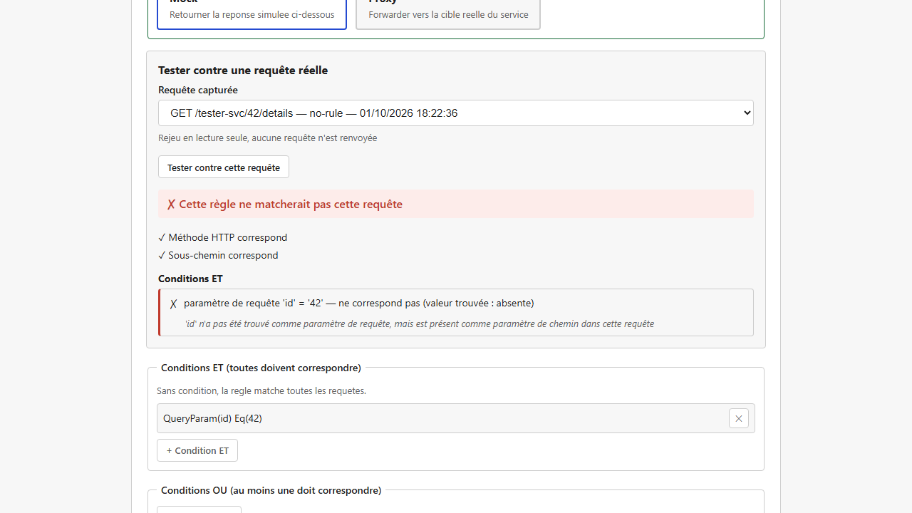
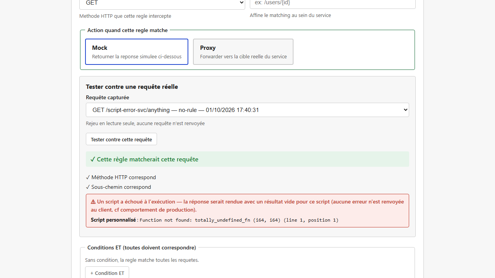
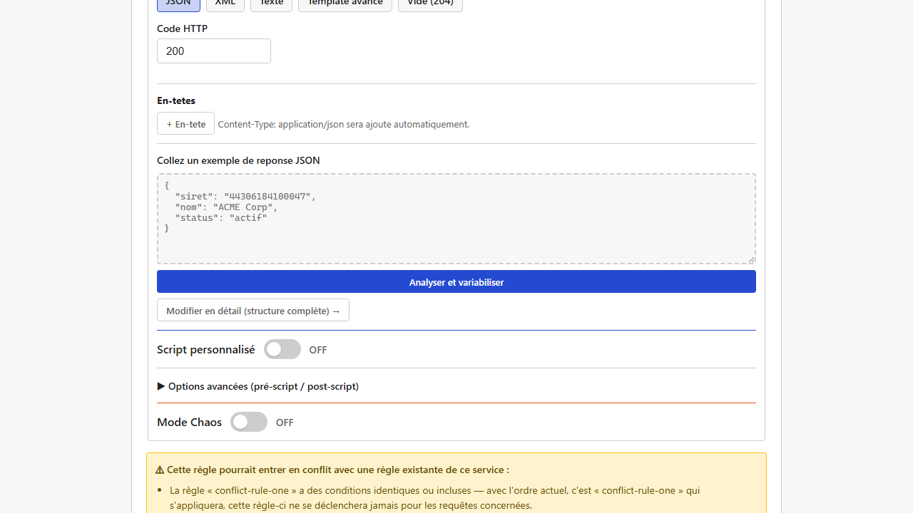

[English](../en/rule-tester-and-conflicts.md)

# Testeur de règle et détection de conflits

Deux aides à la qualité intégrées à l'éditeur de [règle](matching-rules.md), contre les deux pièges les plus fréquents quand on configure des règles : « pourquoi ma règle ne matche-t-elle pas ? » et « pourquoi une autre règle répond-elle à la place de la mienne ? ».

## Le testeur de règle : vérifier contre du trafic réel

Pendant que vous créez ou modifiez une règle, **« Tester contre une requête réelle »** confronte le brouillon à une **requête réellement reçue par Mimicway** récemment (issue du [journal des requêtes](request-log.md)), sans enregistrer la règle d'abord ni envoyer de nouvelle requête.

Pour chaque condition de la règle, le résultat dit si elle a matché et surtout **pourquoi**. Cas typique : vous avez posé une condition sur un « paramètre de requête » (`?cle=valeur`) alors que la valeur se trouvait en réalité dans un « paramètre de chemin » de l'URL (`{cle}`). Sans aide, la règle ne matchait tout simplement pas, sans aucun indice. Le testeur repère ce genre de confusion et le signale (« `cle` n'a pas été trouvé comme paramètre de requête, mais est présent comme paramètre de chemin dans cette requête »).

### Repérer un script cassé avant d'enregistrer

Quand votre règle contient des [scripts Rhai](rhai-scripts.md), le testeur les exécute réellement contre la requête sélectionnée (seulement si la règle la matche, comme en production). Quand un script échoue, par exemple parce qu'il appelle une fonction qui n'existe pas, un message explicite nomme le bloc en cause (script personnalisé, pré-script ou post-script) et l'erreur exacte.

C'est important, car une fois la règle enregistrée, une erreur de script **ne bloque jamais la réponse** : la requête est quand même servie, avec un résultat vide pour le script en échec, et rien de visible pour qui reçoit la réponse. Le testeur est l'endroit où ce genre de problème redevient visible, avant l'enregistrement ; voir [Scripts Rhai : quand un script échoue](rhai-scripts.md#quand-un-script-échoue).

### Voir ce qu'un script a réellement produit, même sans erreur

Un script peut s'exécuter **sans aucune erreur** et produire autre chose que ce que vous attendiez : une clé mal orthographiée, ou un champ imbriqué qui ne se comporte pas comme un chemin JSON (voir [Scripts Rhai : piocher un objet entier dans une liste](rhai-scripts.md#cas-dusage--piocher-un-objet-entier-pas-seulement-une-valeur-dans-une-liste)). Sans erreur à signaler, rien ne vous mettrait sur la piste.

Pour chaque script exécuté sans erreur, le testeur affiche donc **le résultat qu'il a réellement produit** : chaque variable de template qu'il rend disponible (`{{script}}`, ou `{{script.champ}}` pour chaque champ de l'objet retourné), avec sa valeur exacte. C'est le moyen le plus sûr de remarquer qu'une clé que vous pensiez utiliser n'existe pas, ou qu'un champ censé contenir une valeur simple contient tout un bloc JSON.

## Le détecteur de conflits : un avertissement à l'enregistrement

Mimicway applique la **première règle qui correspond** à une requête (voir [Règles de correspondance](matching-rules.md)) : l'ordre de la liste compte donc. Avec beaucoup de règles, il est facile d'en ajouter une qui, sans le vouloir, est **masquée** par une règle plus générale placée avant elle (ou l'inverse).

À chaque enregistrement d'une règle (création ou modification), Mimicway compare le brouillon aux autres règles du service et affiche un avertissement quand un chevauchement plausible est trouvé, en indiquant **laquelle des deux règles s'appliquerait réellement** dans l'ordre actuel.

L'avertissement **ne bloque jamais** : deux choix sont toujours proposés,

- **Enregistrer quand même**, quand le chevauchement est voulu (une règle générale de repli placée exprès après des règles plus précises, par exemple),
- **Modifier la règle**, pour la revoir avant d'enregistrer.

## Prérequis et limites

- Aucun prérequis : disponible dans toutes les installations.
- Le testeur ne peut confronter votre brouillon qu'à des requêtes **déjà passées** par Mimicway et conservées dans le journal. Si aucune ne convient encore, envoyez-en une (avec `curl`, Postman ou l'application testée) et revenez au testeur.
- Une requête relayée par un service en mode proxy (voir [Services et routage](services.md)) n'a pas de détail conservé dans le journal, pour ne pas ralentir ce chemin : le testeur indique qu'aucun détail n'est disponible pour ces entrées.
- Le testeur n'exécute les scripts que si la règle matche la requête sélectionnée et que son action est « Mock » : comme en production, le script d'une règle « Proxy » ne s'exécute jamais.
- La détection de conflits repère les cas courants et nets (mêmes conditions, règle plus précise derrière une règle plus générale…) mais ne promet pas de trouver **tous** les chevauchements possibles, en particulier les combinaisons complexes de conditions OU. Elle ne lève volontairement jamais de fausse alerte, au prix de manquer certains cas limites : un avertissement affiché mérite votre confiance.
- La détection est **purement informative** : elle ne change jamais l'ordre réel d'évaluation ni le comportement des règles.
