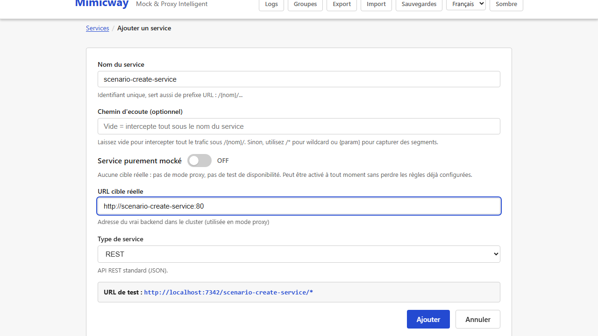
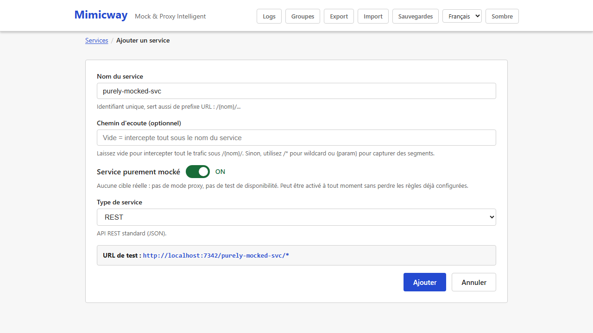
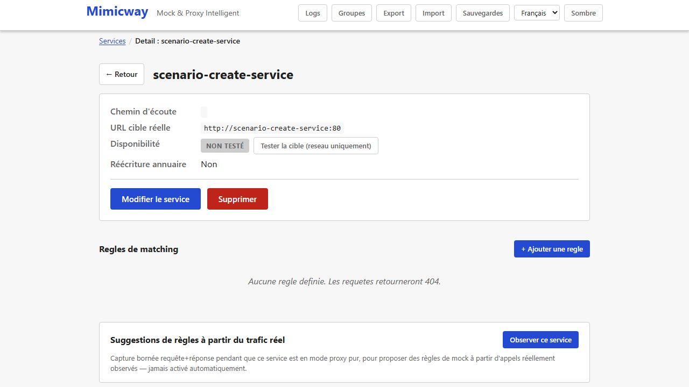
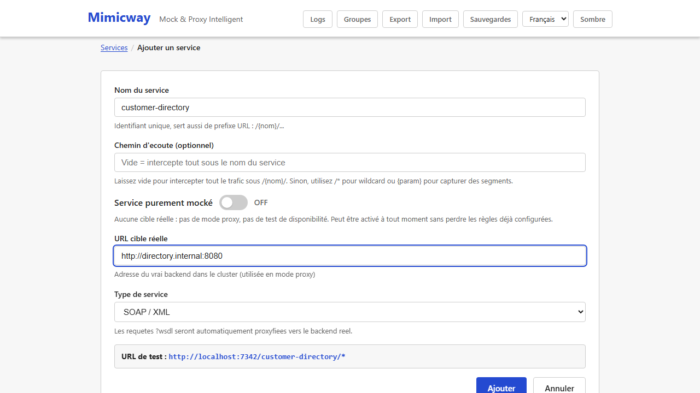

[English](../en/services.md)

# Services et routage

Un **service** est l'unité de base de Mimicway : il représente une API que vous voulez simuler ou relayer. Chaque service créé est aussitôt joignable sur sa propre URL, sans rien redémarrer.

## Créer un service

Sur l'écran d'accueil, **« + Ajouter un service »** ouvre un formulaire avec :

- **Nom** : identifie le service et forme le premier segment de son URL (voir plus bas). Lettres, chiffres, tirets et tirets bas uniquement.
- **Chemin d'écoute** (`listen_path`) : la partie de l'URL après le nom du service, par exemple `/v1/users/{id}`. Il peut contenir des paramètres entre accolades (`{id}`) que les réponses peuvent reprendre. Laissé vide, le service répond à **n'importe quel chemin** sous son nom.
- **Service purement mocké** (interrupteur) : voir la section suivante.
- **URL cible réelle** (`real_target_url`) : l'adresse du vrai backend, utilisée quand une requête est relayée en mode proxy (voir plus bas) et par le [test de disponibilité](availability-check.md).
- **Type de service** : REST (par défaut) ou SOAP ; voir la section plus bas.
- **Groupe** (optionnel, proposé dès qu'un groupe existe) : rattache le service à un [groupe](groups.md).

Un nouveau service avec une cible démarre en mode proxy : il relaie chaque requête jusqu'à ce que vous activiez l'interrupteur **Mock** de sa carte dans la liste des services (voir plus bas).



## Service purement mocké (aucune cible)

Certains services n'ont jamais vocation à relayer une vraie requête : ils ne produisent que des réponses simulées, et leur saisir une URL cible n'a aucun intérêt. L'interrupteur **« Service purement mocké »** supprime cette étape :

- Une fois activé, le champ **URL cible réelle** disparaît du formulaire, de même que le [test de disponibilité](availability-check.md), qui n'a pas de sens sans cible.
- Le service reste en mode mock (l'interrupteur ne peut pas être désactivé pour un service sans cible : relayer vers nulle part ne pourrait qu'échouer).
- Le désactiver à tout moment, y compris en modification, réaffiche le champ cible sans rien perdre : règles, groupe et type de service restent tels quels.



**Une requête qu'aucune règle ne matche** : sur un service purement mocké, la réponse est un `404` avec un message explicite (`No rule matches this request: this service is purely mocked (no target configured).`) plutôt qu'une tentative ratée de relais vers une adresse vide.

**Une règle en action « Proxy » n'a pas de sens sur un service purement mocké** : le formulaire de règle ne propose donc que « Mock » pour ces services.

**Rendre purement mocké un service existant dont certaines règles utilisent « Proxy »** : Mimicway avertit au lieu de bloquer. Le message liste les règles concernées (elles cesseront de relayer et répondront par une erreur claire) et propose « Enregistrer quand même » ou de revenir en arrière pour les corriger d'abord.

## Comment l'URL est construite

Chaque service vit dans son propre espace de noms, si bien que les services n'entrent jamais en collision :

```
/{nom-du-service}/{chemin-d-ecoute}
```

ou, quand le service appartient à un groupe :

```
/{code-du-groupe}/{nom-du-service}/{chemin-d-ecoute}
```

| Nom du service | Chemin d'écoute | URL à appeler |
|---|---|---|
| `insee` | `/v4/sirene/{siret}` | `GET /insee/v4/sirene/44306184100047` |
| `accounts` | `/login` | `POST /accounts/login` |
| `users` | *(vide)* | `GET /users/n-importe-quoi` (n'importe quel chemin) |

L'URL exacte à appeler est toujours affichée sur la page du service : inutile de la reconstituer à la main.



## Mock ou proxy : deux modes, deux niveaux

Mimicway peut soit **répondre lui-même** à une requête (mode *mock*, avec la réponse que vous avez configurée), soit **la transmettre au vrai backend** et renvoyer sa réponse telle quelle (mode *proxy*). Ce choix existe à deux niveaux :

- **Au niveau du service** : l'interrupteur de mock fait de TOUT le service un proxy pur (aucune règle n'est évaluée, chaque requête part directement vers `real_target_url`) ou le met en mode mock (les règles du service sont évaluées, voir [Règles de correspondance](matching-rules.md)).
- **Au niveau de la règle** : quand le service est en mode mock, chaque règle peut elle-même être réglée sur « mock » (répondre avec le contenu configuré) ou « proxy » (relayer au vrai backend les requêtes qu'elle matche). On obtient ainsi un **mock partiel** : par exemple, simuler seulement les cas d'erreur et laisser tout le reste atteindre le vrai service.

Dans les deux cas, une requête relayée garde sa méthode, ses paramètres, ses en-têtes et son corps : rien n'est modifié ni perdu en route.

## Type de service : REST ou SOAP

Le sélecteur « Type de service » fixe le traitement des requêtes techniques SOAP (WSDL, le fichier qui décrit une API SOAP) :

- **REST** (par défaut) : comportement standard, sans traitement propre à SOAP.
- **SOAP** : les requêtes WSDL peuvent soit être **relayées telles quelles au vrai backend** (`Proxy`/`Auto`, pratique pour laisser un client SOAP découvrir le vrai contrat d'API), soit **recevoir la réponse de vos règles simulées** (`Mock`, pour simuler aussi la description du service).



Passer un service en SOAP se fait entièrement dans ce formulaire : rien d'autre à configurer.

## Modifier, dupliquer, supprimer

- **Modifier** ouvre le même formulaire, prérempli.
- **Dupliquer** préremplit un nouveau formulaire à partir d'un service existant (nom suggéré `{nom}-copie`, modifiable) : un moyen rapide de créer une variante.
- **Supprimer** retire ce service seulement : un service du même nom dans un autre groupe n'est pas touché (deux services peuvent porter le même nom s'ils sont dans des groupes différents, ou si l'un n'a pas de groupe et l'autre en a un).

## Retrouver un service

La liste des services a un champ de recherche qui filtre par nom, chemin, URL ou groupe, et ouvre le groupe d'un résultat qui se trouve dans un groupe replié.

## Prérequis et limites

- Aucun prérequis : disponible dans toutes les installations.
- Un nom de service doit être unique **dans son périmètre** (sans groupe, ou dans un groupe). Deux services du même nom dans deux groupes sont autorisés et distingués partout dans l'interface.
- Certains noms sont réservés par Mimicway lui-même (`api`, `auth`, `assets`, `index.html`, `favicon.ico`, `runtime-config.json`) et ne peuvent pas nommer un service, pour qu'ils ne masquent jamais l'interface.
