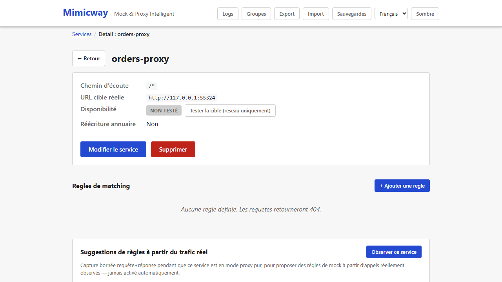
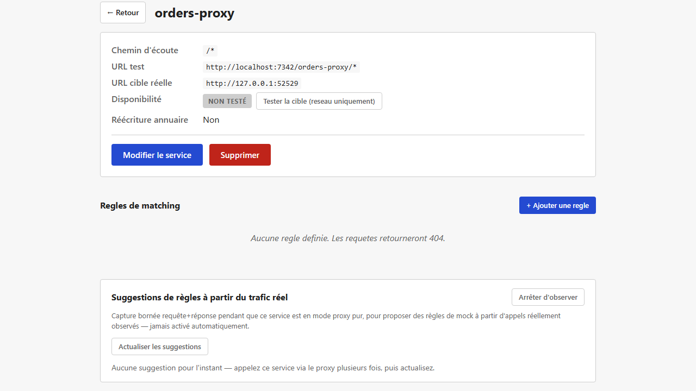
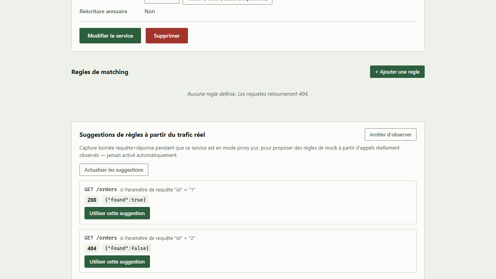
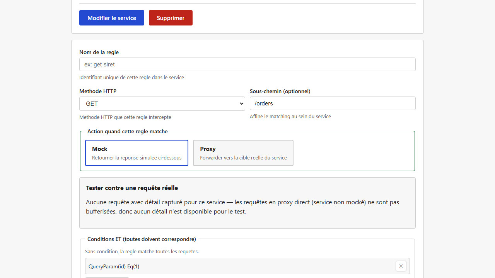

[English](../en/traffic-observation.md)

# Observation de trafic et suggestions de règles

Pour un service en mode **proxy pur** (pas encore simulé du tout), Mimicway peut observer le trafic réellement échangé avec le vrai backend et **proposer des règles de mock** à partir de ce qu'il a vu, au lieu de vous les faire toutes écrire à la main. Rien ne démarre tout seul : vous l'activez explicitement, service par service.

## Activer l'observation

Sur la page d'un service **en mode proxy** (`is_mocked` désactivé), le panneau « Suggestions de règles à partir du trafic réel » propose **« Observer ce service »**. Une fois ce bouton cliqué, Mimicway capture (dans certaines limites, voir « Limites » plus bas) la requête et la réponse de chaque appel relayé au vrai backend, tant que l'observation reste active.

Cela ne change **rien** au comportement du proxy (la requête est toujours relayée telle quelle) : une capture s'ajoute seulement à côté, et vous pouvez l'arrêter à tout moment.

## Le piège que Mimicway évite

Deux appels au même point d'accès (même méthode, même chemin) peuvent légitimement recevoir des réponses différentes : un paramètre, un en-tête ou un identifiant qui change modifie aussi la réponse du vrai backend. Une règle générée naïvement à partir du **premier** appel vu casserait silencieusement tous les autres cas.

Mimicway attend donc d'avoir vu **plusieurs appels** à un point d'accès avant de proposer quoi que ce soit, puis :

- Quand toutes les réponses observées sont identiques, il propose une règle **sans condition**.
- Quand les réponses varient et qu'un paramètre de requête, un champ du corps JSON ou un en-tête **prédit exactement** quelle réponse revient pour quelle valeur, il propose **une règle par valeur**, chacune avec sa condition.
- Quand les réponses varient **et qu'aucun champ ne l'explique de façon fiable**, il ne propose aucune règle. Un message signale la variation, plutôt qu'une règle qui casserait silencieusement certains appels.

## Utiliser une suggestion

**« Actualiser les suggestions »** relit le trafic observé depuis l'activation de l'observation et recalcule les suggestions (rien ne s'actualise en arrière-plan). **« Utiliser cette suggestion »** ne crée **pas** la règle : il remplit le formulaire de règle habituel (méthode, sous-chemin, condition, réponse), pour que vous la relisiez, l'ajustiez et l'enregistriez comme n'importe quelle autre règle.

## Prérequis et limites

- Seulement pour un service en mode **proxy pur** (`is_mocked` désactivé) : « Observer ce service » est refusé sinon, puisque l'observation n'a de sens que sur du trafic relayé à un vrai backend.
- Un appel n'est capturé que si les tailles de sa requête et de sa réponse sont connues à l'avance (un en-tête `Content-Length`, ou pas de corps). Une réponse envoyée par morceaux (`Transfer-Encoding: chunked`, sans taille annoncée) est toujours relayée normalement, mais pas observée.
- Le nombre d'observations conservées est borné, par point d'accès et au total (voir les réglages `TRAFFIC_OBSERVATION_*` dans le README) : au-delà, les plus anciennes sont remplacées par les plus récentes, si bien que la mémoire ne croît jamais sans limite.
- Les identifiants ne sont jamais capturés : `Authorization`, les cookies, les en-têtes de clé d'API et tout en-tête listé dans `REDACT_HEADERS` sont conservés comme `[redacted]`, et les règles suggérées ne les recopient jamais.
- L'observation s'arrête d'elle-même quand son service est supprimé, et à chaque réinitialisation complète de la configuration.
- Comme pour le [journal des requêtes](request-log.md), rien n'est écrit sur disque : un redémarrage de Mimicway repart sans aucune observation.
