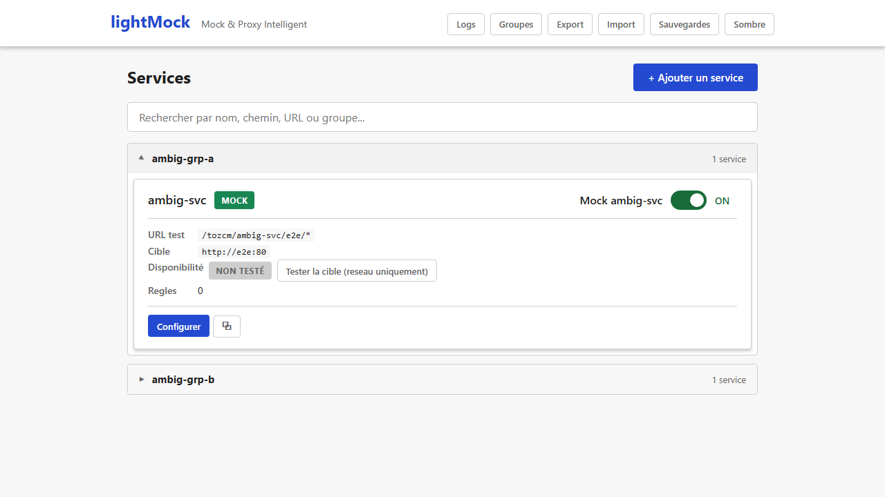
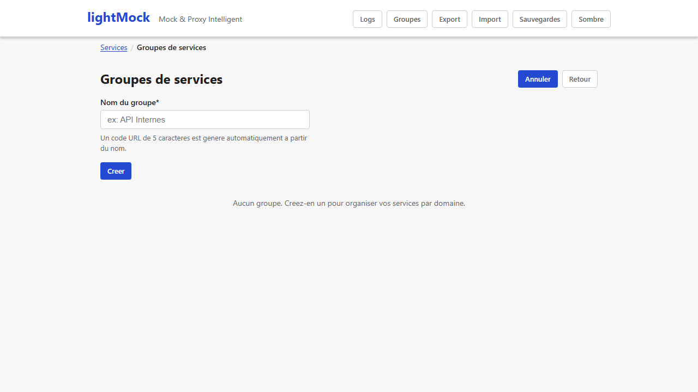

# Groupes de services

Quand le nombre de services simulés grandit, les regrouper permet de garder une interface
lisible et de gérer les droits d'accès par équipe ou par périmètre fonctionnel.

## À quoi sert un groupe

Un groupe rassemble plusieurs [services](services.md) sous :

- Un **affichage replié/déplié** dans la liste (un accordéon par groupe), pour ne pas se noyer
  dans une longue liste de services.
- Un **préfixe d'URL commun** : les services d'un groupe sont accessibles sous
  `/{code-du-groupe}/{nom-du-service}/...` plutôt que simplement `/{nom-du-service}/...`.
- Une **gestion de droits dédiée** (admins et membres du groupe) si l'[authentification](authentification.md)
  est activée.

## Créer un groupe

Depuis le bouton "Groupes" de la barre de navigation, un formulaire simple demande uniquement le
**nom** du groupe. Un **code technique de 5 caractères** est généré automatiquement à partir du
nom (toujours le même code pour un même nom) — c'est ce code qui préfixe les URL des services du
groupe. Il n'y a rien à saisir manuellement pour ce code.

**Qui peut créer un groupe ?** N'importe quel utilisateur. La personne qui crée le groupe en
devient automatiquement administratrice.

## Gérer les membres et les droits

Chaque groupe a deux catégories d'utilisateurs :

- **Administrateurs** : peuvent modifier ou supprimer le groupe, et gérer sa liste
  d'administrateurs/membres.
- **Membres** : ont accès aux services du groupe (le niveau d'accès exact dépend de la
  configuration de l'[authentification](authentification.md)).

Un **super-administrateur** (s'il y en a un de configuré) peut toujours tout gérer, quel que soit
le groupe.

> Si l'authentification n'est pas activée sur votre instance de lightMock, tout le monde a accès
> à tout — les notions d'admin/membre de groupe deviennent surtout indicatives.

*(Capture manquante — aucun scénario E2E existant n'ouvre l'écran de gestion des membres d'un
groupe ; à réaliser manuellement, cf `frontend/e2e/README.md` section captures.)*

## L'état "déplié/replié" est mémorisé pendant votre session

Quand vous dépliez un groupe puis allez modifier un de ses services, le groupe reste déplié à
votre retour sur la liste — vous ne perdez pas votre place. Cet état est cependant remis à zéro si
vous rechargez complètement la page (F5) : ce n'est pas une préférence sauvegardée durablement,
juste un confort pendant que vous naviguez.

## Prérequis et limites

- Aucun prérequis particulier : disponible dès l'installation de base.
- Le nom d'un groupe doit être unique (sans tenir compte des majuscules/minuscules).
- La gestion fine des droits (qui voit quoi) n'a d'effet réel que si
  l'[authentification](authentification.md) est activée ; sans elle, l'accès est toujours complet
  pour tout le monde.
