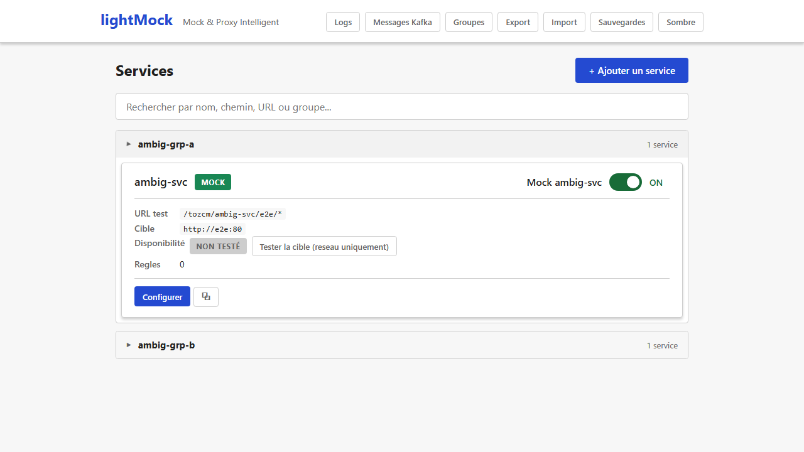
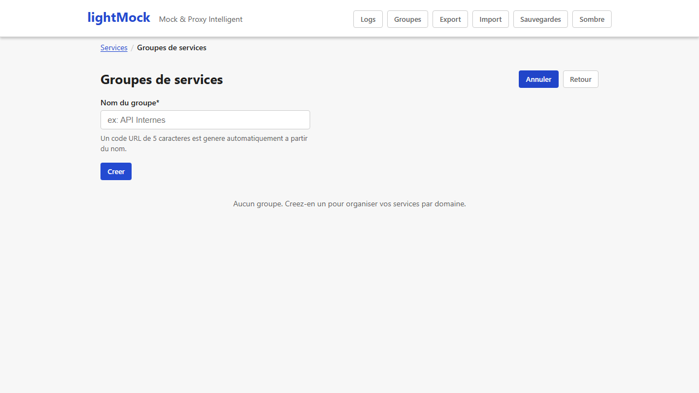

# Service groups

As the number of mocked services grows, groups keep the interface readable and let you manage access per team or per functional area.

## What a group is for

A group gathers several [services](services.md) under:

- A **collapsible section** in the list (one accordion per group), so a long list stays easy to scan.
- A **shared URL prefix**: the services of a group are reached under `/{group-code}/{service-name}/...` rather than `/{service-name}/...`.
- **Their own access rights** (group admins and members) when [authentication](authentication.md) is on.

## Creating a group

The "Groups" button of the navigation bar opens a short form that only asks for the group's **name**. A **5-character code** is derived from the name (the same name always gives the same code); that code prefixes the URLs of the group's services. There is nothing to type for it.

**Who can create a group?** Any user. Whoever creates a group becomes its admin.

## Members and rights

Each group has two kinds of users:

- **Admins** can edit or delete the group and manage its list of admins and members.
- **Members** can work on the group's services (see [authentication](authentication.md) for the exact rights).

A **super-admin**, when one is configured, can manage every group.

> When authentication is off on your lightMock, everyone can do everything: group admins and members are then informative only.

## The expanded or collapsed state is kept while you navigate

When you expand a group and go edit one of its services, the group is still expanded when you come back to the list: you do not lose your place. A full page reload (F5) resets it: it is a convenience while you navigate, not a saved preference.

## Requirements and limits

- No requirement: available in every installation.
- A group name must be unique, ignoring case.
- Fine-grained rights (who sees what) only take effect when [authentication](authentication.md) is on; without it, everyone has full access.
