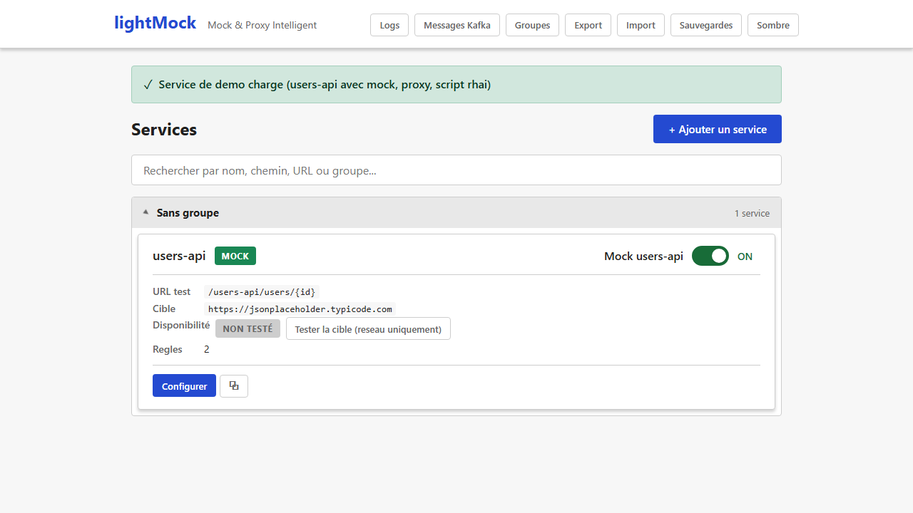

# lightMock — Vue d'ensemble des fonctionnalités

lightMock est un outil qui simule ("mock") ou relaie ("proxy") des appels HTTP vers un vrai service — utile pour tester une application sans dépendre d'un backend réel, ou pour rejouer des scénarios précis (erreurs, lenteurs, données particulières) à la demande. Tout se pilote depuis une interface web, sans redémarrage.

Cette page est une **vue d'ensemble rapide** : une ligne ou deux par fonctionnalité, avec un lien vers la page qui explique comment l'utiliser en détail. Si vous découvrez lightMock, parcourez cette liste une première fois pour savoir ce qui existe, puis revenez piocher les pages détaillées au besoin.

> Cette documentation est destinée aux utilisateurs et testeurs du produit (métier, QA). Pour les détails techniques d'installation ou d'architecture, voir `README.md` à la racine du dépôt — cette doc-ci ne le duplique pas, elle explique **ce que le produit permet de faire** et **comment s'en servir**.

## Services & routage

| Fonctionnalité | En bref |
|---|---|
| [Services et routage](services.md) | Chaque service simulé est exposé sous sa propre URL (`/mon-service/...`). On y définit l'adresse du vrai backend, si le mock est actif ou non, et le type d'API (REST ou SOAP). |
| [Groupes de services](groupes.md) | Regrouper plusieurs services liés (ex. tous les services d'une même équipe) sous un même préfixe d'URL, avec une gestion des droits par groupe. |
| [Ping de disponibilité](ping-de-disponibilite.md) | Un bouton pour vérifier rapidement si le vrai backend est joignable sur le réseau, sans jamais lui envoyer de vraie requête. |

## Règles & réponses simulées

| Fonctionnalité | En bref |
|---|---|
| [Règles de correspondance (matching)](regles-de-matching.md) | Un service peut avoir plusieurs règles : chacune définit une méthode HTTP, un sous-chemin et des conditions (sur les paramètres, en-têtes, corps...) pour décider quelle réponse renvoyer. |
| [Réponses dynamiques et templates](reponses-et-templates.md) | Construire la réponse (JSON ou XML) avec un éditeur visuel, des données factices (faux noms, adresses, SIRET...), et simuler des pannes/lenteurs (mode Chaos). |
| [Scripts Rhai](scripts-rhai.md) | Pour les cas avancés : écrire un petit script qui calcule des valeurs (dates, nombres aléatoires ou déterministes, UUID...) réutilisables dans la réponse. |
| [Testeur de règle et détection de conflits](testeur-de-regle-et-conflits.md) | Vérifier qu'une règle fonctionne comme prévu contre une vraie requête déjà reçue, et être averti si une nouvelle règle risque d'entrer en conflit avec une règle existante. |

## Suivi & diagnostic

| Fonctionnalité | En bref |
|---|---|
| [Journal des requêtes](journal-des-requetes.md) | Historique des dernières requêtes reçues par lightMock, consultable dans l'interface — utile pour comprendre pourquoi une règle a (ou n'a pas) matché. |

## Sauvegarde & administration

| Fonctionnalité | En bref |
|---|---|
| [Sauvegardes et restauration](sauvegardes-et-restauration.md) | La configuration est sauvegardée automatiquement avant chaque changement important ; on peut restaurer un état antérieur en un clic. |
| [Administration (Import / Export / Réinitialisation / Mode sombre)](administration.md) | Exporter/importer toute la configuration en un fichier, réinitialiser complètement l'outil, et basculer entre thème clair et sombre. |

## Sécurité & intégrations

| Fonctionnalité | En bref |
|---|---|
| [Authentification](authentification.md) | Optionnelle : lightMock peut être protégé par une connexion (Keycloak), avec des droits différents selon les utilisateurs et les groupes. |
| [Messaging Kafka](messaging-kafka.md) | Optionnel : au-delà du HTTP, lightMock peut aussi simuler des réponses à des messages Kafka (nécessite une version compilée spécifiquement pour ça). |

---

**Vous ne trouvez pas une fonctionnalité ?** Elle est peut-être décrite dans une des pages ci-dessus sous un autre nom — utilisez la recherche de votre wiki. Si elle manque vraiment, signalez-le : cette documentation est maintenue en même temps que le produit.
