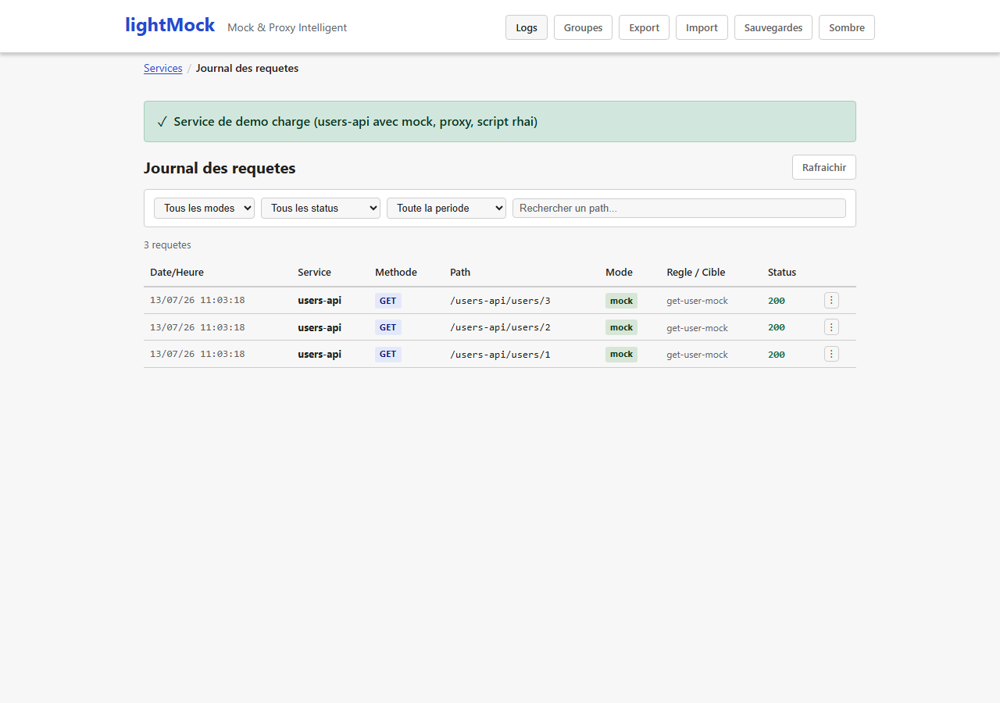
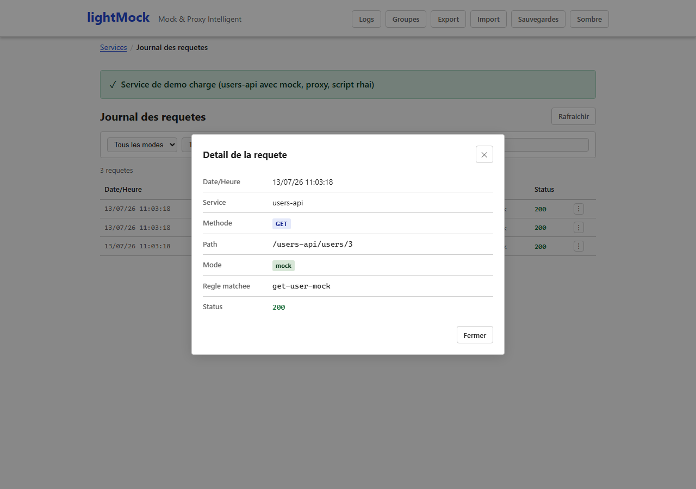

# Journal des requêtes

Le bouton **"Logs"** de la barre de navigation ouvre l'historique des dernières requêtes reçues par lightMock, tous services confondus.Utile pour comprendre ce qui a été réellement envoyé par l'application testée, et pour diagnostiquer une règle qui ne se déclenche pas comme prévu.

*(Capture réalisée manuellement — le journal n'est normalement traversé qu'indirectement via le sélecteur du testeur de règle, aucun scénario E2E automatisé n'ouvre l'écran "Logs" pour lui-même.)*

## Ce que montre une entrée du journal

- Le service et, le cas échéant, la règle qui a été appliquée.
- La date et l'heure de la requête.
- Un détail complet (quand disponible, voir "Limites" ci-dessous) : en-têtes, paramètres de requête et de chemin, corps envoyé.

Ce détail est justement ce qu'utilise le [testeur de règle](testeur-de-regle-et-conflits.md) pour rejouer une requête précédente contre un brouillon de règle.

*(Même remarque que ci-dessus : capture manuelle.)*

## Prérequis et limites

- Aucun prérequis particulier : disponible dès l'installation de base, activé automatiquement dès qu'une requête est reçue.
- Seules les **200 requêtes les plus récentes** sont conservées (le journal n'est pas un historique permanent) — au-delà, les plus anciennes sont retirées automatiquement.
- Le corps d'une requête volumineuse est tronqué au-delà d'une certaine taille dans le journal (les autres informations — méthode, en-têtes, paramètres — restent toujours complètes).
- Une requête relayée directement en mode proxy **au niveau service** (sans passer par l'évaluation d'aucune règle) n'a pas de détail conservé, pour ne pas ralentir ce chemin critique — seule l'existence de l'appel est journalisée.
