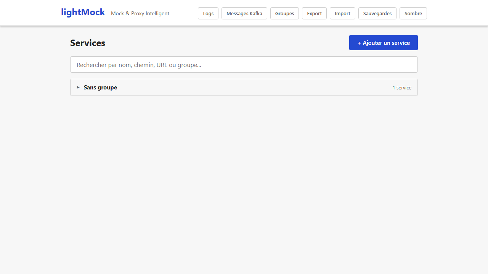
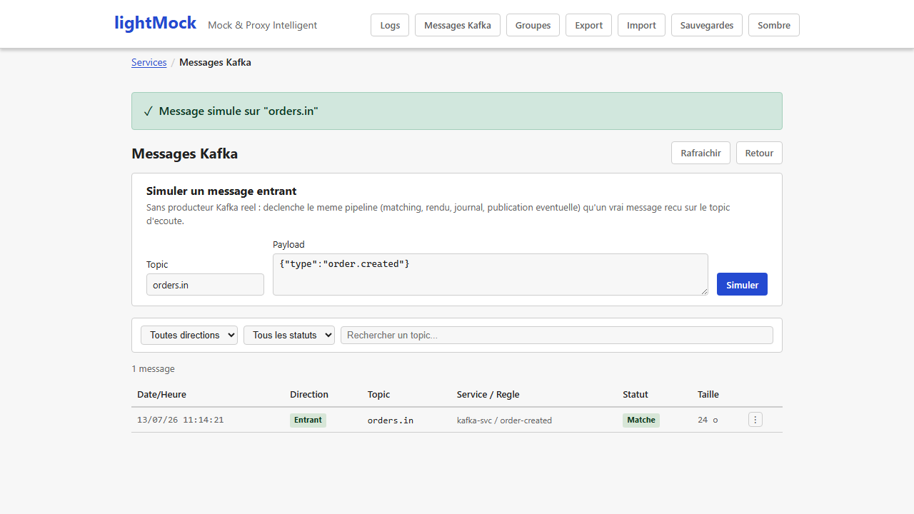
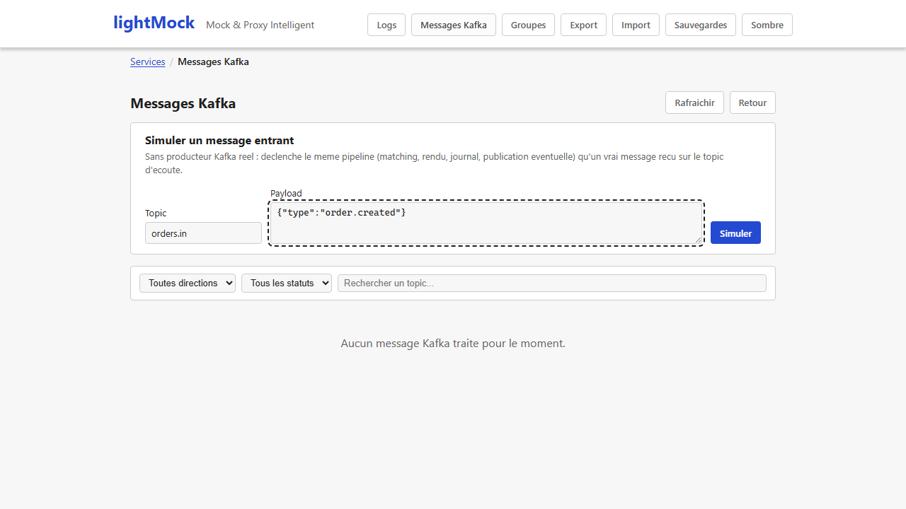

# Messaging Kafka (optionnel)

Au-delà des requêtes HTTP, lightMock peut aussi simuler des réponses à des **messages Kafka** (un
système de messagerie utilisé pour faire communiquer des applications de façon asynchrone, par
opposition à un appel HTTP direct). Cette fonctionnalité est **optionnelle** et n'est pas
forcément disponible sur toutes les installations de lightMock.

## Comment savoir si c'est disponible sur votre instance

Le bouton **"Messages Kafka"** n'apparaît dans la barre de navigation **que si** le binaire
lightMock qui tourne a été compilé avec le support Kafka. S'il est absent, cette fonctionnalité
n'est simplement pas incluse dans votre installation — ce n'est pas une erreur.

*(Capture générée automatiquement par `npm run docs:screenshots`, réalisée contre un binaire
compilé avec `--features messaging-kafka` — `frontend/e2e/messaging.spec.js` est `test.skip`
sinon. Le binaire de développement par défaut ne l'a pas : régénérer contre un binaire avec la
feature activée si cette image redevient manquante après une future mise à jour de l'interface.)*

## Fonctionnement

Une fois activé et connecté à un serveur Kafka, lightMock écoute un "topic" (un canal de messages
Kafka) et applique le **même moteur de règles et de réponses dynamiques** que pour le HTTP
(conditions sur le contenu du message, [templates](reponses-et-templates.md) pour construire la
réponse) : la première règle qui correspond au message reçu est appliquée, et sa réponse peut être
publiée sur un autre topic.

Un **journal des messages**, avec la même logique que le
[journal des requêtes](journal-des-requetes.md) HTTP, permet de consulter les messages reçus, ceux
qui ont matché ou non, et leur réponse.

*(Même remarque que ci-dessus : nécessite un binaire compilé avec `--features messaging-kafka`.)*

## Simuler un message sans serveur Kafka réel

Un panneau "Simuler un message entrant" permet de tester le comportement d'une règle Kafka
directement depuis l'interface, sans avoir besoin d'un vrai serveur Kafka qui envoie le message —
pratique pour valider une règle avant de la brancher sur un flux réel.

*(Même remarque que ci-dessus : nécessite un binaire compilé avec `--features messaging-kafka`.)*

## Prérequis et limites

- **Nécessite une version de lightMock compilée spécifiquement avec le support Kafka** — ce n'est
  pas le cas par défaut. Si le bouton "Messages Kafka" n'apparaît pas, votre installation ne
  l'inclut pas.
- Nécessite également qu'un serveur Kafka soit configuré et accessible (adresses des serveurs,
  topic à écouter...) — sans cette configuration, même une version compilée avec le support Kafka
  n'activera pas l'écoute réelle.
- Un seul topic d'écoute global est géré (pas de topic dédié par service) : le message entrant est
  comparé aux règles de **tous** les services, la première qui correspond gagne.
- Les [scripts Rhai](scripts-rhai.md) (pré-script/script/post-script) ne sont **pas** exécutés
  pour un message Kafka — cette capacité reste réservée au trafic HTTP dans cette version.
- Le journal des messages ne conserve ni indéfiniment ni sans limite : les entrées les plus
  anciennes sont retirées automatiquement (après un certain temps ou au-delà d'un certain nombre
  d'entrées), et le contenu d'un message volumineux peut être tronqué dans l'affichage.
