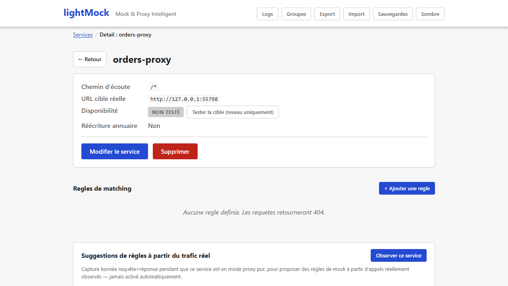
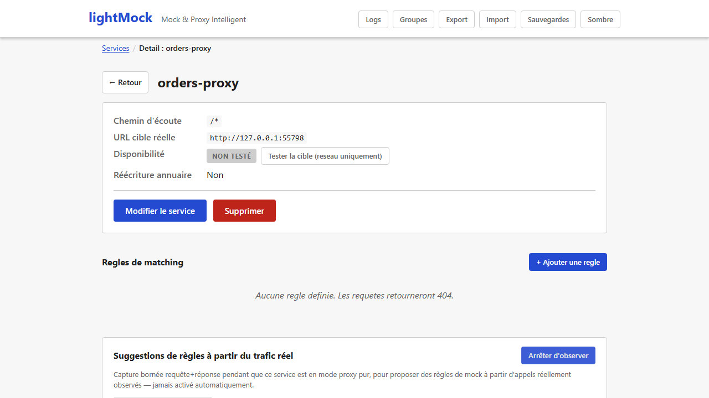
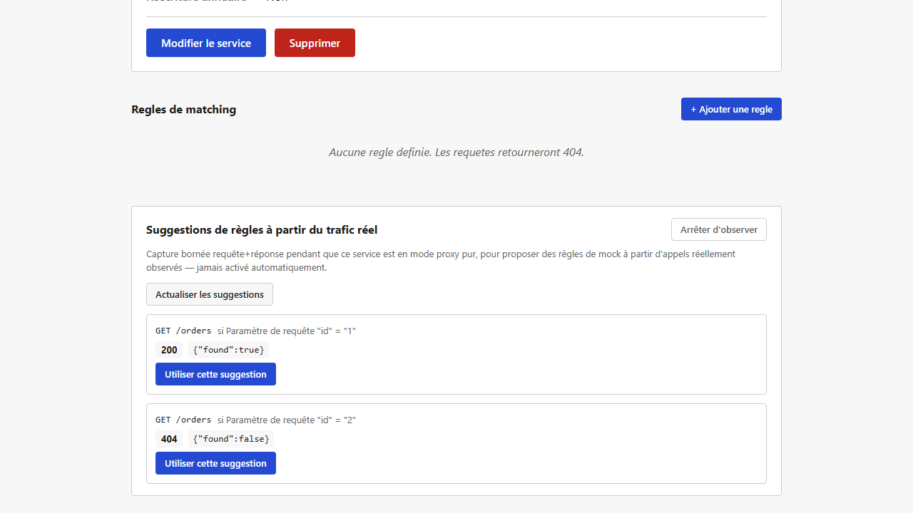
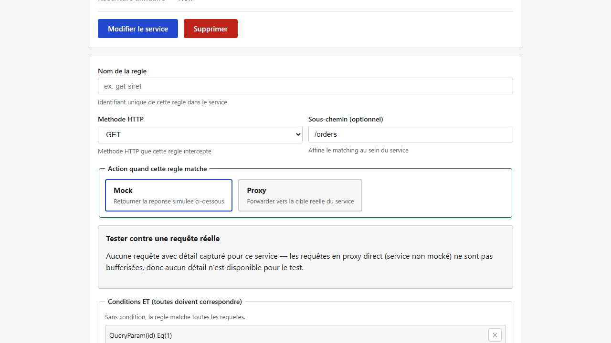

# Observation de trafic et suggestions de règles

Pour un service en mode **proxy pur** (pas encore mocké du tout), lightMock peut observer le
trafic réellement échangé avec le vrai backend et **proposer automatiquement des règles de mock**
à partir de ce qui a été vu — plutôt que d'obliger à les écrire entièrement à la main. Rien n'est
activé automatiquement : c'est un bouton à cliquer explicitement, service par service.

## Activer l'observation d'un service

Depuis la fiche d'un service **en mode proxy** (`is_mocked` désactivé), un panneau "Suggestions de
règles à partir du trafic réel" propose un bouton **"Observer ce service"**. Une fois cliqué,
lightMock capture (de façon bornée, voir "Limites" plus bas) la requête et la réponse de chaque
appel relayé vers le vrai backend, tant que l'observation reste active.

Ce bouton ne change **rien** au comportement du proxy lui-même (la requête est toujours relayée
telle quelle) — il ajoute uniquement une capture en parallèle, désactivable à tout moment.

## Le piège que lightMock essaie d'éviter

Deux appels au même endpoint (même méthode, même chemin) peuvent légitimement renvoyer des
réponses différentes — un paramètre, un en-tête ou un identifiant qui change change aussi la
réponse du vrai backend. Générer naïvement une règle à partir du **premier** appel observé
casserait silencieusement tous les cas suivants.

lightMock attend donc d'avoir observé **plusieurs appels** au même endpoint avant de proposer quoi
que ce soit, puis :

- Si toutes les réponses observées sont identiques → une règle **sans condition** est proposée.
- Si les réponses varient et qu'un paramètre de requête, un champ du corps JSON ou un en-tête
  permet de **prédire exactement** quelle réponse revient pour quelle valeur → une règle **par
  valeur distincte** est proposée, chacune avec sa condition.
- Si les réponses varient **sans qu'aucun champ ne l'explique de façon fiable** → aucune règle
  n'est proposée. Un simple message signale la variance observée, pour éviter de générer une
  règle qui casserait silencieusement certains appels.

## Utiliser une suggestion

Le bouton **"Actualiser les suggestions"** relit le trafic observé depuis la dernière activation
et recalcule les propositions (aucun rafraîchissement automatique en arrière-plan). Cliquer sur
**"Utiliser cette suggestion"** ne crée **pas** la règle directement : cela pré-remplit le
formulaire de création de règle habituel (méthode, sous-chemin, condition, réponse), pour que vous
puissiez relire, ajuster et sauvegarder exactement comme n'importe quelle autre règle.

## Prérequis et limites

- Disponible uniquement pour un service en mode **proxy pur** (`is_mocked` désactivé) — l'option
  "Observer ce service" est refusée sinon, l'observation n'a de sens que sur du trafic
  effectivement relayé vers un vrai backend.
- La capture n'a lieu que quand la taille de la requête et de la réponse est connue à l'avance
  (en-tête `Content-Length`, ou absence de corps) — une réponse envoyée en streaming/segments
  (`Transfer-Encoding: chunked`, sans taille annoncée) continue d'être relayée normalement mais
  n'est pas observée pour cet appel précis.
- Le nombre d'observations retenues est borné, par endpoint et au global — au-delà, les plus
  anciennes sont remplacées par les plus récentes, aucune croissance illimitée en mémoire.
- L'observation est désactivée automatiquement si le service correspondant est supprimé, et à
  chaque réinitialisation complète de la configuration.
- Comme le [journal des requêtes](journal-des-requetes.md), rien n'est persisté sur disque : un
  redémarrage de lightMock repart d'un état d'observation vide.
