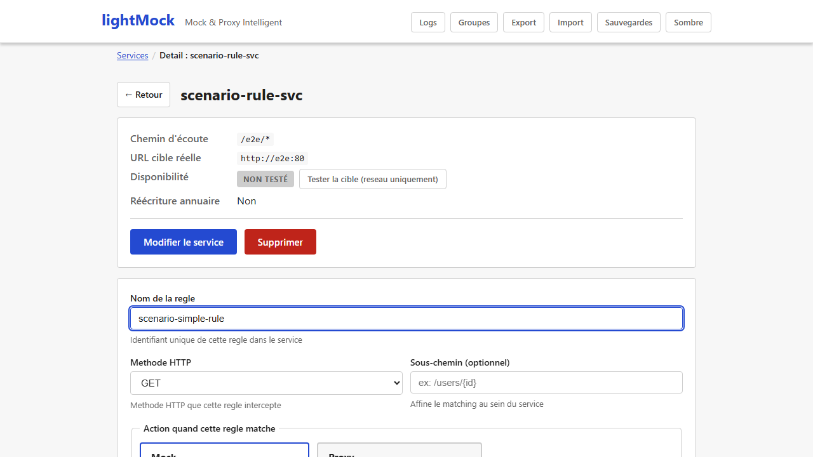

# Règles de correspondance (matching)

Un [service](services.md) en mode simulé peut avoir **plusieurs règles**. Chaque règle définit
"pour quelle requête" renvoyer "quelle réponse". C'est le cœur de la simulation : sans règle, un
service mocké ne sait répondre à rien de précis.

## Ce que définit une règle

- **Nom** : sert uniquement à identifier la règle dans l'interface (unique au sein du service).
- **Méthode HTTP** : `GET`, `POST`, `PUT`, `PATCH`, `DELETE`, `OPTIONS` ou `HEAD`. C'est la règle,
  pas le service, qui porte la méthode — un même service peut donc répondre différemment sur
  `GET` et sur `POST`.
- **Sous-chemin** (optionnel) : un complément au chemin d'écoute du service, pour distinguer
  plusieurs règles sur des URL voisines. Laissé vide, la règle s'applique à tout chemin sous le
  service.
- **Conditions** (optionnelles) : des critères supplémentaires pour affiner quand la règle
  s'applique (voir ci-dessous). Sans condition, la règle matche dès que la méthode et le
  sous-chemin correspondent.
- **Action** : `mock` (répondre avec le contenu configuré, voir
  [Réponses dynamiques et templates](reponses-et-templates.md)) ou `proxy` (relayer cette requête
  précise vers le vrai backend, pour un mock partiel — voir [Services et routage](services.md)).

## Les conditions : cibler une requête précisément

Une condition compare une valeur trouvée dans la requête (paramètre d'URL, en-tête, morceau du
corps...) à une valeur attendue. Les sources possibles :

| Source | Exemple d'usage |
|---|---|
| **Paramètre de chemin** (`{id}` dans l'URL) | Ne matcher que si `{id}` vaut une valeur précise |
| **Paramètre de requête** (`?cle=valeur`) | Ne matcher que si un paramètre de query string est présent/vaut telle valeur |
| **En-tête HTTP** | Ex. matcher selon un en-tête `X-Client-Version` |
| **Champ de formulaire** | Pour un corps envoyé en `application/x-www-form-urlencoded` |
| **Chemin JSON dans le corps** | Ex. matcher sur `montant` dans un corps JSON `{"montant": 100}` |
| **Chemin XPath dans le corps** | Équivalent pour un corps XML/SOAP |
| **Corps brut** | Comparer le corps de la requête tel quel, sans le parser |

Et les opérateurs de comparaison :

- **Égal à** une valeur exacte.
- **Contient** une sous-chaîne.
- **Correspond à une expression régulière**.
- **Est présent** (peu importe la valeur — juste vérifier que le champ existe).

Plusieurs conditions peuvent être combinées :

- **Toutes ces conditions** (ET) : la règle ne matche que si chaque condition est vraie.
- **Au moins une de ces conditions** (OU) : la règle matche dès qu'une seule condition est vraie.

*(Capture manquante — aucun scénario E2E existant ne construit une règle avec plusieurs
conditions combinées via l'interface ; à réaliser manuellement, cf `frontend/e2e/README.md`
section captures.)*

### Aide à la saisie

Pour un paramètre de chemin, l'interface propose une liste fermée des noms de paramètres
réellement présents dans l'URL du service (pas de faute de frappe possible). Pour un paramètre de
requête, une liste de suggestions apparaît à partir des paramètres vus dans le
[journal des requêtes](journal-des-requetes.md) récentes — mais vous restez libre de saisir une
valeur qui n'y figure pas encore.

## Quelle règle s'applique si plusieurs correspondent ?

Les règles d'un service sont évaluées **dans l'ordre où elles sont listées**, et **la première
qui correspond gagne** — les suivantes ne sont même pas regardées. L'ordre des règles est donc
important : une règle très générale placée avant une règle plus spécifique "masquera" toujours
cette dernière.

Vous pouvez **réordonner les règles** par glisser-déposer dans la liste. Pour éviter les
mauvaises surprises liées à l'ordre, utilisez le
[testeur de règle et la détection de conflits](testeur-de-regle-et-conflits.md) : il signale à la
sauvegarde si une nouvelle règle risque d'être masquée par une règle existante (ou l'inverse),
sans vous empêcher de sauvegarder si c'est un choix volontaire.

*(Capture manquante — aucun scénario E2E existant ne réordonne des règles par glisser-déposer
[le seul test de ce comportement est un test unitaire Vitest, pas un test E2E piloté navigateur] ;
à réaliser manuellement, cf `frontend/e2e/README.md` section captures.)*

## Prérequis et limites

- Aucun prérequis particulier : disponible dès l'installation de base.
- La détection des chevauchements entre règles (voir
  [testeur de règle et détection de conflits](testeur-de-regle-et-conflits.md)) couvre les cas les
  plus courants mais pas absolument tous les cas possibles — elle reste une aide, pas une
  garantie absolue.
