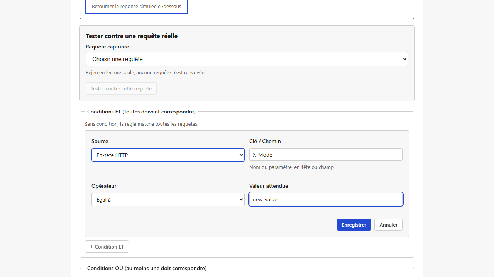
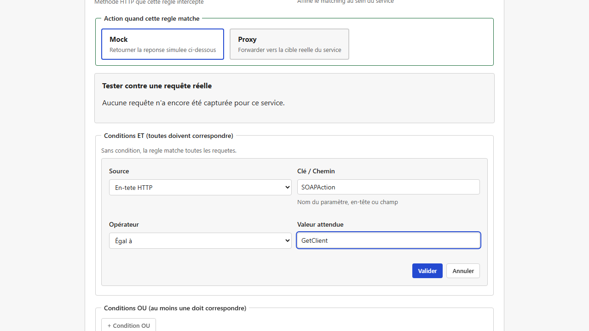
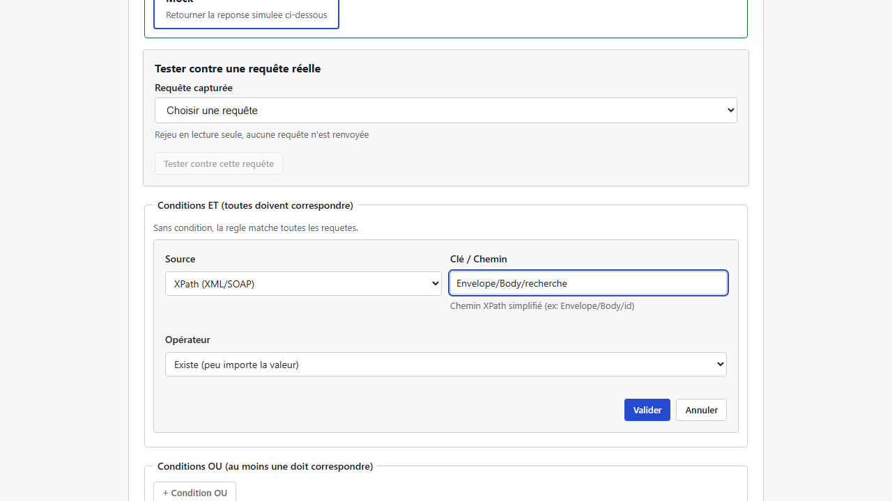

# Règles de correspondance (matching)

Un [service](services.md) en mode simulé peut avoir **plusieurs règles**. Chaque règle définit "pour quelle requête" renvoyer "quelle réponse". C'est le cœur de la simulation : sans règle, un service mocké ne sait répondre à rien de précis.

## Ce que définit une règle

- **Nom** : sert uniquement à identifier la règle dans l'interface (unique au sein du service).
- **Méthode HTTP** : `GET`, `POST`, `PUT`, `PATCH`, `DELETE`, `OPTIONS` ou `HEAD`. C'est la règle, pas le service, qui porte la méthode — un même service peut donc répondre différemment sur `GET` et sur `POST`.
- **Sous-chemin** (optionnel) : un complément au chemin d'écoute du service, pour distinguer plusieurs règles sur des URL voisines. Laissé vide, la règle s'applique à tout chemin sous le service.
- **Conditions** (optionnelles) : des critères supplémentaires pour affiner quand la règle s'applique (voir ci-dessous). Sans condition, la règle matche dès que la méthode et le sous-chemin correspondent.
- **Action** : `mock` (répondre avec le contenu configuré, voir [Réponses dynamiques et templates](reponses-et-templates.md)) ou `proxy` (relayer cette requête précise vers le vrai backend, pour un mock partiel — voir [Services et routage](services.md)). Sur un [service purement mocké](services.md#service-purement-mocké-aucune-cible) (aucune cible réelle configurée), l'action `proxy` n'est pas proposée.


**Ouvrir une règle déjà enregistrée en `proxy` sur un service devenu purement mocké** (cas d'une règle créée avant que le service ne soit basculé en "purement mocké") : le formulaire l'affiche automatiquement en `mock`, seule action encore disponible. Ce n'est qu'un affichage tant que vous n'avez rien enregistré — mais si vous sauvegardez cette règle (même pour un tout autre changement, par exemple une condition), lightMock affiche d'abord un avertissement explicite rappelant que cette sauvegarde va réellement faire basculer la règle de `proxy` à `mock`, avant de vous laisser confirmer ("Enregistrer quand même") ou revenir en arrière.

## Les conditions : cibler une requête précisément

Une condition compare une valeur trouvée dans la requête (paramètre d'URL, en-tête, morceau du corps...) à une valeur attendue. Les sources possibles :

| Source | Exemple d'usage |
|---|---|
| **Paramètre de chemin** (`{id}` dans l'URL) | Ne matcher que si `{id}` vaut une valeur précise |
| **Paramètre de requête** (`?cle=valeur`) | Ne matcher que si un paramètre de query string est présent/vaut telle valeur |
| **En-tête HTTP** | Ex. matcher selon un en-tête `X-Client-Version` |
| **Champ de formulaire** | Pour un corps envoyé en `application/x-www-form-urlencoded` |
| **Chemin JSON dans le corps** | Ex. matcher sur `montant` dans un corps JSON `{"montant": 100}` |
| **Chemin XPath dans le corps** | Équivalent pour un corps XML/SOAP |
| **Corps brut** | Comparer le corps de la requête tel quel, sans le parser |

Et les opérateurs de comparaison :

- **Égal à** une valeur exacte.
- **Contient** une sous-chaîne.
- **Correspond à une expression régulière**.
- **Est présent** (peu importe la valeur — juste vérifier que le champ existe).

Plusieurs conditions peuvent être combinées :

- **Toutes ces conditions** (ET) : la règle ne matche que si chaque condition est vraie.
- **Au moins une de ces conditions** (OU) : la règle matche dès qu'une seule condition est vraie.

*(Capture manquante — aucun scénario E2E existant ne construit une règle avec plusieurs conditions combinées via l'interface ; à réaliser manuellement, cf `frontend/e2e/README.md` section captures.)*

### Aide à la saisie

Pour un paramètre de chemin, l'interface propose une liste fermée des noms de paramètres réellement présents dans l'URL du service (pas de faute de frappe possible). Pour un paramètre de requête, une liste de suggestions apparaît à partir des paramètres vus dans le [journal des requêtes](journal-des-requetes.md) récentes — mais vous restez libre de saisir une valeur qui n'y figure pas encore.

### Modifier une condition existante

Une condition déjà ajoutée à une règle **se modifie directement** : cliquez sur la condition dans la liste (elle est affichée comme un bouton, pas un simple texte) pour rouvrir le même formulaire que celui utilisé pour l'ajouter, pré-rempli avec sa source, sa clé, son opérateur et sa valeur actuels. Changez ce qu'il faut — y compris le type de source (par exemple passer d'un paramètre de requête à un en-tête HTTP) — puis validez pour l'enregistrer à sa place : les autres conditions de la règle ne sont ni déplacées ni modifiées. "Annuler" referme le formulaire sans rien changer.



Avant cette fonctionnalité, la seule façon de changer une condition était de la supprimer puis d'en recréer une nouvelle (perdant l'ordre relatif et obligeant à ressaisir l'intégralité des champs). Ce n'est plus nécessaire.

## Cas d'usage : une même URL qui répond différemment selon l'opération SOAP

Question fréquente pour les services SOAP/XML : peut-on faire répondre **la même URL** différemment selon l'en-tête `SOAPAction`, ou selon le contenu de l'enveloppe envoyée ? **Oui, sans aucun développement** — il suffit de créer plusieurs règles sur le même service, chacune avec sa propre condition. Comme les règles sont évaluées dans l'ordre et que la première qui correspond gagne (voir plus bas), chaque opération SOAP obtient sa propre réponse simulée.

### Router sur l'en-tête `SOAPAction`

Créez une règle par opération, chacune avec une condition **En-tête HTTP** sur la clé `SOAPAction` :

| Règle `get-client` | Règle `get-order` |
|---|---|
|  |  |

Concrètement, une requête `POST` sur ce service avec l'en-tête `SOAPAction: GetClient` déclenche la règle `get-client` (et sa réponse dédiée), tandis qu'une requête avec `SOAPAction: GetOrder` déclenche `get-order` — sur la **même URL**, sans condition sur le chemin. Une requête avec une troisième valeur de `SOAPAction` (ou sans cet en-tête) ne matche aucune des deux règles et reçoit la réponse "aucune règle ne correspond" (voir [Services et routage](services.md)).

### Variante : router sur le contenu du corps plutôt que sur un en-tête

Certains clients SOAP n'envoient pas d'en-tête `SOAPAction` exploitable, ou vous préférez distinguer les opérations par le nom de l'élément XML envoyé dans l'enveloppe. Utilisez alors une condition **XPath (XML/SOAP)** sur le corps plutôt qu'un en-tête — même principe, une règle par opération :

- Règle `get-client` : source `XPath (XML/SOAP)`, clé `Envelope/Body/GetClientRequest`, opérateur `Existe` — matche tout corps dont l'enveloppe contient un élément `GetClientRequest` dans `Body` (le chemin ne tient pas compte des préfixes d'espace de noms, ex. `soap:Envelope`).
- Règle `get-order` : mêmes réglages avec `Envelope/Body/GetOrderRequest`.

Le même principe s'applique à un corps JSON avec une condition **Chemin JSON dans le corps** (JSON Pointer) — par exemple `/type` égal à `"client"` pour distinguer le type d'objet envoyé, plutôt qu'un élément XML.

#### Exemple vérifié — distinguer deux opérations SOAP par le nom de l'élément dans `Body`

Service `annuaire-soap`, chemin `/service`, deux règles `POST` :

| Règle | Condition |
|---|---|
| `operation-recherche` | `XPath (XML/SOAP)`, clé `Envelope/Body/recherche`, opérateur `Existe` |
| `operation-mode` | `XPath (XML/SOAP)`, clé `Envelope/Body/mode`, opérateur `Existe` |



Une requête `POST` avec ce corps (notez le `<Header></Header>` vide, non auto-fermé, avant `<Body>` — une structure d'enveloppe SOAP tout à fait courante) :

```xml
<SOAP:Envelope>
  <SOAP-ENV:Header></SOAP-ENV:Header>
  <SOAP-ENV:Body>
    <ns3:recherche>
      <ns3:Nom>Test</ns3:Nom>
      <ns3:Siret>98765432109876</ns3:Siret>
    </ns3:recherche>
  </SOAP-ENV:Body>
</SOAP:Envelope>
```

déclenche la règle `operation-recherche` (et **pas** `operation-mode`) — vérifié par un vrai appel HTTP. Une requête avec `<ns3:mode>...</ns3:mode>` à la place de `<ns3:recherche>` déclenche `operation-mode` à la place. Notez que le chemin `Envelope/Body/recherche` ne contient **aucun préfixe d'espace de noms** (ni `SOAP:`, ni `SOAP-ENV:`, ni `ns3:`) — c'est la syntaxe correcte : ces préfixes sont toujours ignorés dans le chemin (voir "Prérequis et limites" ci-dessous), les inclure dans le chemin (ex. `SOAP-ENV:Body/ns3:recherche`) ne matcherait jamais rien.

> **Ce cas précis (Header non auto-fermé avant Body) a été un vrai bug, corrigé.** Avant ce correctif, une condition XPath comme `Envelope/Body/recherche` ne matchait jamais dès qu'un élément frère de `Body` — tel qu'un `<Header></Header>` vide écrit avec une balise ouvrante et une balise fermante séparées, plutôt qu'auto-fermée (`<Header/>`) — précédait `Body` dans l'enveloppe. Ce n'était **pas** une erreur de syntaxe de votre part : le chemin sans préfixe (`Envelope/Body/recherche`) est et a toujours été la bonne syntaxe ; c'était bien un défaut du moteur de correspondance XPath (`walk_xml`), qui perdait la trace d'un ancêtre déjà reconnu (`Envelope`) dès qu'un élément non lié à ce chemin se refermait. Si votre lightMock est à jour, ce cas fonctionne comme documenté ci-dessus.

Pour récupérer une valeur de ce corps SOAP (par exemple le `Siret`) et la réinjecter dans la réponse, voir [le cas d'usage dédié dans Scripts Rhai](scripts-rhai.md#cas-dusage--extraire-une-valeur-de-la-requête-soap-vers-la-réponse).

## Quelle règle s'applique si plusieurs correspondent ?

Les règles d'un service sont évaluées **dans l'ordre où elles sont listées**, et **la première qui correspond gagne** — les suivantes ne sont même pas regardées. L'ordre des règles est donc important : une règle très générale placée avant une règle plus spécifique "masquera" toujours cette dernière.

Vous pouvez **réordonner les règles** par glisser-déposer dans la liste. Pour éviter les mauvaises surprises liées à l'ordre, utilisez le [testeur de règle et la détection de conflits](testeur-de-regle-et-conflits.md) : il signale à la sauvegarde si une nouvelle règle risque d'être masquée par une règle existante (ou l'inverse), sans vous empêcher de sauvegarder si c'est un choix volontaire.

*(Capture manquante — aucun scénario E2E existant ne réordonne des règles par glisser-déposer [le seul test de ce comportement est un test unitaire Vitest, pas un test E2E piloté navigateur] ; à réaliser manuellement, cf `frontend/e2e/README.md` section captures.)*

## Prérequis et limites

- Aucun prérequis particulier : disponible dès l'installation de base.
- La détection des chevauchements entre règles (voir
  [testeur de règle et détection de conflits](testeur-de-regle-et-conflits.md)) couvre les cas les plus courants mais pas absolument tous les cas possibles — elle reste une aide, pas une garantie absolue.
