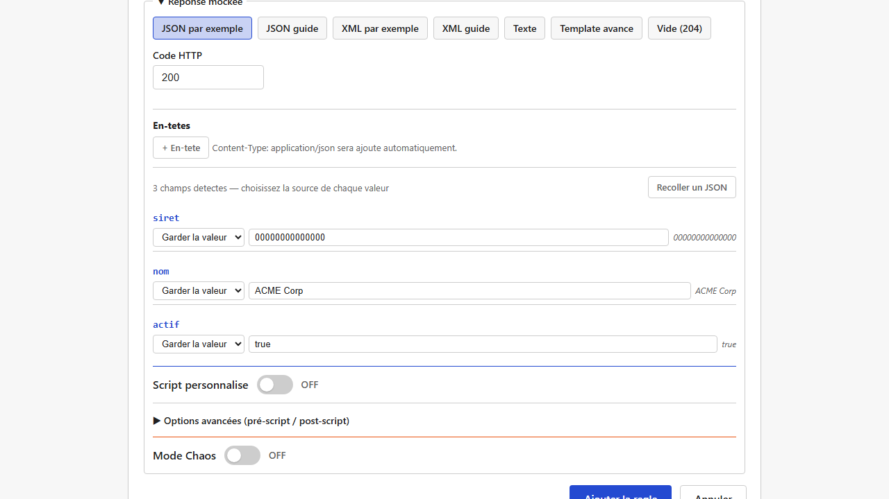
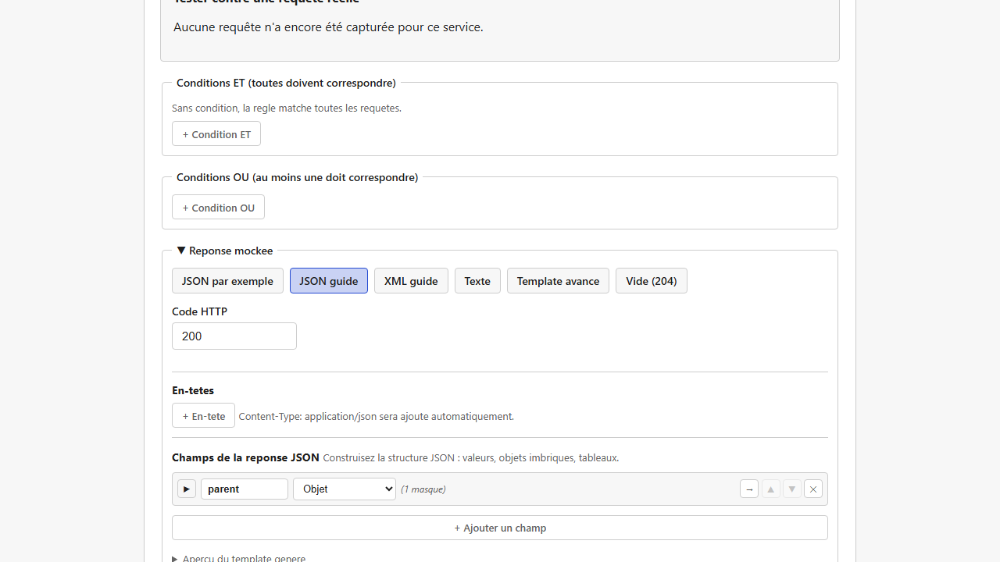

# Réponses dynamiques et templates

Une fois qu'une [règle](regles-de-matching.md) a matché, lightMock doit produire une réponse :
un code de statut HTTP, des en-têtes, et un corps (JSON ou XML) qui peut être **statique** ou **dynamique** (contenir des valeurs calculées à chaque requête).

## Choisir un format, puis un niveau de détail

Le corps de la réponse se construit en deux temps : d'abord un **Format** (JSON, XML, Texte,
Template avancé, ou Vide), puis — pour JSON et XML uniquement — un **niveau d'édition** (assisté
ou détaillé). Ces deux niveaux ne sont **pas deux modes séparés à choisir dès le départ** : vous
démarrez toujours par le niveau assisté (coller un exemple), et un bouton **"Modifier en détail"**
révèle, sur les *mêmes* données, toutes les capacités du niveau détaillé — sans jamais rien perdre
de ce qui a déjà été saisi.

### 1. Niveau assisté : coller un exemple existant

Pour les corps déjà complexes, il est souvent plus rapide de **coller un exemple réel** de réponse
(par exemple, une réponse déjà obtenue du vrai backend) : lightMock détecte automatiquement tous
les champs et vous permet ensuite de remplacer certaines valeurs par des variables ou des données
factices, champ par champ — chaque valeur variable peut aussi recevoir une **transformation**
(voir "Transformations" plus bas), exactement comme au niveau détaillé.

Côté JSON, tous les champs détectés s'affichent **à plat** (avec une simple indentation pour les niveaux imbriqués) — suffisant pour un JSON REST, généralement peu profond.

Côté XML (souvent plus profondément imbriqué, une enveloppe SOAP par exemple), ce niveau assisté propose en plus :

- un **fil d'Ariane** (bouton "→" pour "entrer" dans un nœud, chemin cliquable pour en ressortir),
- des **chevrons de pliage** (▼/▶),
- l'édition des **attributs XML** de chaque élément (y compris la racine) : un attribut détecté (ex. une déclaration d'espace de noms `xmlns:soap="..."`) peut, comme un contenu texte, être remplacé par une variable ou laissé tel quel.

Les préfixes d'espace de noms (`soap:Envelope`) et les déclarations `xmlns`/`xmlns:*` sont conservés tels quels (comme du texte) ; lightMock ne résout pas leur signification — coller un XML avec espaces de noms fonctionne sans erreur, mais aucune validation sémantique n'est faite dessus.

> Le niveau assisté ne permet pas de renommer, ajouter ou supprimer un champ/nœud détecté — pour
> ces retouches, cliquez sur **"Modifier en détail →"** (voir ci-dessous).

### 2. Niveau détaillé : structure complète

Un clic sur **"Modifier en détail"** (visible sous la liste de champs du niveau assisté) fait
apparaître, sur les *mêmes* champs déjà détectés, l'éditeur complet : renommage de clé, ajout/
suppression/réordonnancement de champ, changement de type (valeur/objet/tableau), et création
d'une structure **entièrement nouvelle** si vous n'êtes parti d'aucun exemple (le bouton reste
disponible même sans avoir collé quoi que ce soit — cliquez dessus directement pour démarrer à
vide). Ce passage est **sans perte** : c'est une révélation de capacités supplémentaires sur les
données déjà là, jamais une conversion qui recommencerait de zéro. Il n'y a en revanche pas de
retour possible vers le niveau assisté une fois le détail ouvert — un aller simple, assumé comme
tel.

Chaque champ **objet** ou **tableau** (JSON comme XML) affiche aussi un petit **chevron** (▼/▶) à gauche : cliquez dessus pour **replier** ce champ et masquer temporairement son contenu — pratique une fois qu'une branche est déjà configurée et que vous voulez vous concentrer sur le reste sans la faire défiler à chaque fois. Un texte ("N masqué(s)") rappelle qu'il y a du contenu caché. Replier/déplier n'efface jamais rien : c'est un pur affichage, et tout reste déplié par défaut à l'ouverture du formulaire.

Pour naviguer dans une structure profondément imbriquée sans se perdre, un fil d'Ariane (chemin cliquable, ex. `racine > adresse > ville`) au-dessus de l'éditeur permet de "rentrer" dans un sous-niveau et d'en ressortir en un clic.

*(Capture manquante — aucun scénario E2E existant ne navigue dans le builder JSON détaillé avec le fil d'Ariane ; à réaliser manuellement, cf `frontend/e2e/README.md` section captures.)*

### Réouvrir une règle déjà configurée : la vue d'origine est restaurée

En rouvrant une règle déjà sauvegardée, lightMock se souvient de **quelle vue** vous avez utilisée
pour la construire (assistée ou détaillée, JSON ou XML) et rouvre directement celle-ci — vous ne
retombez plus systématiquement sur le "Template avancé" (texte brut) comme c'était le cas
auparavant. Une règle construite au niveau assisté rouvre le niveau assisté (avec le bouton
"Modifier en détail" toujours disponible si besoin), une règle construite au niveau détaillé
rouvre directement ce niveau. Le mode "Texte" et le mode "Template avancé" sont eux aussi
restaurés correctement.

**Limite assumée** : si la réponse a été modifiée hors de l'interface (édition manuelle du fichier
de configuration, restauration d'une ancienne sauvegarde) et que son contenu ne correspond plus à
la forme attendue par la vue mémorisée, lightMock retombe sur le "Template avancé" plutôt que
d'afficher une erreur — votre contenu reste toujours visible et modifiable, seule la vue structurée
n'est pas restaurée dans ce cas précis. De même, un corps JSON dont la racine est un **tableau**
(uniquement possible via le niveau assisté JSON) n'est pas restaurable dans une vue structurée à
la réouverture — limite technique assumée, le "Template avancé" prend le relais.

## La syntaxe des templates : `{{ }}`

Que vous utilisiez le builder guidé ou le mode "exemple d'abord", le résultat final est un **template** : un texte JSON ou XML dans lequel certains passages entre doubles accolades sont évalués à chaque requête.

| Écriture | Signification |
|---|---|
| `{` et `}` (accolade simple) | Caractères littéraux, comme dans n'importe quel JSON/XML — **pas** une variable |
| `{{variable}}` | Une expression évaluée à chaque requête |
| `{{variable \| transformation}}` | Une variable, ensuite transformée (voir "Transformations" ci-dessous) |

Exemple : `{"siret":"{{path.siret}}"}` renvoie le paramètre de chemin `siret` de la requête reçue.

### Variables disponibles

| Variable | Contenu |
|---|---|
| `path.X` | Valeur du paramètre de chemin `X` (ex. `{id}` dans l'URL du service) |
| `query.X` | Valeur du paramètre de requête `X` (`?X=...`) |
| `header.X` | Valeur de l'en-tête HTTP `X` |
| `body.X` | Valeur au chemin JSON `X` dans le corps de la requête reçue |
| `fake.NomDuType` | Une donnée factice générée (voir plus bas) |
| `uuid` | Un identifiant unique généré |
| `now_ms` / `now_iso` / `now_epoch` | La date/heure actuelle, sous différents formats |
| `seq` | Un compteur d'appels |
| `script` / `pre_script` / `post_script` | Résultat d'un [script Rhai](scripts-rhai.md) associé à la règle, si vous en avez écrit un |

### Transformations (pipes)

Une variable peut être transformée avant d'être insérée : `lower`, `upper`, `trim`, `capitalize`, `first(N)` (les N premiers caractères), `last(N)`, `substr(debut,longueur)`,
`default("valeur")` (valeur de secours si vide), `replace("a","b")`, `prepend("x")` (ajoute devant), `append("x")` (ajoute derrière), `length`.

Exemple : `{{path.siret | first(9)}}` ne garde que les 9 premiers caractères du SIRET reçu.

### Données factices (`fake.*`)

Pratique pour peupler une réponse avec des données qui ont l'air réalistes sans devoir les saisir à la main : prénom, nom, email, téléphone français, entreprise, adresse, ville, code postal,
SIREN/SIRET, adresse complète, date passée/future, horodatage, booléen aléatoire, phrase de remplissage ("lorem"), pays, IBAN français, et un entier dans une plage donnée (`Integer{min,max}`).

*(Capture manquante — aucun scénario E2E existant ne sélectionne un type `fake.*` dans un champ du builder ; à réaliser manuellement, cf `frontend/e2e/README.md` section captures.)*

## Mode Chaos : simuler des pannes et des lenteurs

Pour tester la robustesse d'une application face à un backend capricieux, chaque réponse mockée peut activer un "mode chaos" :

- **Latence** : un délai fixe, ou une plage aléatoire (entre un minimum et un maximum) avant de répondre.
- **Taux d'erreur** : un pourcentage de requêtes qui reçoivent, à la place de la réponse normale, une erreur HTTP (code configurable, `500` par défaut).

*(Capture manquante — aucun scénario E2E existant ne configure le mode Chaos via l'interface (les tests existants postent `chaos: null` directement via l'API) ; à réaliser manuellement, cf
`frontend/e2e/README.md` section captures.)*

## Prérequis et limites

- Aucun prérequis particulier : disponible dès l'installation de base.
- Le niveau assisté (coller un exemple) ne permet pas de renommer, ajouter ou supprimer un champ
  directement — cliquez sur "Modifier en détail" pour ces retouches, sans perte du contenu déjà saisi.
- Côté XML, un espace de noms (`xmlns:...`) est conservé tel quel dans le tag/l'attribut, sans résolution — voir "Niveau assisté" plus haut.
- Côté XML toujours, un nœud qui mélange du texte direct et des sous-éléments (contenu dit "mixte") n'est pas représenté fidèlement : les sous-éléments sont conservés, le texte direct est ignoré.
- Un corps JSON dont la racine est un tableau (uniquement possible via le niveau assisté) ne peut
  pas être restauré dans une vue structurée à la réouverture de la règle — voir "Réouvrir une règle
  déjà configurée" plus haut.
