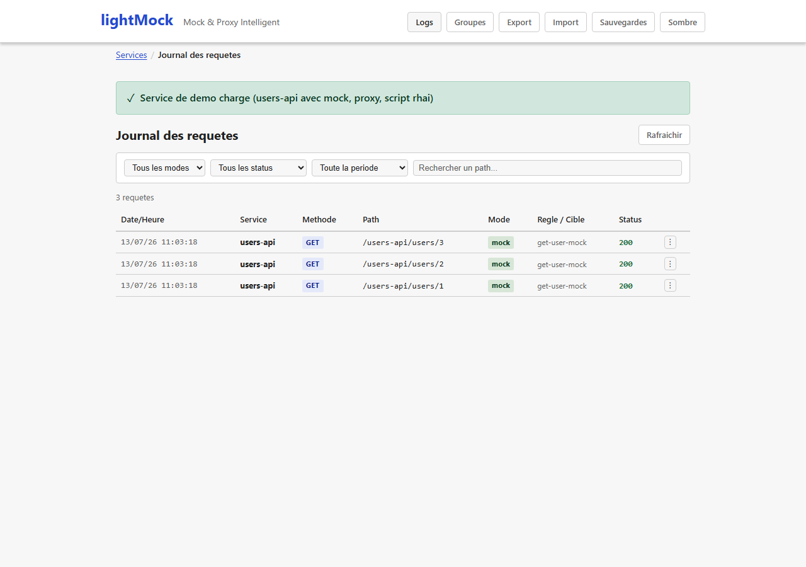
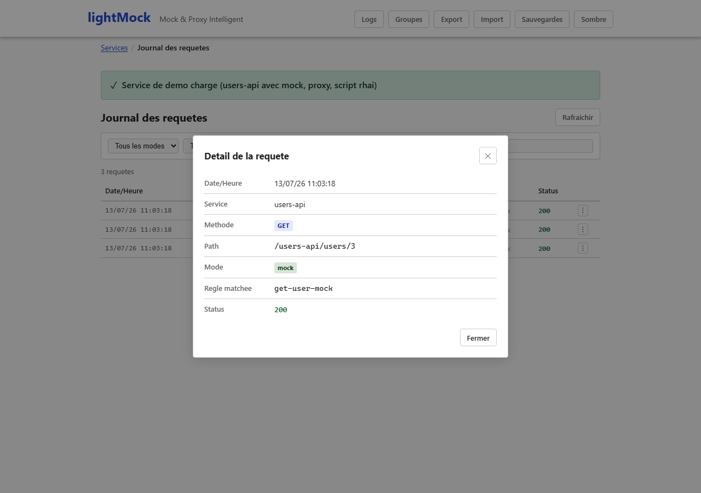

# Request log

**"Logs"** in the navigation bar opens the history of the latest requests lightMock received, across all services. It shows what the application under test really sent, and helps diagnose a rule that does not trigger as expected.

## What an entry shows

- The service and, when there is one, the rule that applied.
- The date and time of the request.
- Full details when available (see "Limits" below): headers, query and path parameters, body sent.

These details are what the [rule tester](rule-tester-and-conflicts.md) uses to replay an earlier request against a draft rule.

## Requirements and limits

- No requirement: available in every installation, filled as soon as a request arrives.
- Only the **200 most recent requests** are kept (the log is not a permanent history); older ones are dropped.
- A large body is truncated in the log beyond a set size (`REQUEST_LOG_MAX_BODY_SIZE`, 16 KiB by default); the other details (method, headers, parameters) are always complete.
- Credentials are never kept: the values of `Authorization`, `Cookie`, `Set-Cookie`, API-key headers and any header listed in `REDACT_HEADERS` are shown as `[redacted]`.
- A request relayed by a service in proxy mode (no rule evaluated) has no details kept, so as not to slow that path down: only the fact that the call happened is logged.
- With authentication on, each user only sees the entries of the services they can access.
