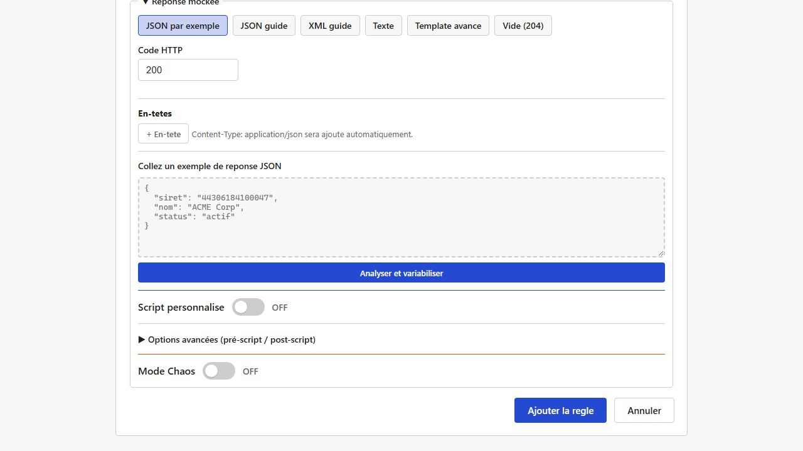
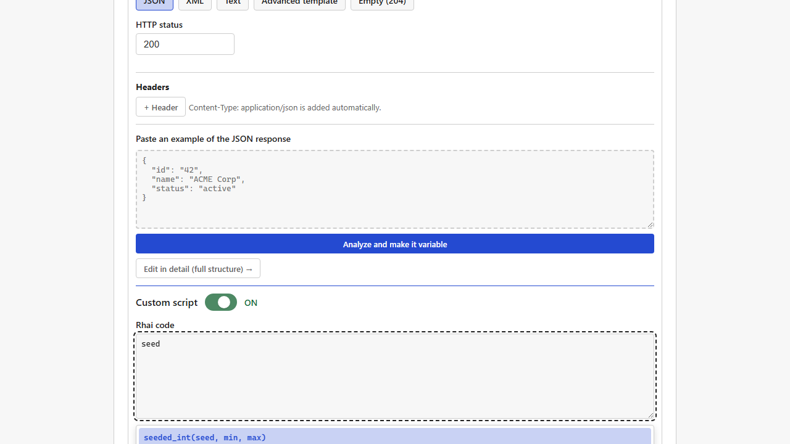
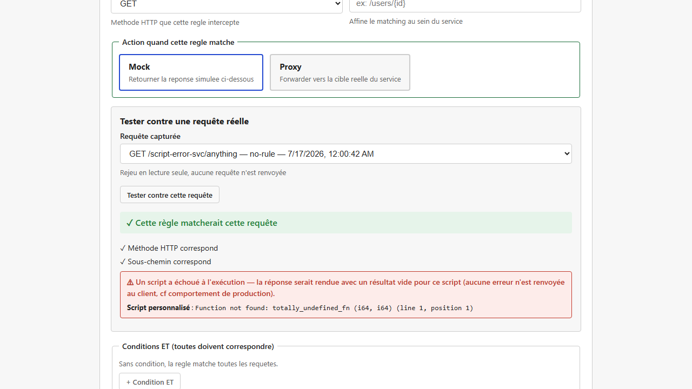
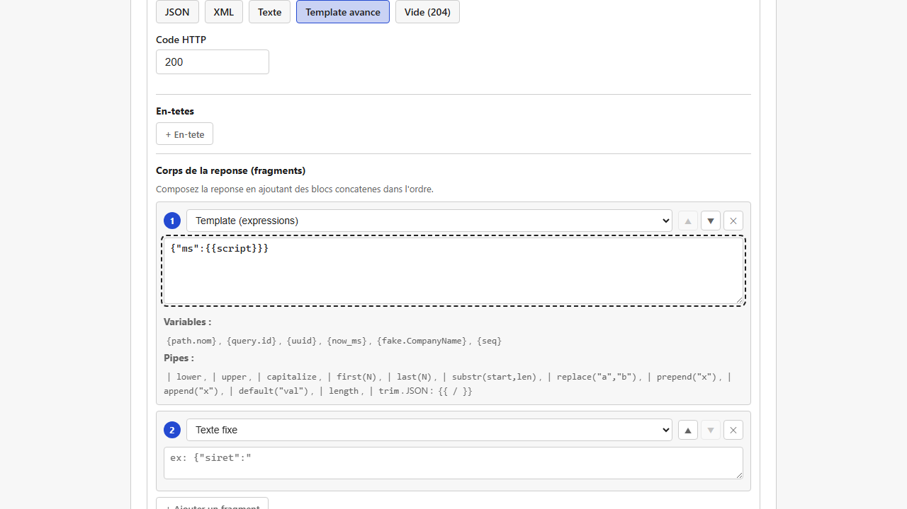
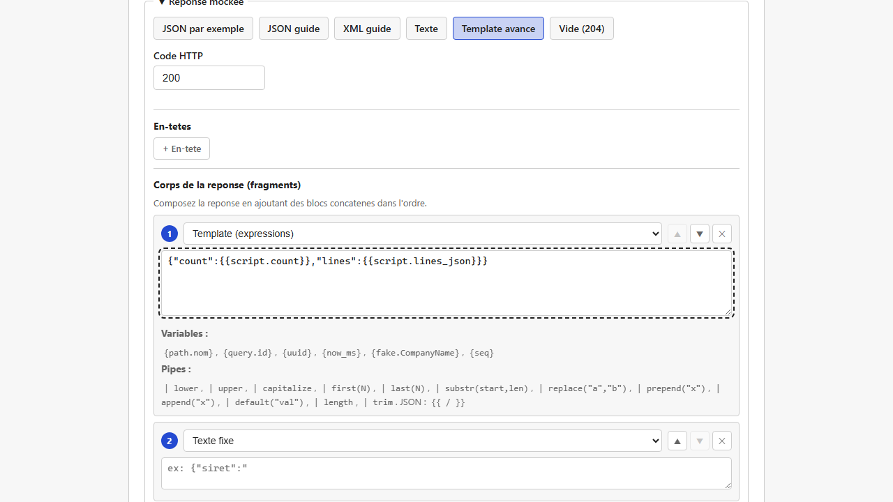
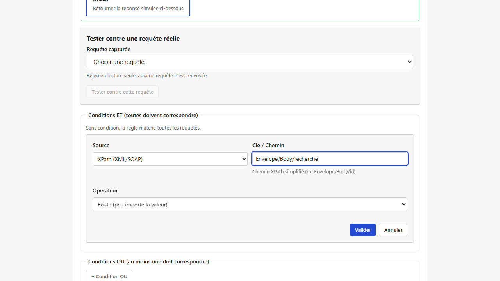
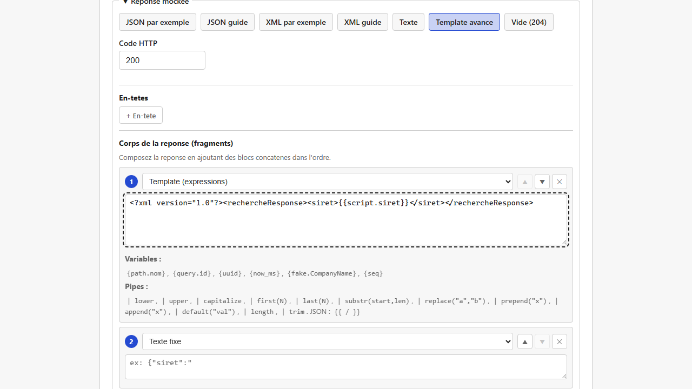

# Rhai scripts (computed values in a rule)

For what the [response builder](responses-and-templates.md) does not cover directly (calculations, values that depend on each other, data that is "always the same for the same input"…), each rule can run a short script written in a simple language called **Rhai**. The script's result then becomes a variable of the response body.

> Rhai is a small scripting language (with a syntax close to JavaScript and Rust) that runs in a sandbox: it cannot reach the disk or the network, cannot `eval` code, and cannot use unbounded resources (at most 10,000 operations, 1 MB strings, 1,000-item arrays, 500-entry maps and 32 nested calls per run).
> You do not need to know Rhai in depth: the functions below cover most needs, and the editor suggests them as you type.

## Three independent script slots

A rule offers up to three script slots, all optional:

- **Pre-script (preparation)**
- **Custom script** (the main one)
- **Post-script (finalization)**

The three blocks are **fully independent**: they all see the same request, and none can read another's result. "Pre" and "post" are a convention to help you organize your logic (preparing data, then formatting it, for instance), not an actual chain.

> **Pre-script and post-script are folded by default** behind "Advanced options (pre-script / post-script)": most rules do not need them, and only the main script stays visible. Click that line to show them. When you edit a rule that already uses one of them, the section opens **by itself**: configured content is never hidden from you. Folding never deletes what you typed.



Each block can return:
- a **simple value** (text, number), used as `{{script}}` / `{{pre_script}}` / `{{post_script}}`,
- or a **map with several fields** (`#{ name: "...", age: 30 }`), each field usable on its own: `{{script.name}}`, `{{script.age}}`.

## Reading the request

Each script sees the incoming request through a `request` variable with 4 fields:

| Access | Content |
|---|---|
| `request.path.parameter_name` | A path parameter (`{id}` in `/orders/{id}` gives `request.path.id`) |
| `request.query.parameter_name` | A query parameter (`?page=2` gives `request.query.page`) |
| `request.headers.header_name` | An HTTP header. **Header names are always lowercase** on the server (`SOAPAction` becomes `request.headers.soapaction`): always use the lowercase name, or the key will not be found. |
| `request.body` | The raw request body, as text. Combine it with `parse_json()` or `parse_xml_items()` (see below) when the body is structured. |

> **Pitfall: reading a missing key NEVER raises an error.** Whether you write `request.path.id` (with a dot) or `request.headers["x-missing"]` (with brackets), a key that does not exist simply gives an empty value, and the script goes on. Calling a function that does not exist is different (see "When a script fails" below): that is a real error. In practice, a rule that never behaves as expected because of a misspelled parameter name (`request.path.id` while the parameter is really called `orderId`) fails **silently**, with no error message anywhere. Use the [rule tester](rule-tester-and-conflicts.md) against a captured request to check that a key is found before relying on the script.

Like the functions below, these 4 accesses appear in the editor's autocompletion (type `request` to see them).

## Functions

| Function | What it does |
|---|---|
| `random_int(min, max)` | A random integer between `min` and `max` |
| `now_ms()` | The current timestamp, in milliseconds |
| `now_iso()` | Today's date as `YYYY-MM-DD` |
| `year()` | The current year |
| `uuid()` | A unique identifier (UUID) |
| `fake("Kind")` | Fake data (the same kinds as the response builder, for instance `fake("Siret")`) |
| `date_now(format?)` | Today's date, with an optional format: `"iso"` (default, `YYYY-MM-DD`), `"fr"` (`DD/MM/YYYY`), `"en"` (`MM/DD/YYYY`) |
| `date_past(days, format?)` | A date `days` days before today |
| `date_future(days, format?)` | A date `days` days after today |
| `parse_date(text, "pattern")` | The **reverse** of `date_now`/`date_past`/`date_future`: parses a date **typed** in an explicit pattern and returns milliseconds since the epoch (see the use case below) |
| `seeded_int(seed, min, max)` | An integer between `min` and `max`, **always the same for the same `seed`** |
| `seeded_pick(seed, [list])` | An item of `list`, **always the same for the same `seed`** |
| `parse_json(text)` | Turns JSON text (such as `request.body`) into a Rhai structure you can navigate (array or map) |
| `to_json(value)` | Turns a Rhai structure (an array or map built in the script) into JSON text |
| `parse_xml_items(text, "path/to/item")` | Extracts every XML element repeated at a path as an array of Rhai maps (one level of child fields) |
| `xml_element(tag, value)` | Builds an XML element `<tag>...</tag>` from a Rhai structure (recursively) |

The editor lists these functions as soon as you start typing their name (or with `Ctrl+Space` for the full list), with their signature and description: no need to memorize this table.



## When a script fails

A script can fail while running, for instance when it calls a function that does not exist (a typo in a function name, or a function invented from the table above but misspelled). What happens then matters, because it is **NOT the same as a missing key** (see the pitfall above):

- **A missing key** (`request.path.no_such_name`) never raises an error: the script goes on, the value is empty.
- **A call to a function that does not exist** (`my_invented_function(1, 2)`) **is a real runtime error**. The script stops right there: no later statement runs (including an `else` branch, if the error happens in the `if` branch).

**In production**, a script error never stops the request from being served: the rule still applies, but `{{script}}`/`{{script.field}}` (or `{{pre_script...}}`/`{{post_script...}}`, depending on the failing block) render as **empty** text. Nothing tells the HTTP client that something went wrong: a broken script must never turn into a total outage of the mock. The error is still written to the server log.

**Before saving a rule**, two checks are available:
1. **"Validate the script"**, under each script slot, checks the **syntax** (is it a valid Rhai program?). It does NOT detect a call to a missing function, nor an error that only happens at run time.
2. The **[rule tester](rule-tester-and-conflicts.md)** ("Test against a real request", shown while editing a rule) really runs your scripts against a captured request, and shows an explicit error message when one fails. It is the reliable way to catch this kind of problem before saving, since syntax alone is not enough.



## Use case: convert a date typed in a custom format into milliseconds

The reverse of `date_now`/`date_past`/`date_future` (which **generate** a date): your mock receives a date **typed** by the caller in a format that is not necessarily ISO (`15/03/2026`, with or without a time), and the response must hold that date as milliseconds since the epoch (what most JSON APIs use internally). That is what `parse_date(text, "pattern")` does.

The **pattern is always explicit**: there is no format detection. Guessing whether `03/04/2026` means April 3 or March 4 would be ambiguous and unpredictable; with `"dd/MM/yyyy"` or `"MM/dd/yyyy"`, there is no ambiguity left.

**Tokens of the pattern** (each repeated letter sets the number of digits expected there; any other character, such as `/`, `-`, `:` or a space, must appear as it is in the text):

| Token | Means | Width |
|---|---|---|
| `yyyy` | Year | 4 digits |
| `MM` | Month (01-12) | 2 digits |
| `dd` | Day (01-31) | 2 digits |
| `HH` | Hour (00-23) | 2 digits, optional |
| `mm` | Minute (00-59) | 2 digits, optional |
| `ss` | Second (00-59) | 2 digits, optional |

`yyyy`, `MM` and `dd` are required; `HH`, `mm` and `ss` are optional. A pattern without a time (`"dd/MM/yyyy"`) means midnight (00:00:00).

**Example**:

```rhai
parse_date(request.query.date, "dd/MM/yyyy")
```

with the response body (Advanced template):

```json
{"ms":{{script}}}
```

`GET /my-service/convert?date=15/03/2026` returns `{"ms":1773532800000}`: the number of milliseconds since the epoch for March 15, 2026 at midnight UTC.



**With a time**:

```rhai
parse_date(request.query.timestamp, "dd/MM/yyyy HH:mm:ss")
```

`parse_date("15/03/2026 08:30:45", "dd/MM/yyyy HH:mm:ss")` returns `1773563445000` (the same day, at 08:30:45 UTC).

**A date that does not fit the pattern is a real runtime error**, never a silent failure: `parse_date("31/02/2026", "dd/MM/yyyy")` fails with an explicit message ("is not a valid date"), and so does a text that does not follow the pattern (wrong separator, non-numeric field, text too short or too long) or a month, hour, minute or second out of range. Leap years are handled: `parse_date("29/02/2028", "dd/MM/yyyy")` works (2028 is a leap year), `parse_date("29/02/2026", "dd/MM/yyyy")` fails (2026 is not). Use the [rule tester](rule-tester-and-conflicts.md) to check that a typical date parses before saving.

## Use case: lookup table with a fallback

A frequent need: map a received value (a name, a code…) to another value (an identifier, a URL…) with a small fixed table, and a fallback when the key is not in it. A Rhai map (`#{ ... }`) indexed by key does it; several equivalent forms work:

```rhai
let mapping = #{
    "billing": "svc-billing-042",
    "orders": "svc-orders-017"
};
let name = request.path.name;

// Form 1: check the key before indexing.
if mapping.contains(name) {
    #{ id: mapping[name], found: "true" }
} else {
    #{ id: "unknown", found: "false" }
}

// Form 2, equivalent: `switch` (easier to read with many cases).
// switch name {
//     "billing" => "svc-billing-042",
//     "orders" => "svc-orders-017",
//     _ => "unknown"
// }
```

**Full example**: service `directory`, path `/lookup/{name}`, a `GET` rule (script above), response body (Advanced template):
```xml
<?xml version="1.0"?><serviceLookup><name>{{path.name}}</name><id>{{script.id}}</id><found>{{script.found}}</found></serviceLookup>
```

`GET /directory/lookup/billing` returns `<id>svc-billing-042</id><found>true</found>`; `GET /directory/lookup/nonexistent` (a key missing from the table) returns the fallback branch, `<id>unknown</id><found>false</found>`, without any error.

> **Pitfall**: Rhai has **no** ternary operator `cond ? a : b` (unlike JavaScript): use `if { ... } else { ... }` as above. Trying `?:` is a syntax error ("Unknown operator") that "Validate the script" reports.

## Use case: always the same answer for the same key

A frequent need: mock an API that **always returns the same result for the same input** (the same SIRET number always gives the same company name, for instance) without writing a real database. That is what `seeded_int` and `seeded_pick` are for: `seed` can be any value of the request (`request.path.siret`, `request.query.X`, `request.headers.X`…), and for the same seed the result is the same on every call.

**Example**: service `seeded-test`, path `/company/{siret}`, a `GET` rule.

Script:
```rhai
#{ name: seeded_pick(request.path.siret, ["Dupont SARL", "Martin SAS", "Petit EURL"]), score: seeded_int(request.path.siret, 0, 100) }
```

Response body:
```json
{"siret":"{{path.siret}}","name":"{{script.name}}","score":{{script.score}}}
```

`GET /seeded-test/company/44306184100047` always returns the same `name` and `score` for that SIRET, and different (but just as stable) values for another one.

## Use case: pick a whole object (not just a value) from a list

A variant of the previous case: instead of a single text value, you want to pick **an object with several fields** (a city with its name, postcode and INSEE code, for instance) and reuse several of these fields in the response. `seeded_pick` works the same on an array of maps (`#{ ... }`) as on an array of strings; what matters is **how you use the result**.

**The simplest way: make the picked object the script's return value.** Each of its fields is then available on its own as `{{script.field_name}}`, as in the previous examples.

**Example**: service `cities-demo`, path `/quote/{siret}`, a `GET` rule:

```rhai
let cities = [
    #{ name: "Paris", postcode: "75000", insee: "75056" },
    #{ name: "Lyon", postcode: "69000", insee: "69123" },
    #{ name: "Marseille", postcode: "13000", insee: "13055" }
];
seeded_pick(request.path.siret, cities)
```

Response body:
```json
{"siret":"{{path.siret}}","name":"{{script.name}}","postcode":"{{script.postcode}}","insee":"{{script.insee}}"}
```

`GET /cities-demo/quote/44306184100047` always returns `{"siret":"44306184100047","name":"Marseille","postcode":"13000","insee":"13055"}`: the 3 fields of the picked city are all available, and it is always the same city for that SIRET.

> **Pitfall: combining the picked object with something else in the same script breaks the dotted reference.** When you need another computed value next to the picked object (a quote identifier, for instance), it is tempting to write:
> ```rhai
> let city = seeded_pick(request.path.siret, cities);
> #{ city: city, quoteId: seeded_int(request.path.siret, 1000, 9999).to_string() }
> ```
> **`{{script.city.name}}` does NOT work**: `{{script.field}}` only goes **one level** deep, and there is a single key "city" (not "city.name"). The `city` field is exposed, but as **serialized JSON**, usable directly in an Advanced template, for instance `"city":{{script.city}}` without quotes around the variable:
> ```json
> {"siret":"{{path.siret}}","city":{{script.city}},"quoteId":"{{script.quoteId}}"}
> ```
> `GET /cities-demo/quote/44306184100047` then returns `{"siret":"44306184100047","city":{"insee":"13055","name":"Marseille","postcode":"13000"},"quoteId":"6051"}`: valid, properly nested JSON.
>
> When you need the city's fields **individually**, rather than as one JSON block, flatten them yourself:
> ```rhai
> let city = seeded_pick(request.path.siret, cities);
> #{ city_name: city.name, city_postcode: city.postcode, quoteId: seeded_int(request.path.siret, 1000, 9999).to_string() }
> ```
> then use `{{script.city_name}}` and `{{script.city_postcode}}`.
>
> **No error ever shows in the failing case above** (`{{script.city.name}}` simply renders empty): as explained in "When a script fails", a missing key is never a runtime error. The [rule tester](rule-tester-and-conflicts.md) is the place that shows **what your script really produced** (each key and its value) before saving: use it whenever the result "looks wrong" while no error is reported.

## Use case: repeat a response item for each item of the request

A frequent need: the request holds a **list of objects** (order lines, articles…) and the response must hold **as many items**, each built from the matching item of the request (same position). Neither a simple `{{...}}` variable nor rule conditions can do that: there is no loop outside a script. That is the job of `parse_json`/`to_json` (JSON, REST) and `parse_xml_items`/`xml_element` (XML, SOAP): parse the received list, loop over it in the script, then build JSON or XML text to insert directly in the response body.



### JSON (REST) example: a multi-line quote

Service `quote`, path `/compute`, a `POST` rule.

**Script:**
```rhai
// The request holds { "lines": [ {sku, qty}, ... ] }. Each line gives a response line at the same position, with a
// unit price that is stable per SKU (seeded_int, see the previous use case) and the computed total.
let req = parse_json(request.body);
let lines = req.lines;
let out = [];
for line in lines {
    let unit_price = seeded_int(line.sku, 10, 500);
    out.push(#{
        sku: line.sku,
        qty: line.qty,
        unitPrice: unit_price,
        lineTotal: unit_price * line.qty
    });
}
// to_json() turns the list into valid JSON text, ready for the response template through {{script.lines_json}}.
#{
    count: out.len(),
    lines_json: to_json(out)
}
```

**Response body** (Advanced template):
```json
{"count":{{script.count}},"lines":{{script.lines_json}}}
```

**Request sent:**
```json
{"lines": [{"sku": "REF-001", "qty": 3}, {"sku": "REF-002", "qty": 1}]}
```

**Response received:**
```json
{"count":2,"lines":[{"sku":"REF-001","qty":3,"unitPrice":445,"lineTotal":1335},{"sku":"REF-002","qty":1,"unitPrice":473,"lineTotal":473}]}
```

A request with a single line returns `"count":1` and a one-item array (the same `unitPrice` for a SKU already seen, thanks to `seeded_int`); a request with `"lines": []` returns `"count":0` and `"lines":[]`, without error.

### XML (SOAP) example: the same totals in a SOAP envelope

Service `order-soap` (service type **SOAP**), path `/totals`, a `POST` rule.

**Script:**
```rhai
// parse_xml_items(text, "path/to/item") extracts EVERY element repeated at the path (here each <article> under
// Envelope/Body/GetOrderTotalsRequest/articles) as an array of Rhai maps, one field per direct child (sku, qty).
let articles = parse_xml_items(request.body, "Envelope/Body/GetOrderTotalsRequest/articles/article");
let out = "";
for a in articles {
    let unit_price = seeded_int(a.sku, 10, 500);
    // Values extracted from XML are always text: parse_int() is needed to compute with them (parse_json, on the
    // other hand, keeps JSON numbers as Rhai numbers).
    let qty = parse_int(a.qty);
    // xml_element(tag, value) builds <tag>...</tag> from a Rhai map (one child element per key); concatenating in
    // the loop rebuilds the repeated list.
    out += xml_element("article", #{
        sku: a.sku,
        qty: a.qty,
        unitPrice: unit_price,
        lineTotal: unit_price * qty
    });
}
#{
    count: articles.len(),
    articles_xml: out
}
```

**Response body** (Advanced template):
```xml
<?xml version="1.0"?><soap:Envelope xmlns:soap="http://schemas.xmlsoap.org/soap/envelope/"><soap:Body><GetOrderTotalsResponse><count>{{script.count}}</count><articles>{{script.articles_xml}}</articles></GetOrderTotalsResponse></soap:Body></soap:Envelope>
```

**Request sent:**
```xml
<?xml version="1.0"?>
<soap:Envelope xmlns:soap="http://schemas.xmlsoap.org/soap/envelope/">
  <soap:Body>
    <GetOrderTotalsRequest>
      <articles>
        <article><sku>REF-001</sku><qty>3</qty></article>
        <article><sku>REF-002</sku><qty>1</qty></article>
      </articles>
    </GetOrderTotalsRequest>
  </soap:Body>
</soap:Envelope>
```

**Response received:**
```xml
<?xml version="1.0"?><soap:Envelope xmlns:soap="http://schemas.xmlsoap.org/soap/envelope/"><soap:Body><GetOrderTotalsResponse><count>2</count><articles><article><sku>REF-001</sku><qty>3</qty><unitPrice>445</unitPrice><lineTotal>1335</lineTotal></article><article><sku>REF-002</sku><qty>1</qty><unitPrice>473</unitPrice><lineTotal>473</lineTotal></article></articles></GetOrderTotalsResponse></soap:Body></soap:Envelope>
```

`unitPrice` is `445` for `REF-001` in both examples: `seeded_int` gives the same value whatever the source format, since the SKU is the same.

> **Limit of `parse_xml_items`**: only the first level of children of each repeated element is captured (flat fields, such as `<sku>` and `<qty>` above). A deeper structure inside an article is not extracted: keep repeated elements simple, or call `parse_xml_items` several times with different paths.

## Use case: copy a value from a SOAP request into the response

> **For the simplest case** (one value to copy, possibly transformed by a pipe such as `substr`), the XML response builder offers an **"XPath (XML/SOAP)"** source directly: see [Responses and templates](responses-and-templates.md), no script needed. The script below is for what the builder alone does not cover: several values combined, conditional logic, or a value reused by several fields of the response.

A frequent need with a SOAP client: take **one value** sent in the envelope (a SIRET number in `<ns3:Siret>`, for instance) and return it in the mocked response. This is an extraction, not a comparison, so an [XPath condition](matching-rules.md#use-case-one-url-a-different-answer-per-soap-operation) does not do it.

Call `parse_xml_items(text, "path/to/element")` **down to the element that holds the value** (not down to the value itself). That element normally appears once in a SOAP request, so the returned array has one item, whose field you read at index `0`:

```rhai
// The "recherche" element (the SOAP operation) appears ONCE in the body, so parse_xml_items() returns a one-item
// array; [0] is that element, and each of its direct children (Nom, Siret...) is a field.
let items = parse_xml_items(request.body, "Envelope/Body/recherche");
let siret = if items.len() > 0 { items[0].Siret } else { "" };
#{ siret: siret }
```

**Full example**: service `directory-soap`, path `/service`, a `POST` rule with an **XPath (XML/SOAP)** condition `Envelope/Body/recherche` = `Exists (any value)` (to match only the "recherche" operation, see [Matching rules](matching-rules.md#use-case-one-url-a-different-answer-per-soap-operation)) and the script above:





**Response body** (Advanced template):
```xml
<?xml version="1.0"?><rechercheResponse><siret>{{script.siret}}</siret></rechercheResponse>
```

**Request sent** (a realistic SOAP envelope, with an empty `<Header>` written in full, next to `<Body>`):
```xml
<SOAP:Envelope>
  <SOAP-ENV:Header></SOAP-ENV:Header>
  <SOAP-ENV:Body>
    <ns3:recherche>
      <ns3:Nom>Test</ns3:Nom>
      <ns3:Siret>98765432109876</ns3:Siret>
    </ns3:recherche>
  </SOAP-ENV:Body>
</SOAP:Envelope>
```

**Response received:**
```xml
<?xml version="1.0"?><rechercheResponse><siret>98765432109876</siret></rechercheResponse>
```

The same idea works on a **JSON** body with `parse_json(request.body).fieldName`: no need for `parse_xml_items` outside XML and SOAP.

## Requirements and limits

- No requirement: available in every installation, nothing to turn on.
- `seeded_int` and `seeded_pick` guarantee a **stable** result for a given key, not that two different keys never give the same result (two SIRET numbers may, rarely, land on the same value): fine for mocks, not for anything that needs guaranteed uniqueness.
- Scripts do **not** run for [Kafka](kafka-messaging.md) messages: they are for HTTP traffic.
- "Validate the script" only checks syntax. An error that only happens at run time (missing function, division by zero…) or a logic error (a wrong computed value) is not detected by it: use the [rule tester](rule-tester-and-conflicts.md) against a captured request (see "When a script fails").
- `parse_json(text)` returns an "empty" value (neither array nor map) when the text is not valid JSON, rather than failing the script: check the request's format when `parse_json(request.body)` does not behave as expected.
- `parse_xml_items` captures one level of child fields per repeated element (see the SOAP example): no nested structure inside an article or line.
- `parse_date` expects a **fixed width** for each token (`dd` and `MM` always 2 digits, `yyyy` always 4): a day or month written with one digit (`"5/3/2026"` with `"dd/MM/yyyy"`) is rejected as a runtime error, not read with a variable width.
