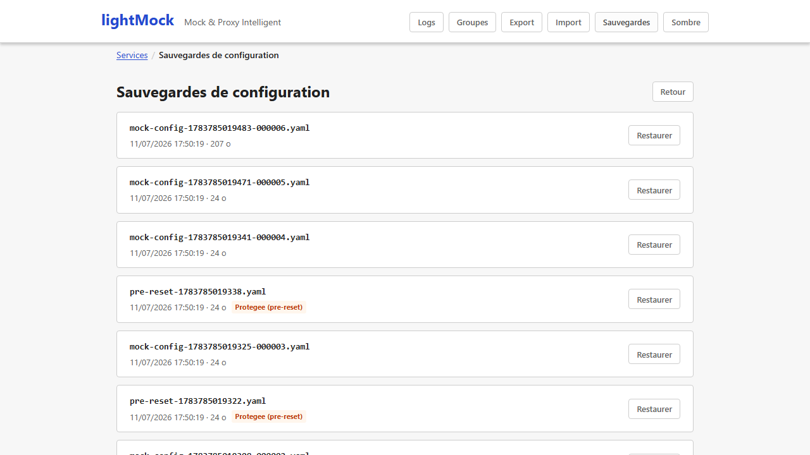
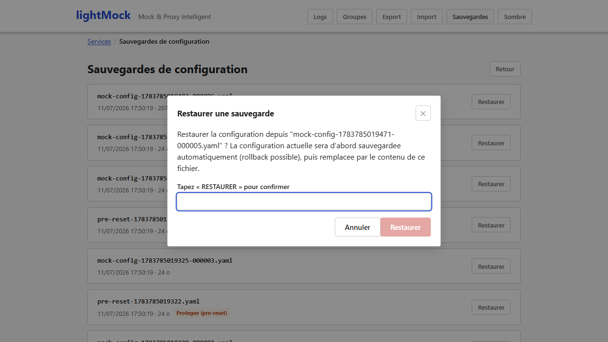

# Sauvegardes et restauration

lightMock protège automatiquement votre configuration contre les erreurs de manipulation : avant
chaque changement important, l'état précédent est sauvegardé — vous pouvez toujours revenir en
arrière.

## Sauvegarde automatique

Avant **chaque modification** de la configuration (création/modification/suppression d'un
service ou d'une règle, restauration d'une sauvegarde...), l'état précédent est automatiquement
copié dans un historique de sauvegardes. Ceci se fait **sans aucune action de votre part**.

Pour ne pas accumuler indéfiniment de fichiers, seules les sauvegardes les plus récentes sont
conservées (les plus anciennes sont retirées automatiquement au fil du temps).

## Restaurer une sauvegarde

Le bouton **"Sauvegardes"** de la barre de navigation liste toutes les sauvegardes disponibles,
avec leur date, leur taille, et permet de restaurer l'une d'entre elles **en un clic**.

Une restauration crée elle-même automatiquement une nouvelle sauvegarde de l'état qui vient d'être
écrasé — même une restauration reste donc réversible.

## Sauvegarde spéciale avant une réinitialisation complète

Avant une [réinitialisation complète](administration.md) (qui supprime tous les services), une
sauvegarde supplémentaire est créée dans un emplacement protégé, à l'abri de la purge automatique
normale pendant 30 jours — de quoi avoir le temps de s'en apercevoir et de la restaurer si le
reset était une erreur.

## Prérequis et limites

- Aucun prérequis particulier : disponible dès l'installation de base, activé automatiquement.
- La liste des sauvegardes et leur restauration sont réservées aux **super-administrateurs**
  quand l'[authentification](authentification.md) est activée. Sans authentification activée, ces
  actions restent accessibles à tout le monde (comme le reste de l'interface dans ce mode).
- La sauvegarde/restauration se fait au niveau de **toute la configuration** (tous les services et
  groupes) — il n'est pas possible de restaurer un seul service isolément depuis une ancienne
  sauvegarde.
