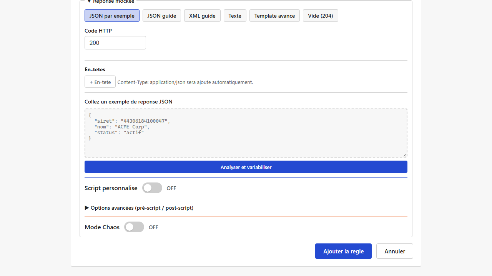
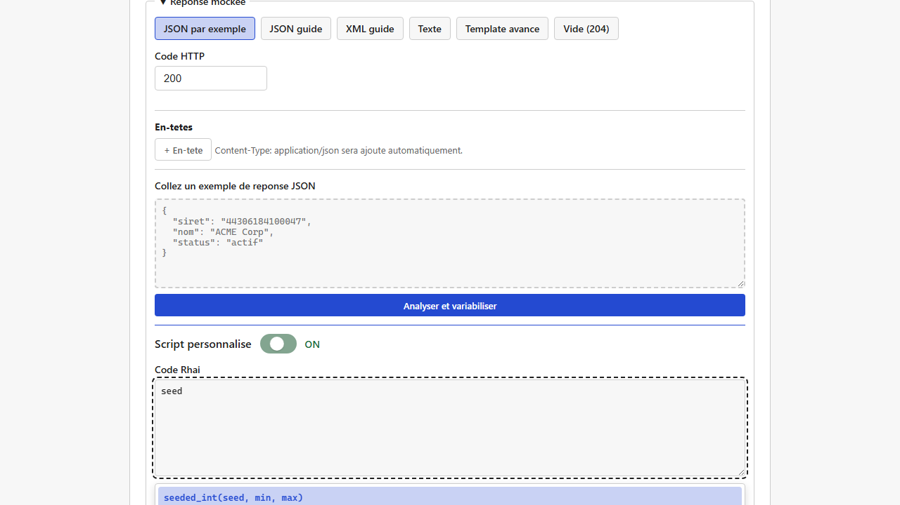
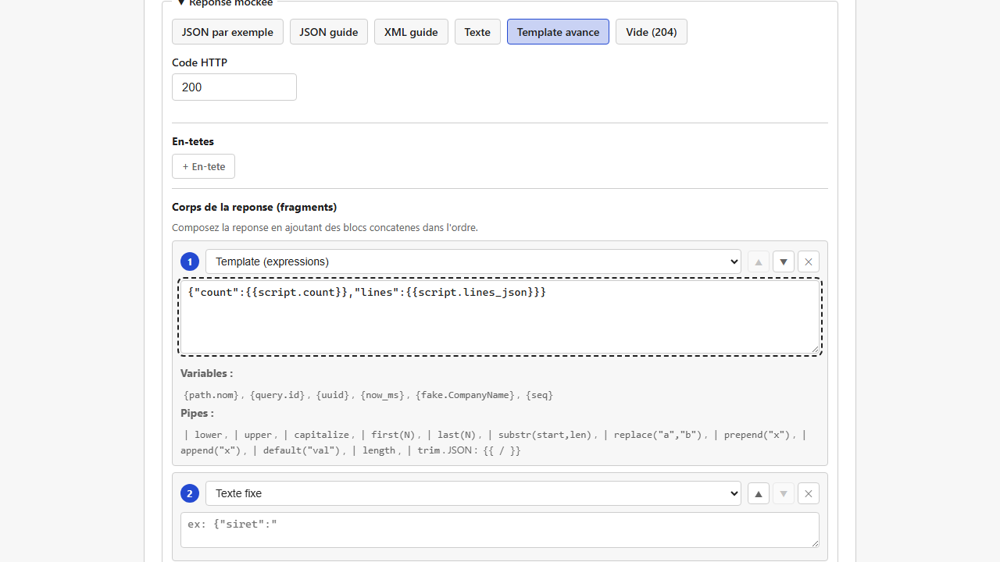

# Scripts Rhai (calculs avancés dans une règle)

Pour les besoins que le [builder de réponse](reponses-et-templates.md) ne couvre pas directement (calculs, valeurs liées entre elles, données "toujours les mêmes pour une même entrée"...), chaque règle peut exécuter un petit script écrit dans un langage simple appelé **Rhai**. Le résultat du script devient ensuite disponible comme variable dans le corps de la réponse.

> Rhai est un mini-langage de script (syntaxe proche de JavaScript/Rust) exécuté dans un bac à sable : il ne peut ni accéder au disque, ni au réseau, ni consommer des ressources illimitées (limité à 10 000 opérations et 1 Mo de texte manipulé par exécution). 
> Vous n'avez pas besoin de connaître Rhai en détail pour l'utiliser : les fonctions ci-dessous suffisent à la plupart des besoins, et l'éditeur les suggère automatiquement pendant la frappe.

## Trois emplacements de script, indépendants

Une règle propose jusqu'à 3 zones de script, toutes optionnelles :

- **Pré-script** (préparation)
- **Script** (le script "principal")
- **Post-script** (finalisation)

Ces trois blocs sont **totalement indépendants** : ils voient tous la même requête reçue, mais aucun ne peut lire le résultat d'un autre. Le nommage "pré/post" est une convention pour vous aider à organiser votre logique (par exemple séparer "préparer des données" et "les mettre en forme"), pas un enchaînement réel.

> **Pré-script et Post-script sont repliés par défaut** derrière une zone "Options avancées" — la plupart des règles n'en ont pas besoin, seul le **Script** principal reste toujours visible. Cliquez sur "Options avancées (pré-script / post-script)" pour les afficher. Si vous modifiez une règle qui utilise déjà l'un des deux, la zone s'ouvre **automatiquement** à l'affichage : vous ne pouvez jamais tomber sur du contenu déjà configuré sans le voir. Replier/déplier n'efface jamais ce que vous avez saisi.



*(Capture manquante — aucun scénario E2E existant n'active simultanément les 3 zones de script [pré-script/script/post-script sont des blocs repliés indépendamment, activés un par un dans les tests actuels] ; à réaliser manuellement, cf `frontend/e2e/README.md` section captures.)*

Chaque bloc peut retourner :
- une **valeur simple** (texte, nombre) → utilisable comme `{{script}}` / `{{pre_script}}` / `{{post_script}}`,
- ou une **structure avec plusieurs champs** (`#{ nom: "...", age: 30 }`) → chaque champ devient utilisable individuellement, ex. `{{script.nom}}`, `{{script.age}}`.

## Fonctions disponibles

| Fonction | Ce qu'elle fait |
|---|---|
| `random_int(min, max)` | Un entier aléatoire entre `min` et `max` |
| `now_ms()` | L'horodatage courant, en millisecondes |
| `now_iso()` | La date du jour au format `AAAA-MM-JJ` |
| `year()` | L'année en cours |
| `uuid()` | Un identifiant unique (UUID) |
| `fake("Kind")` | Une donnée factice (mêmes types que dans le builder de réponse, ex. `fake("Siret")`) |
| `date_now(format?)` | La date du jour, avec un format optionnel : `"iso"` (défaut, `AAAA-MM-JJ`), `"fr"` (`JJ/MM/AAAA`), `"en"` (`MM/JJ/AAAA`) |
| `date_past(jours, format?)` | Une date dans le passé, `jours` jours avant aujourd'hui |
| `date_future(jours, format?)` | Une date dans le futur, `jours` jours après aujourd'hui |
| `seeded_int(seed, min, max)` | Un entier **toujours identique pour la même `seed`**, entre `min` et `max` |
| `seeded_pick(seed, [liste])` | Un élément de `liste`, **toujours le même pour la même `seed`** |
| `parse_json(texte)` | Transforme un texte JSON (ex. `request.body`) en une structure Rhai navigable (liste/objet) |
| `to_json(valeur)` | Transforme une structure Rhai (liste/objet construit dans le script) en texte JSON |
| `parse_xml_items(texte, "chemin/vers/item")` | Extrait tous les éléments XML répétés à un chemin donné en une liste d'objets Rhai (un niveau de champs enfants) |
| `xml_element(tag, valeur)` | Construit un élément XML `<tag>...</tag>` à partir d'une structure Rhai (récursif) |

L'éditeur affiche ces fonctions dans une liste déroulante dès que vous commencez à taper leur nom (ou en appuyant sur `Ctrl+Espace` pour voir la liste complète), avec leur signature et leur description — pas besoin de mémoriser ce tableau.



## Cas d'usage : réponse toujours identique pour une même clé

Besoin fréquent : simuler une API qui renvoie **toujours le même résultat pour une même entrée** (par exemple un même numéro SIRET doit toujours renvoyer le même nom d'entreprise), sans pour autant coder une vraie base de données. C'est le rôle de `seeded_int`/`seeded_pick` : la valeur `seed` peut être n'importe quelle donnée de la requête (`request.path.siret`, `request.query.X`, `request.headers.X`...) — pour une même valeur de `seed`, le résultat est garanti identique à chaque appel.

**Exemple** — service `seeded-test`, chemin `/entreprise/{siret}`, règle `GET` :

Script :
``` 
#{ name: seeded_pick(request.path.siret, ["Dupont SARL", "Martin SAS", "Petit EURL"]), score: seeded_int(request.path.siret, 0, 100) }
```

Corps de la réponse :
```json
{"siret":"{{path.siret}}","name":"{{script.name}}","score":{{script.score}}}
```

Résultat : `GET /seeded-test/entreprise/44306184100047` renverra systématiquement le même `name` et le même `score` pour ce SIRET précis, et des valeurs différentes (mais toujours stables) pour un autre SIRET.

*(Capture manquante — les tests E2E existants pour `seeded_pick`/`seeded_int` [`frontend/e2e/insee.spec.mjs`] vérifient le résultat via de vraies requêtes HTTP, pas via une capture d'écran de l'éditeur de script combiné au testeur de règle ; à réaliser manuellement, cf `frontend/e2e/README.md` section captures.)*

## Cas d'usage : répéter un élément de réponse par élément de la requête

Besoin fréquent : la requête envoyée contient une **liste d'objets** (des lignes de commande, des articles...) et la réponse doit contenir **le même nombre d'éléments**, chacun construit en piochant des informations dans l'élément correspondant de la requête (même position). Ni une variable `{{...}}` simple ni les conditions d'une règle ne peuvent faire ça — il n'y a pas de boucle possible en dehors d'un script. C'est le rôle de `parse_json`/`to_json` (pour du JSON/REST) et `parse_xml_items`/`xml_element` (pour du XML/SOAP) : parser la liste reçue, boucler dessus dans le script, puis reconstruire un texte JSON ou XML directement injectable dans le corps de la réponse.



### Exemple JSON (REST) — calcul de devis multi-lignes

Service `devis`, chemin `/calcul`, règle `POST` :

**Script :**
```rhai
// La requete contient { "lines": [ {sku, qty}, ... ] }. On boucle sur
// chaque ligne pour construire une ligne de reponse correspondante
// (meme position), avec un prix unitaire deterministe par SKU (seeded_int,
// cf cas d'usage precedent) et le total calcule.
let req = parse_json(request.body);
let lines = req.lines;
let out = [];
for line in lines {
    let unit_price = seeded_int(line.sku, 10, 500);
    out.push(#{
        sku: line.sku,
        qty: line.qty,
        unitPrice: unit_price,
        lineTotal: unit_price * line.qty
    });
}
// to_json() serialise la liste construite en texte JSON valide, directement
// collable dans le template de reponse via {{script.lines_json}}.
#{
    count: out.len(),
    lines_json: to_json(out)
}
```

**Corps de la réponse** (mode "Template avancé") :
```json
{"count":{{script.count}},"lines":{{script.lines_json}}}
```

**Requête envoyée :**
```json
{"lines": [{"sku": "REF-001", "qty": 3}, {"sku": "REF-002", "qty": 1}]}
```

**Réponse obtenue** (vérifiée par un vrai appel HTTP) :
```json
{"count":2,"lines":[{"sku":"REF-001","qty":3,"unitPrice":445,"lineTotal":1335},{"sku":"REF-002","qty":1,"unitPrice":473,"lineTotal":473}]}
```

Une requête avec une seule ligne renvoie `"count":1` et un tableau à un élément (même `unitPrice` pour un `sku` déjà vu, grâce à `seeded_int`) ; une requête avec `"lines": []` renvoie `"count":0` et `"lines":[]`, sans erreur.

### Exemple XML (SOAP) — mêmes totaux, en enveloppe SOAP

Service `commande-soap` (type de service **SOAP**), chemin `/totaux`, règle `POST` :

**Script :**
```rhai
// parse_xml_items(texte, "chemin/vers/item") extrait TOUS les elements
// repetes au chemin donne (ici, chaque <article> sous
// Envelope/Body/GetOrderTotalsRequest/articles) en une liste d'objets Rhai
// -- un champ par enfant direct de l'element (sku, qty).
let articles = parse_xml_items(request.body, "Envelope/Body/GetOrderTotalsRequest/articles/article");
let out = "";
for a in articles {
    let unit_price = seeded_int(a.sku, 10, 500);
    // Les valeurs extraites du XML sont toujours du texte : parse_int()
    // est necessaire pour un calcul numerique (contrairement a parse_json,
    // qui garde les nombres JSON comme des nombres Rhai).
    let qty = parse_int(a.qty);
    // xml_element(tag, valeur) construit un <tag>...</tag> a partir d'un
    // objet Rhai (une balise enfant par cle) ; concatener dans une boucle
    // reconstruit la liste repetee.
    out += xml_element("article", #{
        sku: a.sku,
        qty: a.qty,
        unitPrice: unit_price,
        lineTotal: unit_price * qty
    });
}
#{
    count: articles.len(),
    articles_xml: out
}
```

**Corps de la réponse** (mode "Template avancé") :
```xml
<?xml version="1.0"?><soap:Envelope xmlns:soap="http://schemas.xmlsoap.org/soap/envelope/"><soap:Body><GetOrderTotalsResponse><count>{{script.count}}</count><articles>{{script.articles_xml}}</articles></GetOrderTotalsResponse></soap:Body></soap:Envelope>
```

**Requête envoyée :**
```xml
<?xml version="1.0"?>
<soap:Envelope xmlns:soap="http://schemas.xmlsoap.org/soap/envelope/">
  <soap:Body>
    <GetOrderTotalsRequest>
      <articles>
        <article><sku>REF-001</sku><qty>3</qty></article>
        <article><sku>REF-002</sku><qty>1</qty></article>
      </articles>
    </GetOrderTotalsRequest>
  </soap:Body>
</soap:Envelope>
```

**Réponse obtenue** (vérifiée par un vrai appel HTTP) :
```xml
<?xml version="1.0"?><soap:Envelope xmlns:soap="http://schemas.xmlsoap.org/soap/envelope/"><soap:Body><GetOrderTotalsResponse><count>2</count><articles><article><sku>REF-001</sku><qty>3</qty><unitPrice>445</unitPrice><lineTotal>1335</lineTotal></article><article><sku>REF-002</sku><qty>1</qty><unitPrice>473</unitPrice><lineTotal>473</lineTotal></article></articles></GetOrderTotalsResponse></soap:Body></soap:Envelope>
```

Notez que `unitPrice` vaut `445` pour `REF-001` dans les deux exemples (JSON et XML) : `seeded_int` produit la même valeur quel que soit le format d'origine, puisque c'est toujours le même SKU en entrée.

> **Limite de `parse_xml_items`** : seul le premier niveau d'enfants de chaque élément répété est capturé (des champs "à plat", comme `<sku>`/`<qty>` ci-dessus). Une structure imbriquée plus profonde à l'intérieur d'un article ne sera pas extraite — pensez à garder les éléments répétés simples, ou à ajouter plusieurs appels `parse_xml_items` avec des chemins différents si nécessaire.

## Prérequis et limites

- Aucun prérequis particulier : disponible dès l'installation de base, aucune configuration à activer.
- `seeded_int`/`seeded_pick` garantissent la **stabilité** du résultat pour une même clé, mais pas l'absence totale de collision entre deux clés différentes (deux SIRET distincts pourraient, très rarement, tomber sur le même résultat) — c'est un compromis acceptable pour du mock, pas approprié pour un usage nécessitant une unicité garantie.
- Les scripts ne sont **pas** exécutés pour les messages [Kafka](messaging-kafka.md) simulés — ils restent réservés au trafic HTTP.
- La syntaxe est validée avant sauvegarde (le formulaire signale une erreur si le script ne peut pas s'exécuter), mais uniquement au niveau syntaxique — une erreur de logique métier (mauvaise valeur calculée) ne sera pas détectée automatiquement.
- `parse_json(texte)` renvoie une valeur "vide" (ni liste, ni objet) si le texte n'est pas du JSON valide, plutôt que de faire échouer le script — pensez à vérifier le format de la requête si `parse_json(request.body)` ne se comporte pas comme attendu.
- `parse_xml_items` ne capture qu'un seul niveau de champs enfants par élément répété (cf exemple SOAP ci-dessus) — pas de structure imbriquée à l'intérieur d'un article/ligne.
