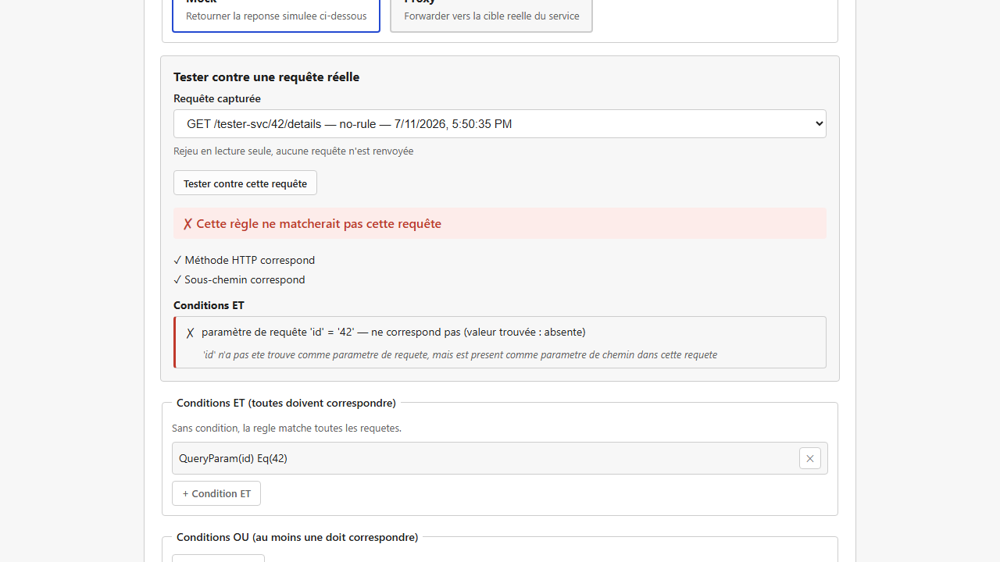
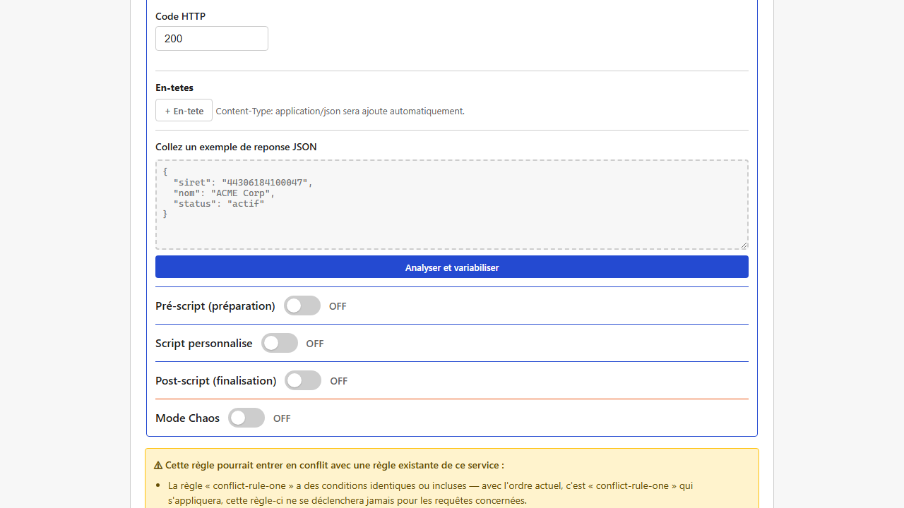

# Testeur de règle et détection de conflits

Deux aides à la qualité intégrées à l'éditeur de [règle](regles-de-matching.md), pour éviter les
deux pièges les plus fréquents en configurant des règles : "pourquoi ma règle ne matche pas ?" et
"pourquoi une autre règle répond à la place de la mienne ?".

## Le testeur de règle : vérifier contre du trafic réel

Quand vous créez ou modifiez une règle, un panneau "Tester la règle" permet de la confronter à une
**requête réellement reçue par lightMock** récemment (issue du
[journal des requêtes](journal-des-requetes.md)), sans avoir besoin de sauvegarder la règle
d'abord ni de renvoyer une vraie requête.

Pour chaque condition de la règle, le résultat indique clairement si elle a matché ou non — et
surtout **pourquoi**. Cas typique : vous avez configuré une condition sur un "paramètre de
requête" (`?cle=valeur`) alors que la valeur se trouvait en réalité dans un "paramètre de chemin"
de l'URL (`{cle}`) — sans cette aide, la règle ne matchait tout simplement pas, sans aucun indice.
Le testeur détecte ce genre de confusion et l'indique explicitement ("`cle` n'a pas été trouvé
comme paramètre de requête, mais est présent comme paramètre de chemin dans cette requête").

## Le détecteur de conflits : être averti à la sauvegarde

lightMock applique la **première règle qui correspond** à une requête (voir
[Règles de correspondance](regles-de-matching.md)) — l'ordre des règles dans la liste compte donc
directement. Avec de nombreuses règles, il devient facile d'en ajouter une qui, sans le vouloir,
sera **masquée** par une règle existante plus générale placée avant elle (ou l'inverse).

À chaque sauvegarde d'une règle (création ou modification), lightMock compare automatiquement le
brouillon aux autres règles du même service et affiche un avertissement si un chevauchement
plausible est détecté, en précisant **laquelle des deux règles s'appliquerait réellement** avec
l'ordre actuel.

Cet avertissement n'est **jamais bloquant** : deux choix sont toujours proposés,

- **Enregistrer quand même** — si le chevauchement est volontaire (par exemple une règle générale
  de repli, placée intentionnellement après des règles plus spécifiques),
- **Modifier la règle** — pour revoir la règle avant de sauvegarder.

## Prérequis et limites

- Aucun prérequis particulier : disponible dès l'installation de base.
- Le testeur de règle ne peut confronter votre brouillon qu'à des requêtes **déjà passées** par
  lightMock et conservées dans le journal — si aucune requête pertinente n'a encore été reçue,
  envoyez-en une manuellement (via `curl`, Postman, ou l'application testée) puis revenez au
  testeur.
- Une requête relayée en proxy **au niveau service** (voir [Services et routage](services.md))
  n'a pas de détail conservé dans le journal (pour des raisons de performance) — le testeur
  l'indique comme "détail non disponible" pour ces entrées.
- La détection de conflits repère les cas les plus courants et évidents (mêmes conditions, règle
  plus spécifique en repli d'une règle plus générale...) mais ne garantit pas de détecter **tous**
  les chevauchements possibles, en particulier des combinaisons complexes de conditions "OU". Elle
  ne remonte volontairement jamais de fausse alerte au prix de rater certains cas limites — un
  avertissement affiché doit rester digne de confiance.
- Cette détection est **uniquement informative** : elle ne change jamais l'ordre réel
  d'évaluation des règles ni leur comportement en production.
